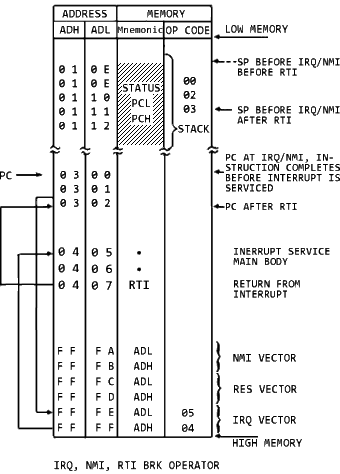

## 6502 INSTRUCTIONS

### Table of instruction codes

||00|01|02|03|04|05|06|07|08|09|0A|0B|0C|0D|0E|0F|
|:---:|:---:|:---:|:---:|:---:|:---:|:---:|:---:|:---:|:---:|:---:|:---:|:---:|:---:|:---:|:---:|:---:|
|00|BRK&nbsp;impl|ORA&nbsp;X,ind|-|-|-|ORA&nbsp;zpg|ASL&nbsp;zpg|-|PHP&nbsp;impl|ORA&nbsp;#|ASL&nbsp;A|-|-|ORA&nbsp;abs|ASL&nbsp;abs|-|
|10|BPL&nbsp;rel|ORA&nbsp;ind,Y|-|-|-|ORA&nbsp;zpg,X|ASL&nbsp;zpg,X|-|CLC&nbsp;impl|ORA&nbsp;abs,Y|-|-|-|ORA&nbsp;abs,X|ASL&nbsp;abs,X|-|
|20|JSR&nbsp;abs|AND&nbsp;X,ind|-|-|BIT&nbsp;zpg|AND&nbsp;zpg|ROL&nbsp;zpg|-|PLP&nbsp;impl|AND&nbsp;#|ROL&nbsp;A|-|BIT&nbsp;abs|AND&nbsp;abs|ROL&nbsp;abs|-|
|30|BMI&nbsp;rel|AND&nbsp;ind,Y|-|-|-|AND&nbsp;zpg,X|ROL&nbsp;zpg,X|-|SEC&nbsp;impl|AND&nbsp;abs,Y|-|-|-|AND&nbsp;abs,X|ROL&nbsp;abs,X|-|
|40|RTI&nbsp;impl|EOR&nbsp;X,ind|-|-|-|EOR&nbsp;zpg|LSR&nbsp;zpg|-|PHA&nbsp;impl|EOR&nbsp;#|LSR&nbsp;A|-|JMP&nbsp;abs|EOR&nbsp;abs|LSR&nbsp;abs|-|
|50|BVC&nbsp;rel|EOR&nbsp;ind,Y|-|-|-|EOR&nbsp;zpg,X|LSR&nbsp;zpg,X|-|CLI&nbsp;impl|EOR&nbsp;abs,Y|-|-|-|EOR&nbsp;abs,X|LSR&nbsp;abs,X|-|
|60|RTS&nbsp;impl|ADC&nbsp;X,ind|-|-|-|ADC&nbsp;zpg|ROR&nbsp;zpg|-|PLA&nbsp;impl|ADC&nbsp;#|ROR&nbsp;A|-|JMP&nbsp;ind|ADC&nbsp;abs|ROR&nbsp;abs|-|
|70|BVS&nbsp;rel|ADC&nbsp;ind,Y|-|-|-|ADC&nbsp;zpg,X|ROR&nbsp;zpg,X|-|SEI&nbsp;impl|ADC&nbsp;abs,Y|-|-|-|ADC&nbsp;abs,X|ROR&nbsp;abs,X|-|
|80|-|STA&nbsp;X,ind|-|-|STY&nbsp;zpg|STA&nbsp;zpg|STX&nbsp;zpg|-|DEY&nbsp;impl|-|TXA&nbsp;impl|-|STY&nbsp;abs|STA&nbsp;abs|STX&nbsp;abs|-|
|90|BCC&nbsp;rel|STA&nbsp;ind,Y|-|-|STY&nbsp;zpg,X|STA&nbsp;zpg,X|STX&nbsp;zpg,Y|-|TYA&nbsp;impl|STA&nbsp;abs,Y|TXS&nbsp;impl|-|-|STA&nbsp;abs,X|-|-|
|A0|LDY&nbsp;#|LDA&nbsp;X,ind|LDX&nbsp;#|-|LDY&nbsp;zpg|LDA&nbsp;zpg|LDX&nbsp;zpg|-|TAY&nbsp;impl|LDA&nbsp;#|TAX&nbsp;impl|-|LDY&nbsp;abs|LDA&nbsp;abs|LDX&nbsp;abs|-|
|B0|BCS&nbsp;rel|LDA&nbsp;ind,Y|-|-|LDY&nbsp;zpg,X|LDA&nbsp;zpg,X|LDX&nbsp;zpg,Y|-|CLV&nbsp;impl|LDA&nbsp;abs,Y|TSX&nbsp;impl|-|LDY&nbsp;abs,X|LDA&nbsp;abs,X|LDX&nbsp;abs,Y|-|
|C0|CPY&nbsp;#|CMP&nbsp;X,ind|-|-|CPY&nbsp;zpg|CMP&nbsp;zpg|DEC&nbsp;zpg|-|INY&nbsp;impl|CMP&nbsp;#|DEX&nbsp;impl|-|CPY&nbsp;abs|CMP&nbsp;abs|DEC&nbsp;abs|-|
|D0|BNE&nbsp;rel|CMP&nbsp;ind,Y|-|-|-|CMP&nbsp;zpg,X|DEC&nbsp;zpg,X|-|CLD&nbsp;impl|CMP&nbsp;abs,Y|-|-|-|CMP&nbsp;abs,X|DEC&nbsp;abs,X|-|
|E0|CPX&nbsp;#|SBC&nbsp;X,ind|-|-|CPX&nbsp;zpg|SBC&nbsp;zpg|INC&nbsp;zpg|-|INX&nbsp;impl|SBC&nbsp;#|NOP&nbsp;impl|-|CPX&nbsp;abs|SBC&nbsp;abs|INC&nbsp;abs|-|
|F0|BEQ&nbsp;rel|SBC&nbsp;ind,Y|-|-|-|SBC&nbsp;zpg,X|INC&nbsp;zpg,X|-|SED&nbsp;impl|SBC&nbsp;abs,Y|-|-|-|SBC&nbsp;abs,X|INC&nbsp;abs,X|-|

### Address Modes

      A     ....  Accumulator             OPC A       operand is AC (implied single byte instruction)  
      abs   ....  absolute                OPC $LLHH   operand is address $HHLL *  
      abs,X ....  absolute, X-indexed     OPC $LLHH,X operand is address; effective address is address incremented by X with carry **  
      abs,Y ....  absolute, Y-indexed     OPC $LLHH,Y operand is address; effective address is address incremented by Y with carry **  
      #     ....  immediate               OPC #$BB    operand is byte BB  
      impl  ....  implied                 OPC         operand implied  
      ind   ....  indirect                OPC ($LLHH) operand is address; effective address is contents of word at address: C.w($HHLL)  
      X,ind ....  X-indexed, indirect     OPC ($LL,X) operand is zeropage address; effective address is word in (LL + X, LL + X + 1), inc. without carry: C.w($00LL + X)  
      ind,Y ....  indirect, Y-indexed     OPC ($LL),Y operand is zeropage address; effective address is word in (LL, LL + 1) incremented by Y with carry: C.w($00LL) + Y  
      rel   ....  relative                OPC $BB     branch target is PC + signed offset BB ***  
      zpg   ....  zeropage                OPC $LL     operand is zeropage address (hi-byte is zero, address = $00LL)  
      zpg,X ....  zeropage, X-indexed     OPC $LL,X   operand is zeropage address; effective address is address incremented by X without carry **  
      zpg,Y ....  zeropage, Y-indexed     OPC $LL,Y   operand is zeropage address; effective address is address incremented by Y without carry **  
      
      *   16-bit address words are little-endian, lo(w)-byte first, followed by the hi(gh)-byte.  
      (An assembler will use a human readable, big-endian notation as in $HHLL.)  

      **  The available 16-bit address space is conceived as consisting of pages of 256 bytes each, with  
      address hi-bytes representing the page index. An increment with carry may affect the hi-byte  
      and may thus result in a crossing of page boundaries, adding an extra cycle to the execution.  
      Increments without carry do not affect the hi-byte of an address and no page transitions do occur.  
      Generally, increments of 16-bit addresses include a carry, increments of zeropage addresses don't.  
      Notably this is not related in any way to the state of the carry bit of the accumulator.  

      *** Branch offsets are signed 8-bit values, -128 ... +127, negative offsets in two's complement.  
      Page transitions may occur and add an extra cycle to the execution.  

### Instructions by Name
<b>
</b>
[ADC](#ADC "instruction details for ADC...")    ....  add with carry  
[AND](#AND "instruction details for AND...")    ....  and (with accumulator)  
[ASL](#ASL "instruction details for ASL...")    ....  arithmetic shift left  
[BCC](#BCC "instruction details for BCC...")    ....  branch on carry clear  
[BCS](#BCS "instruction details for BCS...")    ....  branch on carry set  
[BEQ](#BEQ "instruction details for BEQ...")    ....  branch on equal (zero set)  
[BIT](#BIT "instruction details for BIT...")    ....  bit test  
[BMI](#BMI "instruction details for BMI...")	....	branch on minus (negative set)  
[BNE](#BNE "instruction details for BNE...")	....	branch on not equal (zero clear)  
[BPL](#BPL "instruction details for BPL...")	....	branch on plus (negative clear)  
[BRK](#BRK "instruction details for BRK...")	....	break interrupt  
[BVC](#BVC "instruction details for BVC...")	....	branch on overflow clear  
[BVS](#BVS "instruction details for BVS...")	....	branch on overflow set  
[CLC](#CLC "instruction details for CLC...")	....	clear carry  
[CLD](#CLD "instruction details for CLD...")	....	clear decimal  
[CLI](#CLI "instruction details for CLI...")	....	clear interrupt disable  
[CLV](#CLV "instruction details for CLV...")	....	clear overflow  
[CMP](#CMP "instruction details for CMP...")	....	compare (with accumulator)  
[CPX](#CPX "instruction details for CPX...")	....	compare with X  
[CPY](#CPY "instruction details for CPY...")	....	compare with Y  
[DEC](#DEC "instruction details for DEC...")	....	decrement  
[DEX](#DEX "instruction details for DEX...")	....	decrement X  
[DEY](#DEY "instruction details for DEY...")	....	decrement Y  
[EOR](#EOR "instruction details for EOR...")	....	exclusive or (with accumulator)  
[INC](#INC "instruction details for INC...")	....	increment  
[INX](#INX "instruction details for INX...")	....	increment X  
[INY](#INY "instruction details for INY...")	....	increment Y  
[JMP](#JMP "instruction details for JMP...")	....	jump  
[JSR](#JSR "instruction details for JSR...")	....	jump subroutine  
[LDA](#LDA "instruction details for LDA...")	....	load accumulator  
[LDX](#LDX "instruction details for LDX...")	....	load X  
[LDY](#LDY "instruction details for LDY...")	....	load Y  
[LSR](#LSR "instruction details for LSR...")	....	logical shift right  
[NOP](#NOP "instruction details for NOP...")	....	no operation  
[ORA](#ORA "instruction details for ORA...")	....	or with accumulator  
[PHA](#PHA "instruction details for PHA...")	....	push accumulator  
[PHP](#PHP "instruction details for PHP...")	....	push processor status (SR)  
[PLA](#PLA "instruction details for PLA...")	....	pull accumulator  
[PLP](#PLP "instruction details for PLP...")	....	pull processor status (SR)  
[ROL](#ROL "instruction details for ROL...")	....	rotate left  
[ROR](#ROR "instruction details for ROR...")	....	rotate right  
[RTI](#RTI "instruction details for RTI...")	....	return from interrupt  
[RTS](#RTS "instruction details for RTS...")	....	return from subroutine  
[SBC](#SBC "instruction details for SBC...")	....	subtract with carry  
[SEC](#SEC "instruction details for SEC...")	....	set carry  
[SED](#SED "instruction details for SED...")	....	set decimal  
[SEI](#SEI "instruction details for SEI...")	....	set interrupt disable  
[STA](#STA "instruction details for STA...")	....	store accumulator  
[STX](#STX "instruction details for STX...")	....	store X  
[STY](#STY "instruction details for STY...")	....	store Y  
[TAX](#TAX "instruction details for TAX...")	....	transfer accumulator to X  
[TAY](#TAY "instruction details for TAY...")	....	transfer accumulator to Y  
[TSX](#TSX "instruction details for TSX...")	....	transfer stack pointer to X  
[TXA](#TXA "instruction details for TXA...")	....	transfer X to accumulator  
[TXS](#TXS "instruction details for TXS...")	....	transfer X to stack pointer  
[TYA](#TYA "instruction details for TYA...")	....	transfer Y to accumulator  

      
### Registers

      PC    ....  program counter (16 bit)
      AC    ....  accumulator (8 bit)
      X     ....  X register (8 bit)
      Y     ....  Y register (8 bit)
      SR    ....  status register [NV-BDIZC] (8 bit)
      SP    ....  stack pointer (8 bit)

### Status Register Flags (bit 7 to bit 0)

      N	....	Negative
      V	....	Overflow
      -	....	ignored
      B	....	Break
      D	....	Decimal (use BCD for arithmetics)
      I	....	Interrupt (IRQ disable)
      Z	....	Zero
      C	....	Carry

### Processor Stack
LIFO, top down, 8 bit range, 0x0100 - 0x01FF  

### Bytes, Words, Addressing
- 8 bit bytes, 16 bit words in lobyte-hibyte representation (Little-Endian).  
- 16 bit address range, operands follow instruction codes.
- Signed values are two's complement, sign in bit 7 (most significant bit).  
(%11111111 = $FF = -1, %10000000 = $80 = -128, %01111111 = $7F = +127)  

### Vendor  
MOS Technology, 1975  

## APPENDIX A: 6502 Instructions in Detail
<b>
</b>
### ADC - Add Memory to Accumulator with Carry - [top](#INSTR_BY_NAME "instructions by name")

      A + M + C -> A, C                N Z C I D V
                                      + + + - - +

      addressing    assembler    opc  bytes  cyles
      --------------------------------------------
      immidiate     ADC #oper     69    2     2
      zeropage      ADC oper      65    2     3
      zeropage,X    ADC oper,X    75    2     4
      absolute      ADC oper      6D    3     4
      absolute,X    ADC oper,X    7D    3     4\*
      absolute,Y    ADC oper,Y    79    3     4\*
      (indirect,X)  ADC (oper,X)  61    2     6
      (indirect),Y  ADC (oper),Y  71    2     5\*

### AND - AND Memory with Accumulator - [top](#INSTR_BY_NAME "instructions by name")

     A AND M -> A                     N Z C I D V
                                      + + - - - -

     addressing    assembler    opc  bytes  cyles
     --------------------------------------------
     immidiate     AND #oper     29    2     2
     zeropage      AND oper      25    2     3
     zeropage,X    AND oper,X    35    2     4
     absolute      AND oper      2D    3     4
     absolute,X    AND oper,X    3D    3     4\*
     absolute,Y    AND oper,Y    39    3     4\*
     (indirect,X)  AND (oper,X)  21    2     6
     (indirect),Y  AND (oper),Y  31    2     5\*

### ASL - Shift Left One Bit (Memory or Accumulator) - [top](#INSTR_BY_NAME "instructions by name")

     C <- \[76543210\] <- 0             N Z C I D V
                                      + + + - - -

     addressing    assembler    opc  bytes  cyles
     --------------------------------------------
     accumulator   ASL A         0A    1     2
     zeropage      ASL oper      06    2     5
     zeropage,X    ASL oper,X    16    2     6
     absolute      ASL oper      0E    3     6
     absolute,X    ASL oper,X    1E    3     7

### BCC - Branch on Carry Clear - [top](#INSTR_BY_NAME "instructions by name")

     branch on C = 0                  N Z C I D V
                                      - - - - - -

     addressing    assembler    opc  bytes  cyles
     --------------------------------------------
     relative      BCC oper      90    2     2\*\*

### BCS - Branch on Carry Set - [top](#INSTR_BY_NAME "instructions by name")

     branch on C = 1                  N Z C I D V
                                      - - - - - -

     addressing    assembler    opc  bytes  cyles
     --------------------------------------------
     relative      BCS oper      B0    2     2\*\*

### BEQ - Branch on Result Zero - [top](#INSTR_BY_NAME "instructions by name")

     branch on Z = 1                  N Z C I D V
                                      - - - - - -

     addressing    assembler    opc  bytes  cyles
     --------------------------------------------
     relative      BEQ oper      F0    2     2\*\*

### BIT - Test Bits in Memory with Accumulator - [top](#INSTR_BY_NAME "instructions by name")

     bits 7 and 6 of operand are transfered to bit 7 and 6 of SR (N,V);
     the zeroflag is set to the result of operand AND accumulator.

     A AND M, M7 -> N, M6 -> V        N Z C I D V
                                     M7 + - - - M6

     addressing    assembler    opc  bytes  cyles
     --------------------------------------------
     zeropage      BIT oper      24    2     3
     absolute      BIT oper      2C    3     4

### BMI - Branch on Result Minus - [top](#INSTR_BY_NAME "instructions by name")

     branch on N = 1                  N Z C I D V
                                      - - - - - -

     addressing    assembler    opc  bytes  cyles
     --------------------------------------------
     relative      BMI oper      30    2     2\*\*

### BNE - Branch on Result not Zero - [top](#INSTR_BY_NAME "instructions by name")

     branch on Z = 0                  N Z C I D V
                                      - - - - - -

     addressing    assembler    opc  bytes  cyles
     --------------------------------------------
     relative      BNE oper      D0    2     2\*\*

### BPL - Branch on Result Plus - [top](#INSTR_BY_NAME "instructions by name")

     branch on N = 0                  N Z C I D V
                                      - - - - - -

     addressing    assembler    opc  bytes  cyles
     --------------------------------------------
     relative      BPL oper      10    2     2\*\*

### BRK - Force Break - [top](#INSTR_BY_NAME "instructions by name")

     interrupt,                       N Z C I D V
     push PC+2, push SR               - - - 1 - -

     addressing    assembler    opc  bytes  cyles
     --------------------------------------------
     implied       BRK           00    1     7

### BVC - Branch on Overflow Clear - [top](#INSTR_BY_NAME "instructions by name")

     branch on V = 0                  N Z C I D V
                                      - - - - - -

     addressing    assembler    opc  bytes  cyles
     --------------------------------------------
     relative      BVC oper      50    2     2\*\*

### BVS - Branch on Overflow Set - [top](#INSTR_BY_NAME "instructions by name")

     branch on V = 1                  N Z C I D V
                                      - - - - - -

     addressing    assembler    opc  bytes  cyles
     --------------------------------------------
     relative      BVC oper      70    2     2\*\*

### CLC - Clear Carry Flag - [top](#INSTR_BY_NAME "instructions by name")

     0 -> C                           N Z C I D V
                                      - - 0 - - -

     addressing    assembler    opc  bytes  cyles
     --------------------------------------------
     implied       CLC           18    1     2

### CLD - Clear Decimal Mode - [top](#INSTR_BY_NAME "instructions by name")

     0 -> D                           N Z C I D V
                                      - - - - 0 -

     addressing    assembler    opc  bytes  cyles
     --------------------------------------------
     implied       CLD           D8    1     2

### CLI - Clear Interrupt Disable Bit - [top](#INSTR_BY_NAME "instructions by name")

     0 -> I                           N Z C I D V
                                      - - - 0 - -

     addressing    assembler    opc  bytes  cyles
     --------------------------------------------
     implied       CLI           58    1     2

### CLV - Clear Overflow Flag - [top](#INSTR_BY_NAME "instructions by name")

     0 -> V                           N Z C I D V
                                      - - - - - 0

     addressing    assembler    opc  bytes  cyles
     --------------------------------------------
     implied       CLV           B8    1     2

### CMP - Compare Memory with Accumulator - [top](#INSTR_BY_NAME "instructions by name")

     A - M                            N Z C I D V
                                      + + + - - -

     addressing    assembler    opc  bytes  cyles
     --------------------------------------------
     immidiate     CMP #oper     C9    2     2
     zeropage      CMP oper      C5    2     3
     zeropage,X    CMP oper,X    D5    2     4
     absolute      CMP oper      CD    3     4
     absolute,X    CMP oper,X    DD    3     4\*
     absolute,Y    CMP oper,Y    D9    3     4\*
     (indirect,X)  CMP (oper,X)  C1    2     6
     (indirect),Y  CMP (oper),Y  D1    2     5\*

### CPX - Compare Memory and Index X - [top](#INSTR_BY_NAME "instructions by name")

     X - M                            N Z C I D V
                                      + + + - - -

     addressing    assembler    opc  bytes  cyles
     --------------------------------------------
     immidiate     CPX #oper     E0    2     2
     zeropage      CPX oper      E4    2     3
     absolute      CPX oper      EC    3     4

### CPY - Compare Memory and Index Y - [top](#INSTR_BY_NAME "instructions by name")

     Y - M                            N Z C I D V
                                      + + + - - -

     addressing    assembler    opc  bytes  cyles
     --------------------------------------------
     immidiate     CPY #oper     C0    2     2
     zeropage      CPY oper      C4    2     3
     absolute      CPY oper      CC    3     4

### DEC - Decrement Memory by One - [top](#INSTR_BY_NAME "instructions by name")

     M - 1 -> M                       N Z C I D V
                                      + + - - - -

     addressing    assembler    opc  bytes  cyles
     --------------------------------------------
     zeropage      DEC oper      C6    2     5
     zeropage,X    DEC oper,X    D6    2     6
     absolute      DEC oper      CE    3     6
     absolute,X    DEC oper,X    DE    3     7

### DEX - Decrement Index X by One - [top](#INSTR_BY_NAME "instructions by name")

     X - 1 -> X                       N Z C I D V
                                      + + - - - -

     addressing    assembler    opc  bytes  cyles
     --------------------------------------------
     implied       DEC           CA    1     2

### DEY - Decrement Index Y by One - [top](#INSTR_BY_NAME "instructions by name")

     Y - 1 -> Y                       N Z C I D V
                                      + + - - - -

     addressing    assembler    opc  bytes  cyles
     --------------------------------------------
     implied       DEC           88    1     2

### EOR - Exclusive-OR Memory with Accumulator - [top](#INSTR_BY_NAME "instructions by name")

     A EOR M -> A                     N Z C I D V
                                      + + - - - -

     addressing    assembler    opc  bytes  cyles
     --------------------------------------------
     immidiate     EOR #oper     49    2     2
     zeropage      EOR oper      45    2     3
     zeropage,X    EOR oper,X    55    2     4
     absolute      EOR oper      4D    3     4
     absolute,X    EOR oper,X    5D    3     4\*
     absolute,Y    EOR oper,Y    59    3     4\*
     (indirect,X)  EOR (oper,X)  41    2     6
     (indirect),Y  EOR (oper),Y  51    2     5\*

### INC - Increment Memory by One - [top](#INSTR_BY_NAME "instructions by name")

     M + 1 -> M                       N Z C I D V
                                      + + - - - -

     addressing    assembler    opc  bytes  cyles
     --------------------------------------------
     zeropage      INC oper      E6    2     5
     zeropage,X    INC oper,X    F6    2     6
     absolute      INC oper      EE    3     6
     absolute,X    INC oper,X    FE    3     7

### INX - Increment Index X by One - [top](#INSTR_BY_NAME "instructions by name")

     X + 1 -> X                       N Z C I D V
                                      + + - - - -

     addressing    assembler    opc  bytes  cyles
     --------------------------------------------
     implied       INX           E8    1     2

### INY - Increment Index Y by One - [top](#INSTR_BY_NAME "instructions by name")

     Y + 1 -> Y                       N Z C I D V
                                      + + - - - -

     addressing    assembler    opc  bytes  cyles
     --------------------------------------------
     implied       INY           C8    1     2

### JMP - Jump to New Location - [top](#INSTR_BY_NAME "instructions by name")

     (PC+1) -> PCL                    N Z C I D V
     (PC+2) -> PCH                    - - - - - -

     addressing    assembler    opc  bytes  cyles
     --------------------------------------------
     absolute      JMP oper      4C    3     3
     indirect      JMP (oper)    6C    3     5

### JSR - Jump to New Location Saving Return Address - [top](#INSTR_BY_NAME "instructions by name")

     push (PC+2),                     N Z C I D V
     (PC+1) -> PCL                    - - - - - -
     (PC+2) -> PCH

     addressing    assembler    opc  bytes  cyles
     --------------------------------------------
     absolute      JSR oper      20    3     6

### LDA - Load Accumulator with Memory - [top](#INSTR_BY_NAME "instructions by name")

     M -> A                           N Z C I D V
                                      + + - - - -

     addressing    assembler    opc  bytes  cyles
     --------------------------------------------
     immidiate     LDA #oper     A9    2     2
     zeropage      LDA oper      A5    2     3
     zeropage,X    LDA oper,X    B5    2     4
     absolute      LDA oper      AD    3     4
     absolute,X    LDA oper,X    BD    3     4\*
     absolute,Y    LDA oper,Y    B9    3     4\*
     (indirect,X)  LDA (oper,X)  A1    2     6
     (indirect),Y  LDA (oper),Y  B1    2     5\*

### LDX - Load Index X with Memory - [top](#INSTR_BY_NAME "instructions by name")

     M -> X                           N Z C I D V
                                      + + - - - -

     addressing    assembler    opc  bytes  cyles
     --------------------------------------------
     immidiate     LDX #oper     A2    2     2
     zeropage      LDX oper      A6    2     3
     zeropage,Y    LDX oper,Y    B6    2     4
     absolute      LDX oper      AE    3     4
     absolute,Y    LDX oper,Y    BE    3     4\*

### LDY - Load Index Y with Memory - [top](#INSTR_BY_NAME "instructions by name")

     M -> Y                           N Z C I D V
                                      + + - - - -

     addressing    assembler    opc  bytes  cyles
     --------------------------------------------
     immidiate     LDY #oper     A0    2     2
     zeropage      LDY oper      A4    2     3
     zeropage,X    LDY oper,X    B4    2     4
     absolute      LDY oper      AC    3     4
     absolute,X    LDY oper,X    BC    3     4\*

### LSR - Shift One Bit Right (Memory or Accumulator) - [top](#INSTR_BY_NAME "instructions by name")

     0 -> \[76543210\] -> C             N Z C I D V
                                      0 + + - - -

     addressing    assembler    opc  bytes  cyles
     --------------------------------------------
     accumulator   LSR A         4A    1     2
     zeropage      LSR oper      46    2     5
     zeropage,X    LSR oper,X    56    2     6
     absolute      LSR oper      4E    3     6
     absolute,X    LSR oper,X    5E    3     7

### NOP - No Operation - [top](#INSTR_BY_NAME "instructions by name")

     ---                              N Z C I D V
                                      - - - - - -

     addressing    assembler    opc  bytes  cyles
     --------------------------------------------
     implied       NOP           EA    1     2

### ORA - OR Memory with Accumulator - [top](#INSTR_BY_NAME "instructions by name")

     A OR M -> A                      N Z C I D V
                                      + + - - - -

     addressing    assembler    opc  bytes  cyles
     --------------------------------------------
     immidiate     ORA #oper     09    2     2
     zeropage      ORA oper      05    2     3
     zeropage,X    ORA oper,X    15    2     4
     absolute      ORA oper      0D    3     4
     absolute,X    ORA oper,X    1D    3     4\*
     absolute,Y    ORA oper,Y    19    3     4\*
     (indirect,X)  ORA (oper,X)  01    2     6
     (indirect),Y  ORA (oper),Y  11    2     5\*

### PHA - Push Accumulator on Stack - [top](#INSTR_BY_NAME "instructions by name")

     push A                           N Z C I D V
                                      - - - - - -

     addressing    assembler    opc  bytes  cyles
     --------------------------------------------
     implied       PHA           48    1     3

### PHP - Push Processor Status on Stack - [top](#INSTR_BY_NAME "instructions by name")

     push SR                          N Z C I D V
                                      - - - - - -

     addressing    assembler    opc  bytes  cyles
     --------------------------------------------
     implied       PHP           08    1     3

### PLA - Pull Accumulator from Stack - [top](#INSTR_BY_NAME "instructions by name")

     pull A                           N Z C I D V
                                      + + - - - -

     addressing    assembler    opc  bytes  cyles
     --------------------------------------------
     implied       PLA           68    1     4

### PLP - Pull Processor Status from Stack - [top](#INSTR_BY_NAME "instructions by name")

     pull SR                          N Z C I D V
                                      from stack

     addressing    assembler    opc  bytes  cyles
     --------------------------------------------
     implied       PLP           28    1     4

### ROL - Rotate One Bit Left (Memory or Accumulator) - [top](#INSTR_BY_NAME "instructions by name")

     C <- \[76543210\] <- C             N Z C I D V
                                      + + + - - -

     addressing    assembler    opc  bytes  cyles
     --------------------------------------------
     accumulator   ROL A         2A    1     2
     zeropage      ROL oper      26    2     5
     zeropage,X    ROL oper,X    36    2     6
     absolute      ROL oper      2E    3     6
     absolute,X    ROL oper,X    3E    3     7

### ROR - Rotate One Bit Right (Memory or Accumulator) - [top](#INSTR_BY_NAME "instructions by name")

     C -> \[76543210\] -> C             N Z C I D V
                                      + + + - - -

     addressing    assembler    opc  bytes  cyles
     --------------------------------------------
     accumulator   ROR A         6A    1     2
     zeropage      ROR oper      66    2     5
     zeropage,X    ROR oper,X    76    2     6
     absolute      ROR oper      6E    3     6
     absolute,X    ROR oper,X    7E    3     7

### RTI - Return from Interrupt - [top](#INSTR_BY_NAME "instructions by name")

     pull SR, pull PC                 N Z C I D V
                                      from stack

     addressing    assembler    opc  bytes  cyles
     --------------------------------------------
     implied       RTI           40    1     6

### RTS - Return from Subroutine - [top](#INSTR_BY_NAME "instructions by name")

     pull PC, PC+1 -> PC              N Z C I D V
                                      - - - - - -

     addressing    assembler    opc  bytes  cyles
     --------------------------------------------
     implied       RTS           60    1     6

### SBC - Subtract Memory from Accumulator with Borrow - [top](#INSTR_BY_NAME "instructions by name")

     A - M - C -> A                   N Z C I D V
                                      + + + - - +

     addressing    assembler    opc  bytes  cyles
     --------------------------------------------
     immidiate     SBC #oper     E9    2     2
     zeropage      SBC oper      E5    2     3
     zeropage,X    SBC oper,X    F5    2     4
     absolute      SBC oper      ED    3     4
     absolute,X    SBC oper,X    FD    3     4\*
     absolute,Y    SBC oper,Y    F9    3     4\*
     (indirect,X)  SBC (oper,X)  E1    2     6
     (indirect),Y  SBC (oper),Y  F1    2     5\*

### SEC - Set Carry Flag - [top](#INSTR_BY_NAME "instructions by name")

     1 -> C                           N Z C I D V
                                      - - 1 - - -

     addressing    assembler    opc  bytes  cyles
     --------------------------------------------
     implied       SEC           38    1     2

### SED - Set Decimal Flag - [top](#INSTR_BY_NAME "instructions by name")

     1 -> D                           N Z C I D V
                                      - - - - 1 -

     addressing    assembler    opc  bytes  cyles
     --------------------------------------------
     implied       SED           F8    1     2

### SEI - Set Interrupt Disable Status - [top](#INSTR_BY_NAME "instructions by name")

     1 -> I                           N Z C I D V
                                      - - - 1 - -

     addressing    assembler    opc  bytes  cyles
     --------------------------------------------
     implied       SEI           78    1     2

### STA - Store Accumulator in Memory - [top](#INSTR_BY_NAME "instructions by name")

     A -> M                           N Z C I D V
                                      - - - - - -

     addressing    assembler    opc  bytes  cyles
     --------------------------------------------
     zeropage      STA oper      85    2     3
     zeropage,X    STA oper,X    95    2     4
     absolute      STA oper      8D    3     4
     absolute,X    STA oper,X    9D    3     5
     absolute,Y    STA oper,Y    99    3     5
     (indirect,X)  STA (oper,X)  81    2     6
     (indirect),Y  STA (oper),Y  91    2     6

### STX - Store Index X in Memory - [top](#INSTR_BY_NAME "instructions by name")

     X -> M                           N Z C I D V
                                      - - - - - -

     addressing    assembler    opc  bytes  cyles
     --------------------------------------------
     zeropage      STX oper      86    2     3
     zeropage,Y    STX oper,Y    96    2     4
     absolute      STX oper      8E    3     4

### STY - Sore Index Y in Memory - [top](#INSTR_BY_NAME "instructions by name")

     Y -> M                           N Z C I D V
                                      - - - - - -

     addressing    assembler    opc  bytes  cyles
     --------------------------------------------
     zeropage      STY oper      84    2     3
     zeropage,X    STY oper,X    94    2     4
     absolute      STY oper      8C    3     4

### TAX - Transfer Accumulator to Index X - [top](#INSTR_BY_NAME "instructions by name")

     A -> X                           N Z C I D V
                                      + + - - - -

     addressing    assembler    opc  bytes  cyles
     --------------------------------------------
     implied       TAX           AA    1     2

### TAY - Transfer Accumulator to Index Y - [top](#INSTR_BY_NAME "instructions by name")

     A -> Y                           N Z C I D V
                                      + + - - - -

     addressing    assembler    opc  bytes  cyles
     --------------------------------------------
     implied       TAY           A8    1     2

### TSX - Transfer Stack Pointer to Index X - [top](#INSTR_BY_NAME "instructions by name")

     SP -> X                          N Z C I D V
                                      + + - - - -

     addressing    assembler    opc  bytes  cyles
     --------------------------------------------
     implied       TSX           BA    1     2

### TXA - Transfer Index X to Accumulator - [top](#INSTR_BY_NAME "instructions by name")

     X -> A                           N Z C I D V
                                      + + - - - -

     addressing    assembler    opc  bytes  cyles
     --------------------------------------------
     implied       TXA           8A    1     2

### TXS - Transfer Index X to Stack Register - [top](#INSTR_BY_NAME "instructions by name")

     X -> SP                          N Z C I D V
                                      - - - - - -

     addressing    assembler    opc  bytes  cyles
     --------------------------------------------
     implied       TXS           9A    1     2

### TYA - Transfer Index Y to Accumulator - [top](#INSTR_BY_NAME "instructions by name")

     Y -> A                           N Z C I D V
                                      + + - - - -

     addressing    assembler    opc  bytes  cyles
     --------------------------------------------
     implied       TYA           98    1     2

_\*  add 1 to cycles if page boundery is crossed_

_\*\* add 1 to cycles if branch occurs on same page, add 2 to cycles if branch occurs to different page_

#### Legend to Flags 
      + ....      modified
      - ....      not modified
      1 ....      set
      0 ....      cleared
      M6 ....     memory bit 6
      M7 ....     memory bit 7

Note on assembler syntax:
Most assemblers employ "OPC \*oper" for forced zeropage addressing.

## Appendix B: 6502 Jump Vectors and Stack Operations

The 256 bytes processor stack of the 6502 is located at $0100 ... $01FF in  
memory, growing down from top to bottom.  
There are three 2-byte address locations at the very top end of the 64K address  
space serving as jump vectors for reset/startup and interrupt operations:

      $FFFA, $FFFB ...  NMI (Non-Maskable Interrupt) vector  
      $FFFC, $FFFD ...  RES (Reset) vector  
      $FFFE, $FFFF ...  IRQ (Interrupt Request) vector

At the occurrence of an interrupt, the value of the program counter (PC) is put in  
high-low order onto the stack, followed by the value currently in the status  
register and control will be transferred to the address location found in the  
respective interrupt vector. These are recovered from the stack at the end of  
an interrupt routine by the RTI instruction.

  

(Image: MCS6502 Instruction Set Summary, MOS Technology, Inc.)

Similarly, as a JSR instruction is encountered, PC is dumped onto the stack  
and recovered by the JSR instruction:

(Image: MCS6502 Instruction Set Summary, MOS Technology, Inc.)
