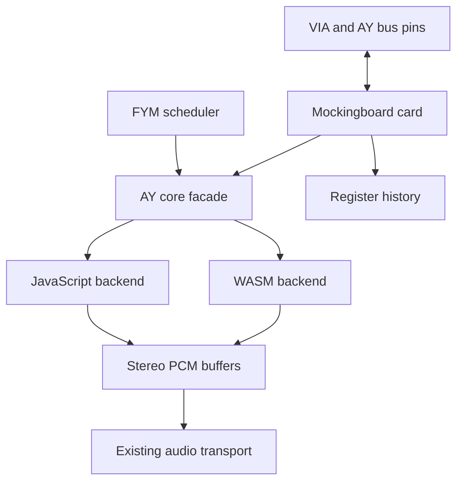

# Shared AY/YM core: JavaScript and WebAssembly design

Date: 2026-10-05  
Status: Proposed design for review; no core implementation is included.  
API / ABI version: 1  
Repository baseline inspected: `2983fa4`, together with the dual-FYM player prepared in this conversation.

## 1. Purpose and scope

Provide one reusable AY-3-8910 / YM2149 sound core, with interchangeable JavaScript and WebAssembly implementations. Both `tools/MockingboardJS.html` and `res/EMU_CARD_mockingboard.js` will consume this interface. The first release supports one or two chips per instance; multiple cards use independent instances.

The goal is lower measured rendering cost and more predictable allocation behavior while retaining the existing sound algorithm, independent chip state, and emulated-time ordering. WASM speed, memory savings, and battery savings are hypotheses to measure, not acceptance assumptions.

The core includes sound-register decoding, tone, noise, envelope, DAC selection, interpolation, FIR decimation, DC removal, channel routing, and chip mixing. JavaScript retains FYM decompression and metadata, frame/loop scheduling, Apple II slot handling, VIA timers and IRQs, AY bus-control pins, external port pins, history recording, UI, and Web Audio transport.

AudioWorklet, workers, shared memory, SIMD, CPU-WASM integration, and a new VIA implementation are separate changes. The synchronous core can later be hosted in an AudioWorklet without changing its time or register contract.

## 2. Current code and architectural choice

The current `Ayumi` class represents one chip. Its processing method performs eight interpolation steps per output sample, stereo FIR filtering, and separate DC filtering. It also requests two typed-array subarray views per sample. Browser optimizations may eliminate some allocations; actual allocation pressure must be profiled.

The peripheral already owns two chips. It advances both in `advanceAudio()`, places rendered Float32 frames in a bounded FIFO, and lets `MockingboardAudio` drain them. Chip 0 is routed left and chip 1 right. The prepared FYM player instead spreads each chip's A/B/C channels across stereo and mixes both streams.

Three approaches were considered:

| Approach | Consequence | Decision |
| --- | --- | --- |
| Export every existing Ayumi setter and sample method individually | Small initial port, but leaves the sample loop and repeated boundary crossings in JavaScript | Reject as the primary API |
| One synchronous, block-rendering core behind a shared JS/WASM interface | Moves both chip loops and filtering into the selected backend; keeps emulator ownership and transport stable | Select |
| Move AY, VIA, scheduler, and audio delivery into a worker or worklet together | Adds threading, asynchronous hardware reads, and transport changes to the sound optimization | Defer |

The module is compiled once and may host several independent core instances. A core instance owns one timeline and one or two complete chips. It never invokes JavaScript from a rendering loop.



## 3. State ownership

| Owner | Authoritative state |
| --- | --- |
| AY core | Sound registers R0–R13, generator phases, noise LFSR, envelope state, sample-time fraction, interpolation and filter histories, routing coefficients |
| AY bus adapter | Selected register/address latch, BDIR/BC1/reset observation, bus drive, R14/R15 external-port behavior, synchronous register mirror for CPU reads |
| VIA | Port direction, input/output pins, timers, IFR/IER, interrupts |
| FYM adapter | Inflated file bytes, metadata, frame indices, frame rates, loop points, frame-event deadlines |
| Audio device/player transport | PCM queues, browser audio nodes, scheduling, host playback-rate adjustment, user volume |
| History recorder | Accepted writes and resets with their actual emulated timestamps |

The bus mirror is necessary because CPU register reads must remain immediate while audio writes may be collected into a batch. It is updated only when an actual bus write is accepted, using the same masks as the core. `getRegisters()` on the core is a diagnostic view at the core's cursor, not a substitute for a future bus mirror.

R14/R15 are outside this sound ABI. The bus adapter maintains them exactly as the current peripheral does. Modeling physical AY port inputs/outputs later requires a separately versioned port interface.

## 4. Time and ordering contract

### 4.1 Units and range

Each instance has an integer `timebaseHz`, independent of each chip's `clockHz`. For a card, timebase ticks are emulated CPU cycles. For FYM playback, the timebase is the output sample rate and ticks are output-frame indices.

Absolute ticks are nonnegative JavaScript safe integers, up to `2^53 - 1`. They must never be truncated with a 32-bit bitwise conversion. WASM receives scalar ticks as `f64`, validates integrality/range, and converts internally to unsigned 64-bit integers. Packed events use low/high unsigned 32-bit words.

Each call may advance at most `2^32 - 1` ticks. Larger catch-up intervals are split by the adapter. With sample rates up to 192,000 Hz, this keeps phase products within unsigned 64-bit arithmetic.

The cumulative rendered-frame count must also remain a nonnegative safe integer. A call that would exceed that limit fails with `E_TIME` before mutation; it cannot silently wrap the diagnostic count or sample index.

### 4.2 Rendering and boundary writes

The cursor starts at `originTick`. Output-frame boundaries occur at:

`originTick + n * timebaseHz / sampleRate`, for integer `n >= 1`.

`renderUntil(T, ...)` completes all samples whose boundaries are at or before T. For a write at t, the core first completes samples with boundaries at or before t, then applies the write. Thus a write exactly on a sample boundary affects subsequent samples. A write between boundaries affects the next generated sample.

This retains the current renderer's sample-level quantization. It does not introduce sub-sample scheduling or claim additional cycle accuracy for the analog waveform. Replacing that algorithm later requires a new quality mode with its own reference tests.

Within each call, events must be ordered by nondecreasing tick. Events at equal ticks are processed in input order; reset/write order is observable. Events at the current cursor are legal, including an additional same-tick write in a subsequent call. Events earlier than the cursor or later than T are rejected.

`renderUntil(T)` also applies events at T after completing audio through T. The resulting register view includes those writes even if they produced no new sample. An identical T with no events is a successful no-op.

### 4.3 Exact sample counting

Maintain integer `samplePhase` in `[0, timebaseHz)`. For elapsed ticks d:

```
q = samplePhase + d * sampleRate
frames = floor(q / timebaseHz)
nextPhase = q % timebaseHz
```

Use this rule between every event group and the requested end tick. It avoids cumulative floating-point frame drift. The same events must produce the same samples regardless of rendering block boundaries.

Backward time is an error. A hardware restart creates a fresh transport origin explicitly; it is never inferred from a decreasing tick.

## 5. Shared JavaScript API

Factory initialization may be asynchronous. Operations on an initialized instance are synchronous.

```javascript
var core = await AYCore.create({
    backend: "auto",         // "auto", "js", or "wasm"
    chipCount: 2,
    sampleRate: 44100,
    timebaseHz: 1021800,
    originTick: 0,
    maxFrames: 4096,
    maxEvents: 4096
});
```

| Method | Required behavior |
| --- | --- |
| `configureChip(chip, {model, clockHz})` | Model is `"AY"` or `"YM"`. Establishes the clock and reference DAC table. Allowed only before the first advancement or after `resetTransport()` |
| `setMix(chip, weights)` | Six Float64 coefficients, `[AL, AR, BL, BR, CL, CR]`. Replaces output routing at the current cursor without resetting generators or filters |
| `writeNow(chip, reg, value)` | Writes R0–R13 at the current cursor; useful after synchronous CPU-time advancement. Preserves repeated writes |
| `resetChipNow(chip)` | Applies the defined chip reset at the current cursor, retaining the continuous output filter history |
| `renderUntil(endTick, batch, output)` | Applies the packed event batch and fills caller-owned planar Float32 PCM; returns generated frame count |
| `getRegisters(chip, destination)` | Copies 14 masked registers into a caller-owned Uint8Array; performs no time advancement |
| `getPosition(destination)` | Fills caller-owned `{tick, samplePhase, renderedFrames}` with the current timeline position |
| `resetTransport(originTick)` | Clears every chip and all interpolation/filter history, establishes a new sample origin; retains clock/model/routing configuration |
| `saveState()` | Returns a versioned state blob for the current backend at a completed call boundary |
| `loadState(blob)` | Validates and restores a compatible snapshot atomically |
| `destroy()` | Releases instance resources; subsequent operations fail with a destroyed-handle error |

`batch` is `{data: Uint8Array, count: number}` using the event format below. `null` means no events. `output` is `{left: Float32Array, right: Float32Array}`. Each array must accommodate every frame produced by the call; the unused suffix is left unchanged. Zero-frame calls accept empty output arrays.

The facade validates arguments, stages packed events with one contiguous copy for the WASM backend, invokes one render export for both chips, and copies only the generated PCM into the caller's buffers. Neither backend allocates objects or arrays during rendering. Existing per-chip convenience setters may be implemented by an adapter for migration, but they are not the rendering contract.

The JS backend precomputes the FIR phase subarray views at creation, replacing the current per-sample view construction without changing the numerical operations. Output arrays must be separate, nonoverlapping Float32Array storage and must not alias the event batch. All six mixing coefficients must be finite and in `[0, 1]`. Chip clocks must be positive integers at most `64 * sampleRate`, retaining the existing algorithm's supported interpolation-step range. Unsupported clocks fail with `E_ARGUMENT` rather than producing an incorrect waveform.

The live-stream operations throw an `AYCoreError` carrying a stable code on invalid input. The facade resolves error messages outside the numerical loop.

## 6. Packed events and WASM ABI

All memory structures are little-endian. Event stride is 16 bytes; event and PCM buffers are at least four-byte aligned.

| Event byte offset | Type | Meaning |
| --- | --- | --- |
| 0 | u32 | Absolute tick low word |
| 4 | u32 | Absolute tick high word; at most `0x001FFFFF` |
| 8 | u8 | Chip index, 0 or 1 within the instance |
| 9 | u8 | Operation: `0 = WRITE`, `1 = RESET_CHIP` |
| 10 | u8 | Register, 0–13 for WRITE; zero for RESET_CHIP |
| 11 | u8 | Value, 0–255 for WRITE; zero for RESET_CHIP |
| 12 | u32 | Reserved; must be zero |

The reserved word is not a sequence number: array order defines ordering. The batch is caller-owned and is consumed entirely during the call. The core retains no event pointers after returning.

C-style exports:

```c
uint32_t ay_abi_version(void);                      /* returns 1 */
uint32_t ay_config_buffer(void);                    /* module-owned 40-byte setup staging */
int32_t  ay_create(uint32_t config_ptr);             /* positive handle or negative error */
int32_t  ay_configure_chip(int32_t h, uint32_t chip,
                          uint32_t model, uint32_t clock_hz);
int32_t  ay_set_mix(int32_t h, uint32_t chip, uint32_t weights_ptr);
int32_t  ay_write_now(int32_t h, uint32_t chip, uint32_t reg, uint32_t value);
int32_t  ay_reset_chip_now(int32_t h, uint32_t chip);
int32_t  ay_reset_transport(int32_t h, double origin_tick);
int32_t  ay_render_until(int32_t h, double end_tick,
                        uint32_t events_ptr, uint32_t event_count,
                        uint32_t left_ptr, uint32_t right_ptr,
                        uint32_t capacity_frames);
int32_t  ay_get_registers(int32_t h, uint32_t chip, uint32_t dest_ptr);
int32_t  ay_get_position(int32_t h, uint32_t dest_ptr);
int32_t  ay_state_size(int32_t h);
int32_t  ay_save_state(int32_t h, uint32_t dest_ptr, uint32_t capacity_bytes);
int32_t  ay_load_state(int32_t h, uint32_t src_ptr, uint32_t length_bytes);
int32_t  ay_destroy(int32_t h);
uint32_t ay_event_buffer(int32_t h);
uint32_t ay_left_buffer(int32_t h);
uint32_t ay_right_buffer(int32_t h);
uint32_t ay_control_buffer(int32_t h);
uint32_t ay_state_buffer(int32_t h);
```

Model IDs: `0 = AY`, `1 = YM`. Mutators return zero on success. Rendering returns the nonnegative frame count, save returns bytes written, and size queries return required size. All failures return negative codes.

Create configuration, 40 bytes:

| Offset | Type | Field |
| --- | --- | --- |
| 0 | u32 | Structure size, 40 |
| 4 | u32 | ABI version, 1 |
| 8 | u32 | Chip count, 1–2 |
| 12 | u32 | Timebase Hz, 1–`UINT32_MAX` |
| 16 | u32 | Sample rate, 8,000–192,000 |
| 20 | u32 | Maximum frames per call, 1–16,384 |
| 24 | u32 | Maximum events per call, 1–16,384 |
| 28 | u32 | Flags, zero |
| 32 | f64 | Origin tick, nonnegative safe integer |

Creation uses the module-owned setup staging returned by `ay_config_buffer()`, initialized before any instance exists. Create calls are serialized; the core copies the configuration before returning and retains no pointer to that shared staging. Instances own event, output, 64-byte control, and snapshot scratch buffers. All control/configuration buffers are eight-byte aligned. Getter pointers remain valid until destruction; pointer getters return zero for an invalid handle. The control buffer holds six f64 routing coefficients at offsets 0–47, or a position record: f64 tick at 0, u32 phase at 8, u32 reserved zero at 12, f64 rendered-frame count at 16. These uses are sequential, not concurrent.

The snapshot scratch has exactly the implementation's required snapshot capacity reported by `ay_state_size()`, fixed for the instance's configuration. Save writes there; load stages a matching-length blob there before validation. Register/position reads and mixing updates use the control scratch. No unexported allocator is required by the facade. Snapshot copying into a new user-owned Uint8Array occurs outside audio rendering.

The WASM module exports its `memory`. The facade uses the owned buffers for rendering. Render pointers must refer to those exact instance buffers; overlapping/foreign outputs are rejected. Pointer arithmetic and lengths are bounds-checked before state mutation. There are no imports for logging, DOM, file access, browser audio, or callbacks. Handles encode a generation as well as a slot so a stale handle cannot target a newly created instance.

Error codes:

| Code | Name | Meaning |
| --- | --- | --- |
| -1 | `E_ARGUMENT` | Invalid configuration, chip, register, value, flags, or pointer |
| -2 | `E_HANDLE` | Destroyed, unknown, or stale instance |
| -3 | `E_TIME` | Nonintegral, backward, oversized, or out-of-range timeline advancement |
| -4 | `E_ORDER` | Unsorted or out-of-window event batch |
| -5 | `E_CAPACITY` | Too many events or insufficient output/state capacity |
| -6 | `E_MEMORY` | Creation could not reserve the requested fixed buffers |
| -7 | `E_STATE` | Invalid, incompatible, or corrupt snapshot |
| -8 | `E_PHASE` | Reconfiguration attempted after advancement |

The implementation validates the entire batch and required sample count before writing PCM or mutating generators. Expected validation errors leave core state and output buffers unchanged. A runtime trap invalidates the instance; continued playback through that instance is prohibited.

## 7. Sound and reset semantics

R0–R13 masks are `[FF,0F,FF,0F,FF,0F,1F,FF,1F,1F,1F,FF,FF,0F]`. Values are unsigned bytes, then masked. Tone period zero and envelope period zero resolve to one, matching the existing setters. Noise period zero retains the existing Ayumi update behavior. R7 high bits remain readable but do not create host I/O operations.

Every R13 write invokes envelope retriggering, including consecutive writes of the same value. A value of 255 is an ordinary byte which becomes shape 15 after masking; it is not a core-level no-write marker. The FYM adapter suppresses the special 255 marker before emitting events.

`RESET_CHIP` clears the sound register image and initializes tone/noise/envelope digital state: tone counters/output bits zero, effective tone periods one, noise counter zero/LFSR seed one, envelope period one/counter zero/shape zero/segment zero with the existing shape initializer. It retains interpolation, FIR, and DC history, permitting an existing filter tail to drain. This is the defined software reset contract. It must be reviewed against current bus-reset behavior during integration; any difference is reported explicitly rather than disguised as a performance change.

`resetTransport()` performs a cold restart: digital state and all interpolation/filter histories are cleared. Sample phase and rendered-frame count return to zero at the supplied origin.

Keep Float64 numerical state and the current FIR coefficients in the first WASM implementation. Write Float32 only at the PCM boundary. Compile without fast-math/reassociation or floating-point contraction. SIMD and reduced precision require separate benchmark and equivalence decisions.

Mixing is an explicit linear matrix. There is no implicit normalization based on chip count, no limiter, and no silent clipping in the core. Existing adapters choose their gains:

- Peripheral: chip 0's three channels left at 0.5 each; chip 1's three channels right at 0.5 each, retaining current output scaling.
- FYM player: linear pans 0.1/0.5/0.9 for each chip, multiplied by `1 / (1.5 * loadedChipCount)`, retaining the prepared player's normalization.

User volume belongs to the host audio transport, preferably a native GainNode. A routing change at the cursor affects future PCM only and does not rewrite queued samples. Muting output does not freeze chip phases.

## 8. Snapshot and backend lifecycle

Snapshots include cursor/origin/sample phase, rendered-frame count, chip clocks/models, all sound registers, tone/noise/envelope phases, interpolation coefficients/history, FIR buffers/indices, DC buffers/sums/index, and routing. A register dump alone cannot restore continuous sound.

The snapshot header is 24 bytes: magic `AYST` at offset 0; u32 snapshot version 1 at 4; u32 ABI version 1 at 8; u32 backend ID (`1 = JS`, `2 = WASM`) at 12; u32 implementation-state version at 16; u32 total byte length at 20. Payload is backend-owned and versioned. Load checks the complete payload before committing state. Configuration and capacities must match; runtime handles, scratch pointers, output contents, and caller-owned FYM position are not included.

Version 1 snapshots are same-backend snapshots. A live JS/WASM transfer is deliberately deferred. Selecting another backend stops playback and starts a fresh core from the adapter's initial state. A complete emulator checkpoint must combine core, VIA, bus, history, and transport state; saving this core alone is not an Apple II checkpoint.

`backend: "auto"` selects WASM only after capability, ABI-version, and initialization checks; otherwise it creates JS and exposes the reason in diagnostic status. Forced `"wasm"` fails explicitly if unavailable. Backend choice is fixed for that instance. A runtime WASM failure stops playback and surfaces an error; no mid-stream restart or silently lost events are permitted.

## 9. Integration with the FYM tool and peripheral

### FYM player

Keep two independent frame schedulers and file clocks. Configure `timebaseHz = sampleRate`. Frame zero is emitted at the transport origin. Frame k starts at output-frame index `ceil(k * sampleRate / frameRate)`. Implement this with an integer remainder scheduler, not a growing floating-point deadline. Loop transitions retain the scheduler's fractional phase; they do not reset the transport clock.

Build each batch by merging the two chip event streams in deadline order, with chip 0 before chip 1 for equal deadlines. Emit R0–R12 and an R13 write only when the FYM marker is not 255. Do not suppress repeated R13 shapes. Start establishes a new transport origin; Stop disconnects the audio callback. Loading a replacement file stops the pair, as in the prepared player.

The callback generates its packed batch in reusable storage, calls `renderUntil()`, and copies resulting PCM. Frame scheduling remains JavaScript work at song-frame frequency; the per-sample AY loop belongs entirely to the selected core.

### Mockingboard peripheral

Preserve `advanceTo(cpuTick)`, `getAudioFormat()`, queue/drain methods, VIA timing, register bus access, and history APIs. Replace the private per-sample `advanceAudio()` loop with core block rendering, split at buffer capacity and accepted write/reset boundaries.

For an accepted sound write at t: render through t, apply `writeNow()` at t, update the bus mirror, and record the original event exactly once. R14/R15 remain in the bus adapter. Additional sound writes at the same t do not advance audio. Do not convert all setters into independent WASM calls; accepted AY register writes are the boundary operation.

The integration audit must verify callback timestamps. `syncBus()` currently passes `lastCpuTick`, and `advanceTo()` ticks the VIAs before its audio advancement. Do not assume a callback during an elapsed timer interval necessarily happened at the old cursor or interval end. Current VIA timer ticking changes IRQ state rather than AY port pins; if a future pin transition can generate an AY write during ticking, its actual transition timestamp must be supplied and the interval split there. Existing timer/IRQ tests remain mandatory.

Host CPU acceleration continues to affect browser playback scheduling in `EMU_DEVICE_mockingboard_audio.js`; it does not change the core's definition of emulated chip time. Backward CPU-clock realignment requires an explicit core transport reset consistent with the hardware restart path.

The peripheral FIFO retains its existing ownership and bounds. Core scratch output is copied into the FIFO before the next call overwrites it. Rendering while no audio consumer is attached must still advance chip state, as the existing peripheral does.

## 10. Files, loading, build, and memory

Proposed files:

| Path | Role |
| --- | --- |
| `res/EMU_CHIP_AY.js` | Shared facade, register/batch validation, backend selection |
| `res/EMU_CHIP_AY_JS.js` | JavaScript backend using the existing Ayumi numerical algorithm |
| `res/EMU_CHIP_AY_WASM.js` | Generated static asset containing module bytes, ABI metadata, source fingerprint |
| `tools/ay_core/ay_core.c` / `ay_core.h` | C implementation and ABI declarations |
| `tools/ay_core/build.sh` | Reproducible optimized scalar WASM build |
| `tests/ay_core.test.js` | Shared contract, state, and numerical equivalence tests |
| `tools/AY_Core_Benchmark.html` | Manual browser benchmark and backend diagnostics |

Keep `res/ayumi.js` available for other tools and the numerical reference. Declare includes explicitly in `index.html` and in the standalone tool, in dependency order. No dynamically injected scripts, JSON includes, or peripheral-specific functions in `index.html`. Compiled bytes are embedded in the generated JavaScript asset, following the project's offline/static loading preference; instantiation happens once before creating cores. This avoids an extra runtime `.wasm` request.

Use a small plain C build with no libc-dependent audio runtime, no Emscripten object bindings, and no WASM-to-JS imports. Preserve Ayumi attribution and audit upstream/project license obligations before incorporating native source. Use explicit scalar exports and optimization compatible with the numerical requirements above.

WASM memory is fixed after initialization. The facade defaults to 32 pages (2 MiB), reserves staging/stack space, and allocates instance state and scratch buffers during creation. There is no `memory.grow`, allocation, buffer-view construction, or state serialization while rendering. Creation may fail with `E_MEMORY` when the fixed budget is exhausted; it must not change a playing instance's memory. Destruction returns space to the setup-time allocator.

This fixed module budget is a cost to include in benchmarks. Existing per-chip DC/FIR/interpolation arrays already occupy approximately 22 KiB before object overhead. A WASM core is not justified by an assumption that these filters disappear or that total memory necessarily falls.

## 11. Validation and performance decision

First normalize a JS backend against the defined contract; retain the unmodified Ayumi numerical algorithm as the sound reference. Then run identical packed events against JS and WASM.

Required checks:

- All three channels on each chip; independent tone, noise, envelope, clocks, and routing.
- AY and YM amplitude curves; all 16 envelope shapes and repeated R13 writes.
- Register masks, zero-period behavior, and the FYM-only 255 marker rule.
- Writes before/on/after sample boundaries and ordered same-tick resets/writes.
- Identical output for arbitrary block splits, including zero-frame calls.
- Safe timestamps beyond `2^32`, fractional CPU-to-sample ratios, and capacity preflight.
- Same-backend snapshot restoration reproduces the subsequent PCM; corrupted snapshots leave state unchanged.
- Invalid pointers, handles, time, batch order, and capacities; isolation between multiple instances.
- Start/Stop/restart/unmount, muted playback, and disabled audio consumers.
- Current Mockingboard VIA, AY bus, history, audio-device, and configuration tests.

Digital register and generator states must match exactly for equivalence fixtures. PCM parity gate: peak absolute JS/WASM difference at most `1e-6`, with no growing phase drift over a ten-minute synthesized trace. If this fails, investigate operation order before widening the tolerance. Block splitting within a backend must be bit-identical at the Float32 PCM boundary.

Browser benchmark matrix: Chromium, Firefox, and Safari where available; one/two chips at 44.1/48 kHz; tone-only, noise/envelope-heavy, dual-FYM, and authentic dense Mockingboard register traces. Test 128, 512, and 4096-frame blocks, including the shorter intervals imposed by real bus writes. Compare core-only rendering and complete adapter-to-PCM cost. Measure cold initialization separately, then warm up and report median/p95 time across repeated runs, allocation/GC observations, module/state/scratch/transport memory, and actual audio glitches under UI load.

A Node benchmark is supporting evidence, not a substitute for those browser measurements. Use identical numerical quality, events, and output duration. Existing unrelated test failures are recorded by name with their baseline status.

Promotion criterion: retain WASM as optional unless it shows at least a 20% reduction in median end-to-end synthesis cost for representative two-chip playback, no worse p95 time, and all correctness gates pass. Browser-specific exceptions remain on JS under auto selection. This is a project decision threshold, not a forecast of speedup.

## 12. Delivery sequence and review decisions

1. Implement the common JS contract and event fixtures; verify compatibility before changing the peripheral.
2. Implement the scalar C/WASM backend against that contract and prove PCM/state parity.
3. Migrate the dual-FYM tool and measure both implementations through the same adapter.
4. Integrate the peripheral, audit timestamps and reset behavior, and replay authentic history traces.
5. Run the browser benchmark matrix and choose the default based on evidence.

Review decisions represented by this proposal: synchronous core; one/two chips per instance; block output with timed events; existing numerical algorithm and sample-level timing; static asset loading; startup backend selection; same-backend snapshots; AudioWorklet deferred. The next artifact after design review is an implementation plan, not a combined implementation patch.

## References

- Repository: `res/ayumi.js`, `res/EMU_CARD_mockingboard.js`, `res/EMU_DEVICE_mockingboard_audio.js`, `docs/CODING_STYLE.md`, and the prepared dual-FYM tool.
- [Chrome: Audio worklet design pattern](https://developer.chrome.com/blog/audio-worklet-design-pattern): WASM audio kernels, buffer transfer, and real-time allocation considerations.
- [MDN: Background audio processing using AudioWorklet](https://developer.mozilla.org/en-US/docs/Web/API/Web_Audio_API/Using_AudioWorklet): off-main-thread audio processing as a separate hosting choice.
- [Mozilla: Calls between JavaScript and WebAssembly](https://hacks.mozilla.org/2018/10/calls-between-javascript-and-webassembly-are-finally-fast-%F0%9F%8E%89/): boundary costs depend on engine and calling pattern; do not substitute call-count assumptions for measurements.
