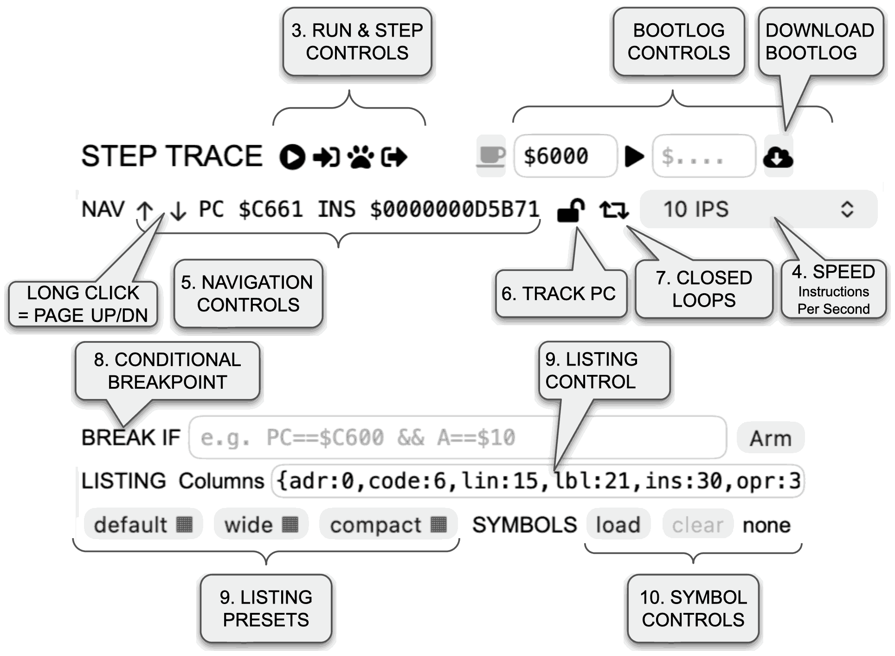
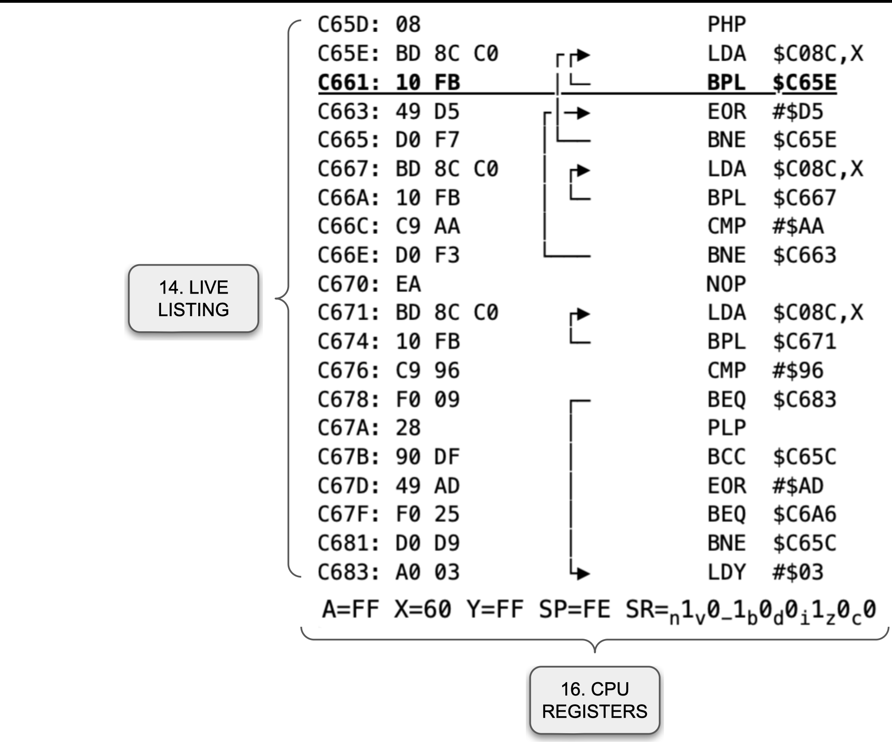

# RetroAppleJS STEP TRACE — Real-Time Debugger Manual

> STEP TRACE is the attached real-time debugger for the live Apple II runtime. This manual describes the current implementation: live CPU execution, mapped-bus disassembly, instruction-row navigation, PC tracking, the 48-bit instruction counter, Step In/Over/Out, conditional breakpoints, branch-line rendering, symbol loading, live CPU registers, peripheral-ROM visibility, boot logging, and optional closed-loop display suppression.

## 1. What STEP TRACE is

**STEP TRACE** debugs the *real* Apple II runtime CPU. It does not run a second CPU and it does not use a private copy of RAM.

When STEP TRACE runs or steps code, it uses the live `apple2plus` CPU together with the currently mapped memory, peripherals, video timing, interrupts, Disk II controller, and I/O. Consequently:

- self-modifying code is visible;
- language-card and ROM mappings are respected;
- peripheral ROM can be traced;
- conditional breakpoints stop on real instruction boundaries;
- Disk II and other devices continue receiving normal emulated CPU/I/O timing while debugger-controlled execution is active.

Debugger reads deliberately mask **`$C000-$C0FF`**, because that page contains Apple II soft switches and slot I/O rather than ordinary instruction memory. The peripheral and expansion ROM window **`$C100-$CFFF`** remains visible to STEP TRACE.

---

## 2. STEP TRACE window at a glance

The interface is approximately:





The exact visual appearance depends on browser and platform font rendering.

---

## 3. Run and step controls

| Control | Function | Keyboard |
|---|---|---|
| **Run / Pause / Breakpoint stop** | Starts or pauses CPU execution in the selected STEP TRACE speed mode. The same icon also indicates a conditional-breakpoint stop. | — |
| **Step In** (`fa-sign-in-alt`) | Executes one live instruction and refreshes the debugger. | **F11** |
| **Step Over** (`fa-paw`) | Steps over `JSR` and `BRK`; otherwise behaves like Step In. | **F10** |
| **Step Out** (`fa-sign-out-alt`) | Runs until the current routine returns, while tracking nested calls and interrupt nesting. | **Shift+F11** |
| **x** | Closes STEP TRACE and clears debugger-owned execution state. | — |

### Main execution pictogram

The first pictogram has three meaningful visual states:

| Pictogram | Meaning |
|---|---|
| `fa-play-circle` | ordinary idle/paused state |
| `fa-pause-circle` | continuous execution is running, **or** a manual Step In/Over/Out has just completed and the debugger is paused at the resulting boundary |
| `fa-parking` | execution stopped because the armed `BREAK IF` expression matched |

A successful breakpoint stop is therefore shown by the **parking** icon rather than by adding `BP IF` text to the NAV line.

### Step In

Step In executes exactly one live instruction. It is always shown literally, even when repeated-loop display is disabled.

### Step Over

For an ordinary instruction, Step Over is equivalent to Step In.

For `JSR` or `BRK`, STEP TRACE temporarily runs the live CPU until the matching return boundary is reached. For a `JSR`, the expected return PC and original stack pointer are used to distinguish the intended return from unrelated control flow.

### Step Out

Step Out follows live execution until the current routine returns. It separately tracks:

- nested `JSR` / `RTS` depth;
- interrupt or `BRK` entry / `RTI` depth.

This prevents an interrupt occurring during Step Out from being mistaken for the requested routine return.

---

## 4. Execution speed

The speed selector offers:

| Mode | Behaviour |
|---|---|
| **1 IPS** | approximately 1 instruction per second |
| **10 IPS** | approximately 10 instructions per second |
| **100 IPS** | debugger-controlled execution in small live batches |
| **1000 IPS** | debugger-controlled execution in larger live batches |
| **Max (SYSTEM)** | execution belongs to the normal emulator scheduler |

`IPS` means **instructions per second**.

The fixed 1/10/100/1000 IPS modes pause the normal SYSTEM CPU owner and execute the *same live CPU* through debugger-controlled instruction boundaries.

Current batching is:

- 1 IPS: 1 instruction per batch;
- 10 IPS: 1 instruction per batch;
- 100 IPS: 5 instructions per batch;
- 1000 IPS: 50 instructions per batch.

A batch can return early at a debugger-significant boundary, for example when:

- execution enters or leaves peripheral/expansion ROM;
- a hidden closed loop exits;
- an armed conditional breakpoint matches.

**Max (SYSTEM)** remains owned by the central emulator scheduler. STEP TRACE samples the running CPU for display, while the CPU's instruction-boundary breakpoint observer still operates at the CPU boundary itself.

---

## 5. NAV row: navigation, PC and instruction counter

The NAV row begins with:

```text
NAV  ↑  ↓   [PC $xxxx  INS $xxxxxxxxxxxx]
```

and is followed by the Track-PC icon, closed-loop-display icon, and speed selector. `PC` and `INS` are presented together in a **read-only input field**, so the live values can be selected and copied without making them editable. The NAV row is reserved for this copyable live CPU position; temporary run state and breakpoint diagnostics are shown beside `BREAK IF` instead.

### `↑` and `↓`

A **short press** moves the listing one decoded instruction row backward or forward.

A **press-and-hold for about 0.5 seconds** moves approximately one page.

Navigation is instruction-oriented, not byte-oriented.

Forward navigation follows each instruction's decoded length. Backward navigation first uses a previously proven predecessor boundary. If none is known, STEP TRACE tests possible 1-, 2-, and 3-byte 6502 predecessors and accepts the result only when exactly one candidate lands on the current address. If backward decoding is ambiguous, navigation stops instead of inventing an instruction alignment.

### `PC $xxxx`

`PC` is the live 16-bit program counter.

### `INS $xxxxxxxxxxxx`

`INS` is the CPU's **48-bit completed-opcode counter since reset**, displayed as 12 hexadecimal digits. For example:

```text
PC $C665  INS $0000000D5700
```

The counter is the same `ic` value exposed by `Cpu6502.watch()`. JavaScript can represent the complete 48-bit integer exactly.

At a clean instruction boundary, `INS` is the number of opcodes already completed. That makes the displayed value directly reusable in a breakpoint expression on a subsequent identical run:

```text
INS==$0000000D5700
```

The PC/INS read-only input remains live even when the listing viewport has been unlocked for manual browsing. Because it is a normal read-only input, either value—or the complete `PC … INS …` text—can be selected and copied.

---

## 6. Track PC

Track PC is controlled by a lock pictogram rather than a checkbox.

| Icon | Meaning |
|---|---|
| `<i class="fa fa-lock"></i>` | **Track PC enabled** — default |
| `<i class="fa fa-lock-open"></i>` | **Track PC disabled** — manual listing view |

When tracking is enabled, the listing follows the live PC.

When tracking is disabled, the listing remains at the manually selected code while the CPU may continue elsewhere. The live PC/INS indicator and CPU register row continue to update.

Manual navigation automatically unlocks the listing.

Keyboard controls:

- **F** — toggle Track PC;
- **Home** — enable Track PC and return the listing to the live execution area.

---

## 7. Closed-loop display control

The retweet pictogram controls whether repeated closed-loop execution is rendered:

```html
<i class="fa fa-retweet"></i>
```

It is **enabled by default**.

### Enabled

STEP TRACE shows normal execution updates, including instructions repeatedly executed inside a loop.

### Disabled

The CPU still executes **every instruction and every cycle**. Only the debugger display is suppressed for dynamically proven repeated loops.

The current logic works as follows:

1. execution proceeds normally;
2. STEP TRACE recognises a closed loop when live execution takes a backward relative branch or backward `JMP`;
3. after the loop is proven, repeated execution inside it is no longer rendered;
4. the listing, displayed PC/INS and register row remain visually frozen while the repeated loop is hidden;
5. when execution leaves the loop, STEP TRACE yields at the first live instruction boundary outside it and resumes normal display;
6. another later loop can be detected and hidden in the same way.

An arbitrary backward `RTS`, `RTI`, or return address is **not** treated as proof of a loop.

Nested `JSR` / `RTS` activity entered from inside a proven loop can remain part of the hidden iteration. An uncertain escape or interrupt ends suppression rather than risk hiding unrelated code.

### Limitation in Max (SYSTEM)

Exact closed-loop display suppression is implemented in debugger-owned execution paths:

- 1 IPS;
- 10 IPS;
- 100 IPS;
- 1000 IPS;
- cooperative Step Over;
- cooperative Step Out.

In **Max (SYSTEM)** mode, STEP TRACE receives scheduler samples rather than a display callback for every instruction, so exact loop-display suppression is not applied there.

---

## 8. Conditional breakpoint — `BREAK IF`

STEP TRACE has **one user-facing breakpoint mechanism**: `BREAK IF`.

There is no separate temporary address-breakpoint field and no separate `Run→` button. Address breakpoints are expressed naturally as conditions, and the normal Run/Pause control starts execution.

### Arm / Disarm model

Enter an expression and press **Arm once**. The same button changes to **Disarm**.

Arming does **not** start the CPU. Use the main Run/Pause control to continue execution.

If an armed expression is edited, STEP TRACE immediately disarms the old predicate. The button returns to **Arm**, and one click arms exactly the expression currently visible in the editor.

There is no `Rearm` state and there is no visible breakpoint `Clear` button.

After a condition matches, it is one-shot/disarmed. The expression remains in the editor and can be armed again with one click.

### Address breakpoint

Use `PC` directly:

```text
PC==$C65E
```

`PC` is 16-bit. `$665E` and `$C65E` are therefore different addresses; if the listing shows `C65E:`, use `PC==$C65E`.

### Break on the instruction counter

`INS` is the same 48-bit completed-opcode count shown in NAV:

```text
INS==$0000000D5700
```

The full 12-digit hexadecimal counter can be selected and copied directly from the NAV read-only PC/INS input.

It can be combined with other terms:

```text
PC==$C65E && INS>=$0000000D5700
```

An INS-only condition is evaluated at every clean instruction boundary while armed. If the expression also contains a safe exact `PC==constant` term in an AND-only path, STEP TRACE can use the PC as an internal gate and evaluate the full expression only at that address.

### More examples

```text
PC==$C600 && A==$10
INS==$0000000D5700
PC==$C65E && INS>=$0000000D5700
M[$4000]==$80 && Z
X!=0 && !C
```

When the condition is false, execution continues and the condition remains armed. When it becomes true, STEP TRACE stops at the clean instruction boundary **before the next opcode at that boundary is fetched or executed**. The main execution pictogram becomes `fa-parking`.

### Buttons and keyboard

| Control | Function |
|---|---|
| **Arm** | compile and arm the expression without starting execution |
| **Disarm** | remove the active condition while retaining editor text |
| **F9** | toggle Arm / Disarm |
| **Shift+F9** | explicitly disarm the condition |

A blank expression cannot be armed. Invalid expressions are rejected. A runtime evaluation error stops visibly rather than silently ignoring the condition.

### Supported registers and counter

```text
A X Y SP P PC INS
```

Identifiers are case-insensitive.

### Supported status flags

```text
N V B D I Z C
```

Each flag evaluates to `0` or `1`.

### Memory expressions

Mapped 8-bit memory:

```text
M[$4000]
M8[$4000]
MEM[$4000]
MEM8[$4000]
```

Mapped 16-bit little-endian memory:

```text
M16[$24]
MEM16[$24]
```

Memory expressions use the debugger's mapped safe-read path. `$C000-$C0FF` is rejected because that range is deliberately masked from debugger reads.

### Number formats

```text
$FF
0xFF
255
$0000000D5700
```

The first two are hexadecimal; an unprefixed numeric literal is decimal. The 12-digit hexadecimal form is useful for `INS`.

### Operators

Comparison:

```text
=  ==  !=  <  <=  >  >=
```

Bitwise:

```text
&  |  ^
```

Logical:

```text
&&  ||  !
```

Parentheses are supported and recommended when an expression mixes several operator classes.

**48-bit counter note:** JavaScript bitwise operators are 32-bit. Equality and relational comparisons on `INS` use the full exact 48-bit value, but `INS & ...`, `INS | ...`, or `INS ^ ...` operate only on the low 32 bits. Use comparison operators for full-width instruction-counter conditions.

### Run/status and error diagnostics

Transient run state and textual breakpoint diagnostics are displayed **between the BREAK IF input and the Arm/Disarm button**. The condition input is flexible, so it automatically becomes narrower while a status message is present and expands again when the status clears.

For example, Step Over/Out can temporarily show:

```text
BREAK IF  [condition........]  OVER→$1234  [Disarm]
BREAK IF  [condition........]  OUT J1 I0    [Disarm]
```

Breakpoint errors use the same status position:

```text
BAD COND
COND ERR
BP!
BP unavailable
```

A **successful** `BREAK IF` hit does not add `BP IF` text. It is indicated by the main **parking** pictogram (`fa-parking`).

The condition can stop fixed-IPS execution, Max/SYSTEM execution, Step Over, or Step Out because the observer is evaluated by the live CPU at instruction boundaries.

---

## 9. LISTING column control

The listing format is controlled by a compact column specification such as:

```text
{adr:0,code:6,lin:15,lbl:21,ins:30,opr:35,com:51}
```

Each value is the character position at which the field begins.

Supported fields:

| Field | Meaning |
|---|---|
| `adr` | 16-bit instruction address |
| `code` | opcode and operand bytes |
| `lin` | Unicode branch/jump guide lines |
| `lbl` | source label at this instruction address |
| `ins` | instruction mnemonic |
| `opr` | operand |
| `com` | loaded instruction comment |

A field can be omitted by leaving it out of the column specification.

### Presets

The **default**, **wide**, and **compact** buttons replace the current column definition with predefined layouts.

The compact preset removes some source/decorative fields so more assembly text fits in the small realtime window.

### Unicode branch lines — `lin`

STEP TRACE reuses the assembler's branch-line renderer.

The `lin` column can therefore contain Unicode guides such as:

```text
│ ─ ┌ └ ▶
```

Guides are generated for supported relative branches and `JMP` control flow. Overlapping branches are allocated separate guide lanes.

A complete guide is drawn only when the relevant source and destination can be represented within the current visible instruction window. If one endpoint is outside the visible window, a complete connection may not be shown.

The `lin` field owns the complete interval up to the next configured column so the rightmost `▶` arrowhead is not intentionally cropped.

---

## 10. SYMBOLS controls

The SYMBOLS row contains:

```text
SYMBOLS  [load] [clear]  <status>
```

The `clear` here belongs to **symbol-table management**; it is unrelated to `BREAK IF`.

### `load`

Loads a symbol file for the realtime listing.

Preferred format:

```text
RetroAppleJS-ASM-symbols JSON
```

The loader recognises:

- `label` records;
- `equ` / symbol records;
- instruction comments.

The chooser accepts `.json`, `.symbols.json`, `.sym`, and `.txt`.

### `clear`

Removes the externally loaded symbol table and refreshes the listing.

### Status

Examples:

```text
none
307 sym / 453 com
error
```

The tooltip provides file name and more detailed counts.

---

## 11. Boot-log controls

The right side of the top row contains boot-log controls.

### Coffee icon

The coffee icon enables or disables boot logging.

Its opacity and tooltip indicate states such as:

```text
disabled
armed
logging
buffer full
complete
```

---

## 12. What loaded symbols affect

### `lbl`

A label whose address exactly matches an instruction appears in the `lbl` column.

### `opr`

Loaded labels and EQU symbols can replace numeric operands in applicable addressing modes.

For example:

```text
LDA $C08C,X
```

can become symbol-aware when `$C08C` has a known symbol.

Operand lookup can also use the assembler's currently available symbol mapping when present.

### `com`

Instruction comments from an exported symbol file can populate the `com` field.

When an exported comment includes opcode bytes, STEP TRACE checks those bytes against the currently mapped live memory before showing the comment. This prevents stale source comments from remaining attached after self-modifying code changes an instruction.

---

## 13. Simple text symbol maps

Besides the canonical assembler JSON export, STEP TRACE accepts simple text maps such as:

```text
START=$0800
LOOP EQU $0812
$C600 DISK_BOOT
RESET $FFFC
```

Text maps primarily provide names and addresses. Use the canonical JSON export when labels, EQU symbols, and source comments all need to be retained.

---

## 14. Live listing interaction

### Current instruction

The row corresponding to the current PC is emphasised.

### Mouse

- **mouse wheel** — move one instruction row;
- **Shift + wheel** — move approximately one page.

### Touch

Vertical dragging over the listing navigates by decoded instruction rows.

### Manual browsing

Manual navigation disables Track PC. The viewport stays at the selected code while the live CPU may continue elsewhere.

The bytes in a manually parked view remain live and mapped-memory aware. Self-modifying code or a mapping change can therefore alter the displayed instruction without forcing the viewport back to the PC.

---

## 15. Keyboard shortcuts

| Key | Action |
|---|---|
| **↑** | previous instruction row |
| **↓** | next instruction row |
| **Page Up** | previous page |
| **Page Down** | next page |
| **Home** | re-enable Track PC and return to live execution |
| **F** | toggle Track PC |
| **F9** | toggle BREAK IF Arm / Disarm |
| **Shift+F9** | explicitly disarm BREAK IF |
| **F10** | Step Over |
| **F11** | Step In |
| **Shift+F11** | Step Out |

The listing receives these keyboard commands after it has focus. Clicking or tapping the listing gives it focus.

---

## 16. CPU register display

Below the listing, STEP TRACE shows the current processor registers:

```text
A=01 X=01 Y=00 SP=FF SR=ₙ0ᵥ0₋1ᵦ0_d0ᵢ1_z0_c0
```

Displayed values:

- accumulator `A`;
- index register `X`;
- index register `Y`;
- stack pointer `SP`;
- status register `SR`.

`PC` is deliberately omitted because it is already displayed in the NAV row. `INS` is likewise displayed in NAV rather than duplicated in the register row.

### Status-register flags

The status display follows 6502 flag order:

```text
N V - B D I Z C
```

where:

- `N` — Negative;
- `V` — Overflow;
- `-` — reserved/unused bit representation;
- `B` — Break;
- `D` — Decimal;
- `I` — Interrupt Disable;
- `Z` — Zero;
- `C` — Carry.

Each flag is followed by its current bit value.

The register row is refreshed from the live CPU state even if the PC itself has not changed.

---

### Start address

The first `$....` field sets an optional start address.

- blank: logging can begin immediately;
- address: logging waits until execution reaches that address.

### Stop address

The second `$....` field sets an optional stop address.

- blank: continue until the boot-log buffer is full;
- address: stop before execution reaches that address.

### Download icon

Downloads the current boot log as a text file, using a generated timestamped file name such as:

```text
apple2_bootlog_2026-09-12T18-30-00-000Z.txt
```

---

## 17. Peripheral ROM tracing

STEP TRACE disassembles through the currently mapped CPU bus.

Debugger-visible address areas include:

```text
$0000-$BFFF
$C100-$CFFF
$D000-$FFFF
```

The intentionally masked range is:

```text
$C000-$C0FF
```

because it is the motherboard/slot soft-switch and I/O page.

Code in slot ROM and expansion ROM is therefore traceable. For example, Disk II firmware execution can appear in the realtime listing when that ROM is mapped into the CPU's slot-ROM window.

At fixed 1/10/100/1000 IPS speeds, high-speed batches yield when execution crosses into or out of `$C100-$CFFF`. This prevents a short ROM excursion from disappearing entirely inside a 5- or 50-instruction display batch.

In **Max (SYSTEM)** mode, the mapped ROM is still readable, but a very short excursion can occur between two display samples.

---

## 18. Self-modifying code and memory remapping

The live disassembler maintains a 64K address-indexed decode cache, but each cached instruction is validated against the bytes currently visible on the mapped CPU bus.

If an instruction changes:

- the stale decode is discarded;
- a predecessor relationship based on the old instruction length is invalidated;
- the instruction is redisassembled from the new bytes.

This supports:

- self-modifying RAM;
- language-card mapping changes;
- ROM/expansion mapping changes;
- code copied or patched at runtime.

STEP TRACE therefore does not depend on a static memory dump.

---

## 19. Instruction-boundary model

The realtime debugger treats the live CPU's current PC as a trusted instruction boundary.

Forward decoding is deterministic.

Backward decoding is inherently ambiguous on the 6502 because instructions have variable lengths. STEP TRACE therefore uses a conservative rule:

1. use a predecessor boundary learned from actual sequential execution when available;
2. otherwise test possible 1-, 2-, and 3-byte predecessors;
3. accept the result only when exactly one candidate ends at the current address.

Upward manual navigation can therefore stop even though lower addresses exist. That is intentional: stopping is safer than silently switching to a false instruction alignment.

---

## 20. Conditional-breakpoint semantics in detail

An armed `BREAK IF` predicate is checked only at a **clean instruction boundary**: the previous opcode has completed (`cycle_delay == 0`) and the next opcode has not yet been fetched.

### PC gating

When an AND-only expression contains an exact `PC==constant` term, STEP TRACE can use that address as an internal gate.

For example:

```text
PC==$C65E && A==$10
```

uses `$C65E` as the gate; the complete expression is evaluated only when that PC is reached.

The same applies to combinations such as:

```text
PC==$C65E && INS>=$0000000D5700
```

### Persistent conditions

A condition without a safe PC equality remains a persistent CPU-boundary condition and is evaluated at every clean instruction boundary while armed. Examples include:

```text
INS==$0000000D5700
M[$4000]==$80
X==0 && Z
```

### Hit behaviour

For each relevant boundary:

1. STEP TRACE evaluates the expression against live CPU state and mapped safe-read memory;
2. a false result leaves the condition armed and execution continues;
3. a true result stops the active execution owner without consuming the target opcode;
4. the breakpoint becomes disarmed/one-shot after the hit;
5. the Run/Pause control changes to the parking icon.

The conditional observer is separate from the CPU's numeric execution trap used by other subsystems, so setting or clearing one cannot silently remove the other.

When BREAK IF is not armed, there is no active per-boundary breakpoint predicate from STEP TRACE.

---

## 21. Track PC versus manual view

Track PC controls the **listing viewport**, not CPU execution.

### Locked

```html
<i class="fa fa-lock"></i>
```

The listing follows the executing PC.

### Unlocked

```html
<i class="fa fa-lock-open"></i>
```

The listing remains where the user browses manually.

Meanwhile:

- the CPU can continue running;
- `PC $xxxx  INS $xxxxxxxxxxxx` remains live;
- the register row remains live;
- manually viewed bytes remain mapped-memory aware.

---

## 22. Suggested debugging workflows

### Inspect a routine instruction by instruction

1. choose **1 IPS** or pause execution;
2. keep Track PC locked;
3. use **F11** for Step In;
4. use **F10** for calls you do not want to enter;
5. use **Shift+F11** to leave the current routine.

### Let a delay loop finish without watching every iteration

1. choose a fixed IPS mode;
2. click the retweet icon to disable repeated-loop display;
3. continue with the main Run control;
4. the CPU still executes every loop instruction;
5. STEP TRACE resumes visual updates at the loop exit.

### Break at an address

```text
PC==$C600
```

Press **Arm**, then use the main Run/Pause control.

### Break at an address only when a register has a value

```text
PC==$C600 && A==$10
```

Press **Arm**, then Run.

### Break at an exact instruction count

Select and copy the displayed NAV counter from the read-only PC/INS input, for example:

```text
INS $0000000D5700
```

and enter:

```text
INS==$0000000D5700
```

Press **Arm**, then Run. On an identical execution path, STEP TRACE stops at the clean boundary represented by that instruction count.

### Break no earlier than an instruction count, at a specific PC

```text
PC==$C65E && INS>=$0000000D5700
```

This uses the PC gate and the full 48-bit counter comparison together.

### Break when memory reaches a value

```text
M[$4000]==$80
```

This remains armed and is evaluated at every clean instruction boundary until it becomes true.

### Trace Disk II ROM

1. choose a fixed speed such as 100 or 1000 IPS;
2. keep Track PC enabled;
3. execute a DOS operation that enters Disk II firmware;
4. STEP TRACE yields at peripheral-ROM transitions so the ROM excursion becomes visible.

### Use source labels in the live trace

1. export symbols from the assembler;
2. select **SYMBOLS → load**;
3. choose the `.symbols.json` file;
4. use a listing layout containing `lbl`, `opr`, and optionally `com`.

---

## 23. Diagnostics available to developers

`Apple2Debug.liveState()` exposes debugger state including:

```text
pc
runMode
running
systemRunning
resumePct
followPC
showLoopSteps
closedLoop
loopDisplayStats
viewTop
mappedBus
traceMaskedRange
tracePeripheralROM
pcInPeripheralROM
liveStepAPI
boundaryAction
conditionalBreakpoint
symbols
cacheHits
cacheMisses
domWrites
```

The `conditionalBreakpoint` diagnostic object contains:

```text
armed
hit
hits
checks
skips
condition
mode
address
editorCondition
lastResult
error
```

`mode` is `address` when a safe PC gate was extracted and `condition` for a persistent condition. `address` contains the gated PC or `null`.

The CPU instruction counter itself is available as `Cpu6502.watch().ic` and is displayed to the user as `INS`.

Loop-display statistics include:

```text
detected
hiddenInstructions
exits
```

These diagnostics are intended mainly for development and validation.

---

## 24. Current behavioural limits and deliberate safeguards

A few behaviours are intentionally conservative:

- `$C000-$C0FF` is masked from debugger reads so disassembly and breakpoint memory expressions do not probe soft-switch I/O.
- Exact peripheral-ROM transition rendering is guaranteed in debugger-owned fixed IPS modes; Max (SYSTEM) remains display-sampled.
- Exact closed-loop display suppression is a fixed-IPS / cooperative Over-Out feature, not a per-instruction display hook in Max (SYSTEM).
- Branch guides depend on the current visible listing window; a destination outside it may not receive a complete Unicode guide.
- Backward disassembly stops on unresolved ambiguity instead of inventing an instruction boundary.
- Source comments imported with opcode signatures disappear when the live bytes no longer match.
- Full-width `INS` comparisons are exact, but JavaScript bitwise operators are 32-bit; do not use bitwise operators to test the upper 16 bits of the 48-bit instruction counter.

These choices favour correctness of the live machine over making the debugger display appear artificially continuous.

---

## 25. Quick-reference card

| Control / gesture | Result |
|---|---|
| `fa-play-circle` | ordinary idle/paused state; click to run |
| `fa-pause-circle` | running, or paused immediately after manual Step In/Over/Out |
| `fa-parking` | stopped because BREAK IF matched |
| Step icon / F11 | Step In |
| Paw icon / F10 | Step Over |
| Exit icon / Shift+F11 | Step Out |
| `↑` / `↓` short press | previous / next instruction |
| `↑` / `↓` hold ~0.5 s | previous / next page |
| Mouse wheel | navigate one instruction row |
| Shift + wheel | navigate a page |
| Home | return to Track PC |
| F | toggle Track PC |
| `fa-lock` | Track PC enabled |
| `fa-lock-open` | Track PC disabled |
| `fa-retweet` bright | show repeated closed-loop steps |
| `fa-retweet` dim | hide repeated closed-loop display; CPU still executes it |
| read-only `PC $xxxx  INS $xxxxxxxxxxxx` input | live copyable CPU position/counter text |
| `PC $xxxx` | live 16-bit program counter |
| `INS $xxxxxxxxxxxx` | live 48-bit completed-opcode counter |
| BREAK IF status slot | transient Over/Out state and breakpoint diagnostics, between the expression and Arm/Disarm |
| BREAK IF | conditional breakpoint expression |
| Arm / F9 | arm the expression |
| Disarm / F9 | disarm the active expression |
| Shift+F9 | explicitly disarm BREAK IF |
| Main Run/Pause | start execution after arming, or pause execution |
| 1/10/100/1000 IPS | debugger-controlled live execution |
| Max (SYSTEM) | normal emulator scheduler |
| default/wide/compact | listing-column presets |
| SYMBOLS load | load labels/EQU/comments |
| SYMBOLS clear | remove loaded symbol table |
| Coffee icon | enable/disable boot log |
| Cloud-download icon | download boot log |
| x | close STEP TRACE |

---

## 26. Summary

STEP TRACE is a **live-system debugger**, not a detached disassembler.

Its central rules are:

- execute the real CPU;
- keep peripherals and timing alive;
- read the currently mapped bus;
- stop only on real instruction boundaries;
- expose both the live PC and an exact 48-bit completed-instruction counter;
- use one conditional breakpoint mechanism for address, register, flag, memory, and instruction-count conditions;
- avoid guessing backward instruction alignment;
- allow the user to follow execution or browse manually;
- preserve source-level conveniences such as symbols, comments, and branch lines without compromising live-memory correctness;
- make high-frequency loops easier to debug by optionally suppressing their *display*, never their execution.
