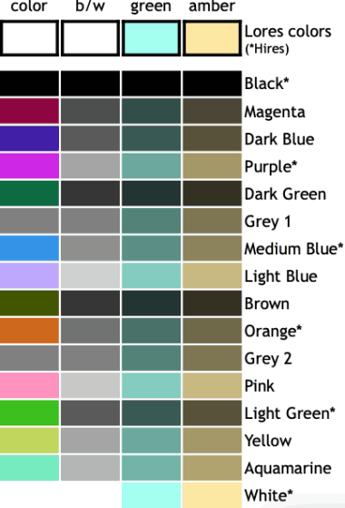
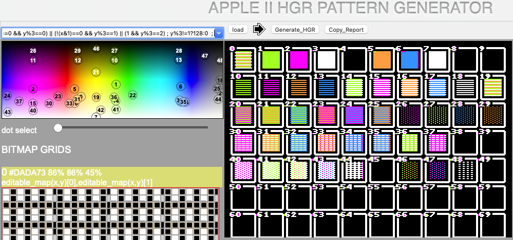
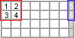
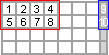
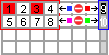
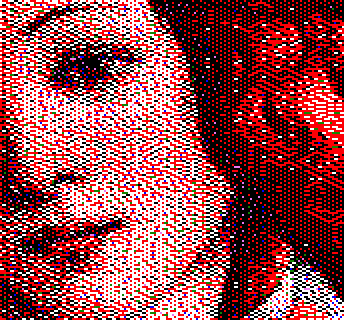
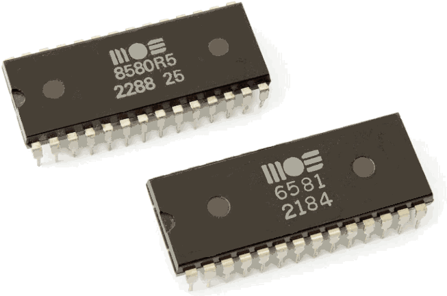

## TOOLS Explained

In the [tools folder](../tools), we keep a collection of helpers to simulate, better understand or automate processes supporting the development of the IDE.  Every tool is designed to run in the browser, just like the IDE, using HTML/CSS/JavaScript.

### ConfigFile_updater.html

This tool gathers all configuration information and documentation, and packs all data together in one config file.

We aim to have all the documentation available in markdown format, for easy online access and editing in GitHub.  This tool is designed to read all the markdown documentation available online (from GitHub) in this project, and compile a JavaScript include file that would provide a perfect copy of all the available documentation and configuration options inside the IDE.  The following diagram shows how clearly the steps:

* Fetch Readme.me file from GitHub
* extract all \*.md file links located in /docs
* fetch all listed .md files
* convert each to HTML and append to JavaScript file
* preview
* download the JavaScript file
* overwite file in /res folder.

        

        ┌──────────┐          ┌────┐ ┌───────────┐       ┌──────────────────┐
        │Readme.md │          │*.md│ │Showdown.js│       │ COM_markdown.css │
        └────┬─────┘          └─┬──┘ └─────┬─────┘       └────────┬─────────┘
             │XmlHttp()         |XmlHttp() │include               |include
        ┌────┴─────────┐     ┌──┴──────────┴─────┐       ┌────────┴─────────┐     ┌────────────────────┐
        │Extract *.md  │     │Read next .md file,│       | Preview/test HTML|     | Download JS file   |
        │links located ├─────┤convert to HTML &  ├───┐───┤ generated by     ├─────┤ COM_CONFIG.js      |
        │in /docs      │  ▲  │append to JS file  |   │   | JavaScript file  |     |(overwrite in /res) |
        └──────────────┘  │  └───────────────────┘   │   └──────────────────┘     └────────────────────┘
                          │    loop until done       │
                          └──────────────────────────┘
        

/<ins> **!** </ins>\ mind that this tool only captures the latest version of the markdown files 2-10 min after the last edits.  This must be the time GitHub requires to update the raw files on the server.

### Monitor_palette.html

Color graphics on the Apple II rendered only 4 distinct colors in high-resolution (green, orange, violet, blue) as a result of a cheap but smart piece of discrete logic.  Surely, owners of monochrome green or amber monitors sometimes longed for some color, but the blurry and color-bleeding TV screen rendering was more like a gimmick compared to the razor-sharp image produced by a genuine monochrome apple monitor.

The emulator's display offers an easy switching capability to render color, black&white, green and amber as some graphics really look nicer in color or monochrome.  e.g. fonts rendered on a hires screen produce very disturbing color fringing artifacts, which make the letters unreadable in color mode; any monochrome setting is more appropriate in this case. 

This tool was made to test and assure the best image rendering approximation with these respective monitors.
It produces a Javascript snippet that seamlessly maps the Apple II colors to the different monochrome versions.  This snippet is located in [EMU_apple2video.js](..f/res/EMU_apple2video.js).

### Tab_ctrl_v*.html

This is a fully client-side tab controller that remembers the last clicked tab after a page reload, based on the URI fragment identifier.  e.g. www.example.com/index.html#tab1
Subsequent versions of this tab control show increasingly interesting capabilities and design options.

|         | pop-out menu | sub- menu | anima- tion |
|:-------:|:------------:|:---------:|:-------------:|
| v0      | -            | -         | -            |
| v1      | YES          | -         | -            |
| v2      | YES          | YES       | -            |
| v3      | -            |           | YES          |

### HGRpatternJS.html

[This tool](https://retroapplejs.github.io/tools/HGRpatternJS.html) is designed to find a color encoding strategy to tackle the typical challenges with Apple II HGR graphics. 

Major challenges to picture quality are:

- extreme color limitations (4 true colors + black and white)
- a high-bit color switch ruling over an entire byte
- convolutional color encoding
- low pixel resolution (at today's standards)

Classic dithering algorithms as we know, simply can't cope well with all the weird stuff that happens on pixel level in an Apple II.  Trying dissociate a **color-encoding layer** and a **pattern encoding  layer** is challenging, both are seriously messed-up.  Most dithering patterns become colors, and generic color dithering algorithms can't handle anamorphous color pallettes.  While  black-and-White dithering can be achieved by means of a simple trick, **any color dithering algorithm known so far, regular or error-diffusion-based, need to be re-invented**.

Please check this [small app](https://retroapplejs.github.io/tools/HGRpatternJS.html), especially designed to examine achievable colors for regular dithering by generating any imaginable bit pattern. Small patches or blocks of pixels, will reveal interesting features in both layers.  Since the color encoding layer has a size of 2x1 bits (wxh), in a full resolution of 280x192, e.g. rendering 4 colors + black and white brings us already down to a color resolution of only 140x192.

Block size 2x2 bits

Block size 4x2 bits

The pattern encoding layer can only bare multiples of the color encoding block size, bringing us to a minimal size of 2x2 bits (wxh), and the next being 4x2 bits (wxh).  In the next figure, we identify color encoding conflicts.

Color conflics at block size 2x2 bits

Color conflics at block size 4x2 bits

Note the high-bit on the right side, turned on or off generates different color conflicts.  According to classic dithering practice, these conflicts should be resolved by any means to keep a minimal color deviation.

The amount of combinations one can get is quite decent, but this testing tool proves that some bit pattern combinations render exactly the same average color.  In theory, these repetitions could be removed, but we have to check other aspects before doing so.  In practice, we have to deal with color encoding conflics that can occur on byte-level.  We still have 7 visible bits per byte ammended by one inivisible high-bit.  Situations where a high-bit selector should be =1 in the lower nibble and =0 for the higher nibble, these can be resolved by picking an alternate dithering pattern in the lower nibble or the higher nibble to resolve the conflict.  We can additionally reduce the statistical chance for such conflicts by chosing for the larger block size.

In our conclusion, we are putting together color resolution, color conflict sensitivity and color range :
* color block size 2x1 bits (wxh)
   * color resolution = 140x96
   * no color conflics - by ruling out conflictual pattern blocks
   * bit combinations = 2 ^ (2 visible bits + 1 high bit) = 8
   * net usable color range - 4 distinct colors + black and white
* pattern block size 2x2 bits (wxh)
   * color resolution = 140x96
   * 3 possible high-bit color conflicts between pattern blocks in the same byte
   * statistical chance for color conflics = (5/7-2/7)/2 = 0.714 - 0.286 / 2 = 21 %
   * bit combinations = 2 ^ (4 visible bits + 2 high bits) = 64
   * net usable color range - 19 distinct colors + black and white
* pattern block size 4x2 bits (wxh)
   * color resolution = 70x96
   * 1 possible high-bit color conflict between pattern blocks in the same byte
   * statistical chance for color conflics = (3/7-4/7)/2 = 0.429 - 0.571 / 2 = 14 %
   * bit combinations = 2 ^ (8 visible bits + 2 high biths) = 1024
   * net usable color range - ? distinct colors + black and white
* mixed mode block size 2x2 and 4x4 bits (wxh)
   * average color resolution = 105x95
   * 3 possible high-bit color conflicts between pattern blocks in the same byte
   * statistical change for color conflicts = (21%+14%)/2 = 17.5%
   * bit combinations = 2 ^ (8 vsible bits + 2 high bits) = 1024
   * net usable color range - ? distinct colors + black and white

#### Pattern selector

Patterns are generated by a two formulas, the first reporting true (bit=1) or false (bit=0) on the visible bits 0-7 and another formula reporting 0 or 127 for the invisible bit 7.  The pattern selector has a double function: selected patterns can be edited and loaded into the first bitmap grid (left pane) and by means of the Generate_HGR button also visualised in the first location of the pattern grid (right pane).

| bit7 | bit6 | bit5 | bit4 | bit3 | bit2 | bit1 | bit0 |
|:----:|:----:|:----:|:----:|:---:|:---:|:---:|----:|
| high bit | even | odd | even | odd | even | odd | even |

#### Color gamut

* switch: 0 selects a pallette of green and violet, and 1 selects a pallet of orange and blue for all 7 visible pixels in bits 0-6
* convolutional logic

| <<left | even bit | right>> | | <<left | odd bit | right>> |
|:----:|:----:|:----:|:----:|:----:|:----:|:----:|
| 1 | 0 | 1 || 1 | 0 | 1 |
|   | 0 |  || 1 | 0 | 1 |

### ConverHGR.html

This handy tool converts the most common image file types to an Apple II HGR color bitmaps.  Dithering achieves a way to convert images from high color-depths to lower depths, but Apple II graphics require a special twist to gracefully overcome inherent 'Wozniackian' artifacts explained in *PatternHGR.html*.   Buttons and tuning sliders will help you model the most acceptable conversion.  For developers, the challenge will be to optimize conversion quality and speed, as this very algorithm will serve inside the webcam capture tool.

TODO: flow diagram

### Camera_capture.html

### SID_emulator.html

While emulating AppleII sound is not working out, let's put to work a crazy idea of emulating a C64-style SID chip that could bring us closer to emulating a peripheral that actually did exist for the Apple II: the [Mockingboard](https://en.wikipedia.org/wiki/Mockingboard) sound card. The Mochinboard used the AY-3-8910, a 3-voice sound chip found in the popular MSX, and later ZX Spectrum home computers.  As we speak, I am evaluating [a closer match to emulating the AY-3-8910 with JavaScript](https://github.com/alexanderk23/ayumi-js), as this could bring us to real software and a few games on the Apple II that made full use of the mockingboards capabilities.
