# VIDEX VIDEOTERM - Installation and Operation Manual

**Authors:** Curtis White; Darrell Aldrich  
**Edition:** Third Edition, January 1982  
**Document number:** 001053 VT-MAN-OOO

First Printing: March, 1 980
Second Printing: August, 1 980
Third Printing: January, 1 982
Published by:
VIDEX
897 N.W. Grant Ave.
Corvallis, Oregon 97330
Phone:L503] 758-0521
All rights reserved. No part of this publication may be reproduced
without prior written permission of VIDEX. Please call for more
information.
Copyright © 1980 by VIDEX.
Apple ][® Apple Compter, Inc.
Micromodem ][® D.C. Hayes Associate, Inc.
ROMWriter® Mountain Hardware, Inc.
EasyWriter® Information Unlimited Software, Inc.
Softcard® Microsoft
Apple PlE® Programma International, Inc.
Video 100 is a product of Leedex Corporation
Videx is a trademark of Videx, Inc.


---

<!-- Source PDF page 4; manual page iii -->

# TABLE OF CONTENTS

Disclaimer........................................................................vii
Warranty.........................................................................Viii

# OVERVIEW

Introduction......................................................................1-1
Physical Description........................................................1-3
VIDEOTERM Features....................................................1-6
Apple][ Hardware Peprequisites and Options................1-10

# INSTALLATION AND CHECKOUT

How to Install the VIDEOTERM Board............................ 2-1
Installation Checklist .....................................................2-8
Checkout..........................................................................2-9
How to Verify Correct Performance............................ 2-9
Video Monitor Adjustment........................................... 2-13
Fault Diagnosis..........................................................2-16

# OPERATION

Using the VIDEOTERM Board....................................... 3-1
VIDEOTERM Initialization............................................... 3-3
Upper and Lower Case.................................................. 3-5
Special Key Operation....................................................3-6

# SOFTWARE

Apple Language Interactions...........................................4-1
Assembly Language. ...............................................4-1
Integer Basic.............................................................4-2
Applesoft..................................................................4-3
Pascal.......................................................................4-4
Language Considerations in General..............................4-7
Software Examples.........................................................4-9
Assembly Language.................................................4-9
Integer Basic.............................................................4-13
Applesoft..................................................................4-22
Pascal ..........................................................................4-28
Using VIDEOTERM with Other Software.......................4-30
EasyWriter . ..................................................................4-30
Apple PIE . . ...................................................................4-3D
Others..........................................................................4-3D
Interfacing with Other Peripherals...................................4-31
Softcard........................................................................4-31
D.C. Hayes Micromodem][.......................................4-31
Creating New Character Sets........................................4-35
Text..........................................................................4-35
Graphics...................................................................4-37


---

<!-- Source PDF page 5; manual page iv -->

# FIRMWARE

Firmware Control of the VIDEOTERM Board.................5-1
CRTC Internal Register Use...................................5-2
How to Modify CRTC Registers.............................5-8
Device Select Operation.........................................5-9
Video Set-Up Flags.................................................5-10
VIDEOTERM Memory Mapping....................................5-12
VIDEX VIDEOTERM Firmware Listing...........................5-15

# HARDWARE OPERATION

Theory of Operation.......................................................6-1
Shift Wire Mod................................................................6-4
The Soft Video Switch...................................................6-5

# APPENDIX

ASCII Character Code Chart........................................A-1
Owners Notes...............................................................A-2
Technical Summary........................................................A-3


---

<!-- Source PDF page 6; manual page v -->

PROGRAM LISTINGS
Program Listing 1...........................................................4-6
Program Listing 2...........................................................4-10
Program Listing 3...........................................................4-15
Program Listing 4...........................................................4-18
Program Listing 5...........................................................4-23
Program Listing 6...........................................................4-26
Program Listing 7...........................................................4-29
FIGURES AND ILLUSTRATIONS
Fig. 1: Board Installed in System: Interior View..........2-2
Fig. 2: VIDEX Switchplate Assembly Mating
with VIDEOTERM Board.................................2-4
Fig. 3: Board Installed in System: Exterior View.........2-6
Fig. 4: insertion of Character Set EPROM into
the VIDEOTERM Board..................................4-35
Fig. 5: Line Drawing Character Set Keyboard
Correspondence.............................................4-38
Fig. 6: Alternate Character Sets.................................4-39
Fig. 7: Standard Character Set..................................4-44
Fig. 8: Blank Forms for Future Character Sets...........4-52
Fig. 9: VIDEOTERM Soldering Points ......................6-7
Fig. 1 0: VIDEOTERM Board Photograph...................A-4
Fig. 11: Schematic Diagram of VIDEOTERM Board...Endsheet
TABLES
Table 1:VIDEOTERM Use of Apple ][ RAM..................3-2
Table 2: VIDEOTERM Control parameters ...................3-4
Table 3: Address Definitions by Language ...................4-8
Table 4: CRTC Register Assignments...........................5-7


---

<!-- Source PDF page 7; manual page vii -->

Notice:
Videx, Inc. reserves the right to make improvements or
changes in the product described in this manual at any time
without notice.
Disclaimer of All Warranties and Liability:
Videx, Inc. makes no warranties neither express nor implied
except as explicitly set forth in the Limited Warranty below, with
respect to this manual nor with respect to the product described
in this manual, its quality, performance, merchantability or
fitness for any purpose. Videx, Inc. software is sold or licensed
“as is”. The entire risk as to its quality and performance is with
the buyer. Should the programs prove defective following their
purchase, the buyer [and not Videx, Inc., its distributors, or its
retailers] assumes the entire cost of all necessary servicing,
repair, or correction and any incidental or consequential
damages. In no event will Videx, Inc. be liable for direct, indirect,
incidental, or consequential damages resulting from any defect in
the hardware/software, even if Videx, Inc. has been advised of
the possibility of such damages. Some states do not allow the ex-
clusion or limitation of implied warranties or liabilitly for incidental
or consequential damages, so the above limitation or exclusion
may not apply to you.


---

<!-- Source PDF page 8; manual page viii -->

Limited Warranty:
Videx, Inc. warrants this product to be free from defects in
material and workmanship for a period of ninety (90] days from
the date of original purchase Videx Inc. agrees to repair or, at
our option, replace any defective unit without charge Videx, Inc.
assumes no responsibility for any special or consequential
damages. No other warranty neither express nor implied, is
authorized by Videx, Inc. Some states do not allow the exclusion
or limitation of implied warranties or liability for incidental or con-
sequential damages so the above limitation or exclusion may not
apply to you.
Please return the registration card in order that VIDEX can
notify you of new products VIDEOTERM updates and new soft-
ware.
Mail to: VIDEX
897 NW. Grant Ave.
Corvallis OR 97330


---

<!-- Source PDF page 9; manual page ix -->

# Errata

\********************************************************************************************************
* *
* *
* IMPORTANT NOTICE: THE VIDEOTERM MUST NOW BE PLACED only IN SLOT 3. *
* *
* *
\*********************************************************************************************************
Since this manual was published, some changes have been made in the
Videoterm and other products. The Soft Video Switch an automatic version of
the Switchplate, was introduced. We generally recommend use of the Soft Video
Switch over the switchplate, however the two may be used together. A new
release of firmware, Firmware 2.4, has been included on your Videoterm. Here
are some of the features which have been added to your Videoterm by the new
firmware:
* The popular Escape I,J,K H cursor movement commands
* Pascal Card Type 6 protocol (eliminating the need for the
program Vidpatch, found on page 4—27)
* The Monitor /// is supported (a CRT from Apple Computer)
* The Soft Video Switch is supported (page 6—5)
* The Shift Wire Mod is supported (page 6—4)
* CP/M’s inverse/normal protocol (CNTL—O/CNTL—N)
* Interrupts are handled properly
* 20% faster output
There are two features documented in this manual which have been removed:
* The 80 characters by 18 line format (used by the 7 x 12 character
font)
* slot independence (the Videoterm MUST be placed in Slot 3)
More new products for your Videoterm include an 80 column VisiCalc
Pre—Boot Disc, an AppleWriter ( Pre—Boot Disc and a Videoterm Utilities Disc.


---

<!-- Source PDF page 10; manual page 1—1 -->

# OVERVIEW

## Introduction

The new Apple II peripheral that you have just
purchased combines the features of an asynchronous
serial interface card with the “guts” of a high
speed terminal to transform your current black and
white video monitor into a full feature intelligent
video display terminal. When properly adjusted, the
interface card clearly displays upper and lower case
characters using a 7 by 9 character dot matrix size
(the full matrix is actuall 9 by 9). An optional 7
by 12 matrix size (full size is 9 by 12) is also
available. You may select for 18 or 24 lines each
containing 80 characters. Special characters may be
defined by the user and preprogrammed EPROM chips
are available that offer various character fonts.
These capabilities are available under both the
Pascal operating system and both Basic languages
that Apple Computer, Inc., supplies.
All of these features are included on one
printed circuit (PC) board, the size of the
Applesoft or Language board, utilizing only 24
integrated circuits. The use of CMOS and low power
electronic components reduces the Dower draw needed
for the board to properly function and virtually
eliminates power conflicts with other expansion
cards. An on—board clock circuit regulates video
signal timing, providing the user with a clear,
flicker—free video image.
The firmware used with the VIDEOTERM board is
fairly transparent to standard Apple II and Apple
II—compatible software. The call addresses for
various hoard functions are fully documented,
allowing you to interface your software directly
with the display software if you desire. Specific
software interface information for the D. C. Hayes


---

<!-- Source PDF page 11; manual page 1—2 -->

Micromodem II (requires an EPROM replacement
firmware chip available from VIDEX), the ROMWriter
by Mountain Hardware, EasyWriter by Information
Unlimited Software and the Microsoft Softcard is
included. A variety of other software application
examples are included, along with specifics on Apple
Basic interaction with the VIDEOTERM.
The remainder of this Overview chapter is
devoted to a description of the physical appearance
of the VIDEOTERM board, a full description of all
features of the board and the necessary Apple II
system prerequisites for its proper functioning.
It is best to close with a word of advice
concerning your new purchase. Treat it well and
with respect as the quality instrument that it is
and it will reward you with years of service,
probably lasting through the life of your Apple II
system. If any difficulty with the unit arises, you
should contact the store where you purchased the
VIDEOTERM. They should be able to determine if the
fault lies with the VIDEOTERM or if your video
monitor is incorrectly adjusted. If they cannot
help you, please feel free to contact VIDEX directly
so that the problem may be quickly corrected.


---

<!-- Source PDF page 12; manual page 1—3 -->

## Physical Description

As you can see when you hold the VIDEOTERM
board in your hand, the hoard is small, compact and
relatively uncluttered with electronic components.
The implementation of the interface design is quite
economic, both in terms of initial purchase price
and by minimizing the number of parts which may
fail. The board measures only 7.25 by 2.75 inches,
about the same size as the Applesoft Basic firmware
card or the Language card.
As you look at the component side of the board,
you will notice a small crystal can on the
right—hand side of the board, possibly with the
label ‘Crystek’. This is the on—board crystal clock
which, with the rest of the clock logic circuit,
ensures flicker—free display characters on your
monitor. The clock should be labelled 17.430.
At the upper left of the board, you will see
the four small prongs of the video signal takeoff
jack and a fifth small prong next to it which is the
light pen takeoff jack. It is designed to be used
with a possible optional light pen.
A separate connector is included which connects
these five prongs to a standard video output female
plug. This connector will not be included if you
have purchased the optional, and more versatile,
Switchplate assembly with your VIDEOTERM. The
Switchplate assembly has an identical connector end
to attach to the VIDEOTERM board. The assembly
allows you to switch between the VIDEOTERM’s video
output signal and the Apple II’s video output signal
without having to change any of the cable
connections. A separate jumper cable, a
double—ended male RCA audio cable, connects a second
female video jack on the Switchplate to the Apple
II’s video monitor output female jack located on the


---

<!-- Source PDF page 13; manual page 1—4 -->

rear of the computer next to the cassette I/O ports By a
simple flick of the switch, you may the display either
PR#0 output on your video monitor this being in the
standard default Apple II video output format of 24
lines by 40 characters, or PR#1 output (where n is the
number of the slot in which the VIDEOTERM board has been
placed), which is in the VIDEOTERM output format. Thus,
you need only use one monitor with the VIDEOTERM,
although it is more convenient and provides more user
options if you have two monitors, one a color TV
connected to the standard Apple II video output (through
standard RF Modulator), the other a black and white
video monitor connected to the VIDEOTERM board. This
allows simultaneous displays of 24 lines of text, each
line containing 80 characters, and full high resolution,
color graphics or another 24 lines of text, each line
containing the Apple II standard of 40 characters.
The large chip in the middle of the board is the
CRT Controller (CRTC) chip. Above it is the EPROM
(erasable programmable read—only memory chip) which
contains the current Optional character set which the
board may display. By switching this EPROM with another,
the optional character set nay be changed. The board
comes equipped with the standard ASCII character set in
a second EPROM located below and to the right of the
long CRTC chip. The Character Generator chip, located
above the CRTC and to the right of the optional
character set EPROM, does the actual work of creating
the display character. The VIDEOTERM board is described
more fully in the Hardware Operation chapter starting at
page 6—1. A labelled photograph and a complete board
schematic drawing are included as Figures 10 and 11,
respectively.
At the bottom right of the board, a part of the
board protrudes and has many parallel electrical
contacts printed on it. This is the expansion slot
interface connector. It is this part of the board


---

<!-- Source PDF page 14; manual page 1—5 -->

which will be pushed into the Apple II’s expansion
bus slot to install the VIDEOTERM. You should avoid
touching the connectors with your fingers as this
may impair the quality of electrical contact. In
general, hold the card by its edges when examining
it and grasp it firmly by its upper corners when
installing or removing it from the Apple II.


---

<!-- Source PDF page 15; manual page 1—6 -->

## VIDEOTERM Features

The VIDEOTERM Board offers you a great many
features, some of which are only found on more
expensive video display terminals. A complete list
of all features is given below. At the end of each
description, a manual page reference is given so
that you may immediately read more concerning that
feature. This allows you to use this section as a
cross-index to the more detailed instructions and
information which follow.
1. 80 Character columns by 24 character
lines are displayed at once. The number
of lines is changeable to 18. You will
definitely want to use the 18 line mode
if you have purchased the optional 7 by
12 character matrix EPROM (pages 3.~3 to
3—4).
2. Text is printed in upper and/or lower
case at your discretion (page 3—5). All
96 ASCII display characters are
available, as are some of the control
characters and a set of graphics
characters (Table 2, page 3—4).
3. All text character entry is done directly
using the Apple II’s keyboard. A
“CTRL—A” keystroke sequence is used to
shift from upper to lower case, and from
lower to upper case (page 3—5). Lower
case letters are Stored internally as
true lower case and do not have a
“CTRL-.A” embedded with them. Alternate
entry keystroke sequences are needed to
access some of the VIDEOTERM~ features.
These are all fully defined herein (pages
3—6 to 3—10).


---

<!-- Source PDF page 16; manual page 1—7 -->

4. You have direct screen cursor control in
Apple’s Basic languages using the
familiar ESCape key sequences (pages 3—8
to 3—9). In Pascal, cursor control is
the same as the Pascal defaults and may
be controlled using GOTOXY (pages 3—9 to
3—10 and 4—28).
5. The VIDEOTERM board is completely
compatible with Pascal. You will not
need any software ‘patches’ to make the
board work right the first time, every
time (page 4—4). Applesoft Basic and
Integer Basic usage requires some slight
modification to existing user programs
and some precautions in writing new
programs that access the VIDEOTERM, but
these are well—defined and have been kept
to a minimum. Such constraints are fully
described (pages 4—2 to 4—4).
6. Both Basics are listed on the VIDEOTERM
using all 80 columns. Keywords are not
split and you may start or stop listings
by using the “CTRL—S” entry just like the
Apple Autostart RON (page 3—8).
7. The VIDEOTERM board generates an almost
immediate response to all inputs. The
effective transfer rate between the
computer and the display is extremely
high, approximately 12,000 BAUD. Speed
is enhanced because there is no need to
encode the signal into a standard
parallel or serial interface format. A
very quick screen response is evident in
all text printing and scrolling.
8. The VIDEOTERM board follows all OEM
specifications as issued by Apple
Computer, Inc. This guarantees that your
board will be fully compatible with all


---

<!-- Source PDF page 17; manual page 1—8 -->

current and future Apple II peripherals
(pages 3—1 and 4—30 to 4—33). The
economy minded design of the board
ensures that the VIDEOTERM board power
draw will be low, further reducing
peripheral conflicts.
9. The board is compatible with the Apple
Serial Interface board, the CCS
Asynchronous Serial Interface board, the
D.C. Hayes Micromodem II (using optional
customized firmware available from
VIDEX), the Microsoft Softcard, and many
other peripherals that allow interaction
with a video display terminal (page
4-33ff) VIDEOTERM is compatible with
the EasyWriter Professional Word
Processing System, the Apple PIE editor
and other word processors available for
the Apple II (page 4—30). With only
slight modifications, you will find that
most software will work excellently with
the VIDE0TERM. And the board is
compatible with the VIDEX KEYBOARD
ENHANCER, allowing direct lower case text
entry from the Apple II keyboard (pages
1—11).
(10> The VIDEOTERM board allows you the option
of displaying, either through keyboard or
software control, a set of user defined
or predefined graphic character sets, in
addition to the standard 96 ASCII display
characters. Although more limited than
the Apple high resolution graphics, many
interesting graphical displays can be
generated in this fashion. Using the
Mountain Hardware R0MWriter (or other
EPROM programmer) the user can create any
desired graphical or character set (page
4—35ff).


---

<!-- Source PDF page 18; manual page 1—9 -->

11. VIDEOTERM in no way interferes with the
memory—mapped graphics display of the
Apple IT itself (page 5—12 to 5—14). You
may thus generate graphical output on
either of the two high—resolution
graphics pages, or display text data on
the direct Apple II video monitor and
also have a full page of text and/or
VIDEOTERM graphics symbols displayed on
your black and white monitor.
12. Optional hardware modifications may be
made to the VIDEOTERM. These allow use
of a 2708, 2716 or 2758 EPROM for the
optional character set, setting the
entire screen to inverse video (black
characters on a white field), or using
the characters eighth bit to invert that
one character (the cursor is lost in this
last option). These hardware
modifications are simple and fully
described herein (pages 6—4 to 6—8).
13. The VIDEOTERM cursor is fully
programmable in size and may be set to
flash at one of two different rates (page
5—8).
14. You may simultaneously display on the
VIDEOTERM text that is being sent to a
printer (pages 4—9 to 4—13). This
software may be modified to allow y o u
to examine what your printer will print
before actually doing so.


---

<!-- Source PDF page 19; manual page 1—10 -->

## Apple II Hardware Prerequisites and Options

To fully use all the features and capabilities
of the VIDEOTERM board, you Should have the
following pieces of equipment. However, any Apple
II or Apple II Plus with at least 16K of RAM will
work, even if the VIDEOTERM~ is your only Apple II
peripheral.
(1) An Apple II or Apple II Plus, with at
least 16K of Random Access Memory.
(2) A black and white video monitor. We have
found the Leedex video-100 monitor and
the Sanyo monitor to be excellent
monitors for use with the VIDEOTERM. Any
monitor that can handle at least a 12 mH
bandwidth is acceptable. We have even
heard of use of the VIDEOTERM with a TI
Color monitor, but the use of Color
monitors is not recommended.
(3) Optionally, an RF Modulator linked to a
Color TV to use for graphics displays,
additional text displays and as the
monitor when the system is first turned
on.
(4) Optionally, at least one, and as many as
six, disk drives for full system
utilization.
(5) Optionally, an Apple Language card. The
80 character per line VIDEOTERM screen
display format is especially useful with
Apple Pascal (or the Softcard).
(6) Optionally, a VIDEX Switchplate assembly
may be added to allow easy use of a
single monitor for both Apple II Standard
video output and VIDEOTERM~ output.


---

<!-- Source PDF page 20; manual page 1—11 -->

(7) Optionally, a VIDEX KEYBOARD ENHANCER for
full text entry, both upper and lower
case, direct from your Apple II keyboard.
This allows access of nine new characters
and operates in three different modes.
(9) Optionally, a ROMWriter or other EPROM
programmer for creation of user defined
character and graphic sets.


---

<!-- Source PDF page 21; manual page 2—1 -->

# INSTALLATION AND CHECKOUT

## How to Install the VIDEOTERM Board

The VIDEX VIDEOTERM consists of two parts: the
VIDEOTERM board itself and a connector from the
board to the video monitor. An optional product,
called the VIDEX Switchplate assembly is also
available. The VIDEX Switchplate assembly has its
own attached jumper cable that replaces the simple
standard connector. If you have installed various
Apple II peripherals before, then you should scan
these instructions, examine the photographs, follow
the checklist at the end of this section as you
install the board, and then proceed directly to the
Checkout section, page 2—9. If you have never
installed a peripheral card in the Apple II
expansion slots, then carefully read the following
explanation through completely at least twice before
attempting the installation. After the detailed
explanation, there is a short checklist, page 2—8,
to follow when installing the board.
To orient you as to how the board appears when
installed, a photograph of the completed
installation is included as Figure 1. The view
shows the inside of the Apple II with the completed
installation, including the Switchplate. Examine
these photographs carefully before installing the
board and again after installation but before
turning on your computer’s power switch.
VIDEX CAN ASSUME NO LIABILITY OR RESPONSIBILITY FOR
DAMAGES CAUSED BY INCORRECT VIDEOTERM INSTALLATION!
So please double check all connections before
you power up the system.
In the following instructions, it is assumed
that you are seated at your Apple II, with the


---

<!-- Source PDF page 22; manual page 2—2 -->

keyboard directly in front of you as if you were
about to type. You should clear the top of the
Apple II so that you can easily open the computer
case and install the board.
(1) Turn the power switch OFF. The power switch
is located at the rear of the Apple II near
the power cord connector. It is imperative
that this be done, as permanent damage may be
done the VIDEOTERM board, the Apple II
Motherboard and/or any of the other peripheral
boards that may be plugged into the expansion
bus at the time. It is much more safe and
sure to also completely detach the power cord
from the Apple II. That way, it is impossible
to accidently have power supplied to the
computer before you are ready.
(2) Remove the cover from the Apple II. Grasp the
cover under its rear lip at each corner using,
one hand at each corner, and pop the cover
loose from its fasteners. Then pull the cove
Figure 1: Board Installed in System: Interior View

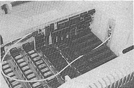


---

<!-- Source PDF page 23; manual page 2—3 -->

directly out toward the rear to avoid possible
prying on the keyboard. When the cover is
free, lift and remove it from the Apple II.
(3) Inside, covering almost the entire bottom of
the computer case, is the green PC Motherboard
of the Apple II. Across the rear of the
Motherboard is a row of 8 connectors or
expansion slots. It is into one of these
slots that you will install the VIDEOTERM
board. The leftmost slot is slot #0 and the
rightmost slot is #7, with the other slots
numbered sequentially between the two. Slot
\#0 should contain your Basic firmware card,
containing either Applesoft or Integer Basic,
or the Apple Language card. Slot #6 should be
reserved for use with the Apple Disk II
controller card. The VIDEOTERM board may go
into any of the other slots, but it is
strongly recommended that it be placed in slot
\#3, as this is the slot that Pascal expects a
terminal to be located in. Standard Apple II
software will undoubtedly be written with this
consideration in mind, so it is probably best
just to use slot #3 right from the start.
However, there is no penalty for not using
this slot and complete information regarding
use of the other slots is given herein. All
examples will assume that the VIDEOTERM board
has been placed in slot #3.
(4) Attach the optional VIDEX Switchplate
assembly, if you have one, to the outside of
the Apple II case in one of the notches cut
into the case for that purpose. Any notch may
be used, since the connector, which will
attach to the VIDEOTERM board, is of
sufficient length to reach the board
regardless of the location of the installation
slot. To attach the VIDEX Switchplate
assembly, loosen the two screws (you should


---

<!-- Source PDF page 24; manual page 2—4 -->

not completely remove them as this will make
installation a little harder), separate the
two PC boards of the assembly and slip the
assembly into a notch. The plate of the
assembly which has the switch and two video
I/O ports should go on the outside while the
board with the VIDEOTERM connector should go
on the inside. Orient the Switchplate
assembly so that the ports are on the bottom
and the switch is on top. Center the
Switchplate in the notch and clamp it into
place by tightening the two screws on the
Switchplate assembly.
(5) Position the VIDEOTERM board’s protruding
expansion slot interface connector directly
over the chosen expansion slot. The card
should be aligned vertically and not twisted
in any manner. Holding firmly onto the
corners of the board, push the expansion
interface connector into its slot. Check that
Figure 2: VIDEX Switchplate Assembly Mating with
the VIDEOTERN Board

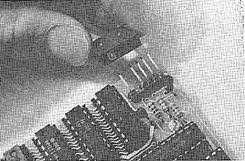


---

<!-- Source PDF page 25; manual page 2—5 -->

the board is firmly pushed all the way into
the slot by rocking it a bit. Make sure that
the board has not been tilted down toward the
center of the Apple II, as this could result
in incomplete connections with the expansion
bus (probably with disastrous effects when the
power is turned on).
(6) Attach the enclosed connector to the five
video output takeoff prongs on the board as
shown in Figure 2 (this connector also slides
onto the light pen prong). If you have the
VIDEX Switchplate assembly, attach its
connector to the VIDEOTERM board in exactly
the same manner. The standard connector will
not be included if you have also purchased the
VIDEX Switchplate assembly. Note that the
Positioning of the 5 prongs and the design of
the connector makes it virtually impossible to
connect the two incorrectly.
(7) Attach your video monitor to the VIDEOTERM by
plugging the male end of the video monitor
input plug into the female plug on the
enclosed connector. If you have the
Switchplate assembly, plug your video monitor
male plug into the female plug on the outside
of the Switchplate assembly. It should go
into the upper of the two I/O video ports, the
one labelled M for Monitor.
(8) If you are using the optional VIDEX
Switchplate assembly, then you should use a
separate standard double—ended male RCA audio
cable to connect the lower video monitor input
port on the Switchplate assembly (labelled A
for Apple) to the Apple II’s video monitor
output port. The Apple II’s port is located
next to the cassette I/O ports on the rear of
the Apple II. Figure 3 shows the completed
assembly of the VIDEX Switchplate assembly and


---

<!-- Source PDF page 26; manual page 2—6 -->

its connections from a back exterior
viewpoint. Flip the switch on the Switchplate
to the right position (assuming that you are
still seated facing the keyboard) so that you
will be sending PR#0 output to your video
monitor. This will assist in checking Out the
VIDEOTERM board as you can tell if your video
monitor is working when you turn on your Apple
II. If you have Apple Language card, you need
not make this connection and you should place
the switch on the VIDEX Switchplate assembly
in the left position. Actually, if you run
just Pascal, you will not need the VIDEX
Switchplate assembly but can make do simply
with the enclosed, less versatile, standard
connector. However, you will find this less
than convenient when using either Basic
language.
Figure 3: Board Installed in System: Exterior View

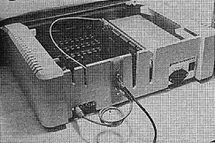


---

<!-- Source PDF page 27; manual page 2—7 -->

(9) Carefully replace the Apple II cover. At the
same time, press down firmly on both rear
corners of the lid to resecure it.
(10) Reattach the power cable and turn on the power
switch located on the back of the Apple II.


---

<!-- Source PDF page 28; manual page 2-8 -->

## Installation Checklist

You are now ready to proceed to the Checkout
section, page 2—9. To assist you in the actual
installation, you may wish to use the following
outline as a checklist.
(1) Turn OFF the power switch and unplug the power
cord.
(2) Remove the cover.
(3) Insert the VIDEX Switchplate assembly, if you
have it, into a notch and tighten its clamp.
(4) Insert the board into the chosen expansion
slot.
(5) Attach the enclosed connector to the 5 takeoff
prongs on the board. If you have it, attach
the VIDEX Switchplate assembly’s connector to
the VIDEOTERM board instead of the connector.
(Note that the standard connector is not
included if you have purchased the VIDEX
Switchplate assembly.)
(6) Connect your video monitor input plug to the
appropriate output plug depending on your use
of the enclosed connector or the VIDEX
Switchplate assembly.
(7) Connect the Switchplate assembly to the Apple
II’s video monitor output port using a
separate double—male audio plug. Place the
switch in the right position (left if you have
Pascal).
(8) Recheck all connections. Replace and resecure
the cover.
(9) Plug in the power cord and turn on your Apple
II!


---

<!-- Source PDF page 29; manual page 2-9 -->

## Checkout

Naturally, the first thing that you will want
to do is verify that the VIDEOTERM board is working
correctly and that all of its features operate as
described. This section will tell you how to make
sure that the board is operating normally, make
minor adjustments and fix minor errors, or diagnose
serious hardware problems which would justify
contacting us. All boards are tested before sale,
but problems can arise with anything, electronic or
otherwise.

### A. How to Verify Correct Performance

Verification of board performance will be
discussed by type of Apple II system configuration.
We need to discuss each language and how the
Autostart ROM presence or absence affects the
checkout. We will start with a standard Basic Apple
II system utilizing one of the two Basic languages.
Before we try the board using one of the Basics,
however, we will use the Apple II Monitor to do some
initial adjustment.
When you turn your system on, it should beep
and fill the screen with question marks and/or other
symbols and an asterisk with a flashing square
cursor next to it will appear near the lower left
corner, indicating that you are in the Apple II
Monitor. The Monitor’s capabilities are described
at length in the Apple II Reference Manual. Suffice
it to say here that the Monitor is very powerful and
you may adequately verify the VIDEOTERM board’s
correct response from here with a few simple tests.
If you have the Autostart—ROM installed in your
Apple II, the probable conditon with the Apple
II—Plus, you will see
APPLE II


---

<!-- Source PDF page 30; manual page 2—10 -->

at the top center of your screen. If you have the
Disk II system, it will automatically be turned 01
and a copy of the DOS will be written into your
Apple’s RAM. Your “HELLO” program that you “INIT”ed
the diskette with will be loaded and run. Without
the Disk II peripheral, your computer will simply go
into either the Applesoft or Integer Basic language
depending on which language is set as the default.
(The default language is the one in the Apple II ii
its Motherboard sockets $D8 to $F8, or on your
Applesoft or Integer Basic card depending on it's
switch position.) Once you are in either language.
type
CALL —154 (CR)
and you will be placed in the monitor mode.
If you have the standard Monitor ROM
initialize your disk operating system (if you have
one), as this will make some of our later tests a
little faster. You do this, of course, by typing “6
CTRL—P”, where the hyphen indicates that you
hold the Control key while depressing the P key.
Naturally, you will terminate all your responses to
the Apple II by striking the Return key. After your
disk drive finishes whirring, return to the Monitor
by pushing the Reset button.
Now, no matter your system configuration using
the Basic languages, you are ready to activate the
VIDEOTERM board. Type “3 CTRL—P”, if you have the
board in slot 3. If not, type “n CTRL—P”, where n
is the number of the slot that you have placed the
board in. Flip the switch on the VIDEX Switchplate
assembly to the left position. Asterisk should be
visible on the left side of the monitor display with
a flashing cursor next to it. Reenter either Basic
by typing
\*3DOG (CR)


---

<!-- Source PDF page 31; manual page 2—11 -->

and ask for a “CATALOG”. If you don’t have a Disk
II system, then reenter either Basic by typing
“CTRL—B” and fill the screen with caracters
bydepressing any alphanumeric key and, while
depressing it, hold down the Repeat key for a few
seconds. You might want to pause at this time and
fine adjust your video monitor since your screen
should now be almost full of characters. (With Disk
II, try to CATALOG a full diskette so that you can
see characters down the entire left side of your
screen.) If everything is proceeding smoothly, load
and list a Basic program. If you have both versions
of Basic installed, try typing “FP” or “INT” as
appropriate, and loading and listing a program in
the other language. If you don’t have the Disk II
system, then you can change Basic languages by
typing
\>POKE —16256,0 (CR) (Integer)
?OVERFLOW ERROR IN 60908 (or similar error
message will appear on
screen)
\*“CTRL..B” (CR) (Enter Applesoft)
or
POKE 49280,0 (CR) (Applesoft)
\*“CTRL..B” (CR) (Enter Integer Basic)
which will work with or without the Autostart—ROM.
Note that “CTRL—B” should not be typed literally,
but means that you should strike the B key while
holding down the Control key.
If you have a problem at any time, refer first
to the Video Monitor Adjustment section, page 2—13,
and then proceed to the Fault Diagnosis section,
page 2—16 if your question still has not been
answered. If everything has been verified, then you
may proceed to the Operation section, page 3—1
below.


---

<!-- Source PDF page 32; manual page 2—12 -->

If you are lucky enough to have either the
Apple Language card or the Microsoft Softcard, you
will especially enjoy the convenience of the full 80
character wide display and soon be making full use
of the lower case capabilities. It is very
important that you place the board in slot 3, as
this is the normal terminal display interface slot.
As explained above, you will not need the VIDEX
Swltchplate assembly for exclusive Pascal use of the
VIDEOTERM board, although it is convenient to have
it so that you can use more than one monitor at a
time. If you do have the VIDEX Switchplate
assembly, make sure the switch is in the left
position. Go ahead and activate your system by
turning on your Apple II. If by chance you have
replaced the Autostart ROM with its non—Autostart
brother, then you will have to type “6 CTRL—P”. You
should see the Pascal announcement in the center of
your screen. Proceed to the Video Monitor
Adjustment section, page 2—13, until you do have the
display.
As soon as you have the Pascal menu prompt line
showing, go ahead and try asking for a directory.
Feel free to try editing any of your programs.
You’ll be amazed at the different look your programs
and text will have. If you have any difficulties,
reread the Video Monitor Adjustment section, page
2—13.If all else fails, consult the Fault
Diagnosis section, page 2—16.


---

<!-- Source PDF page 33; manual page 2—13 -->

### B. Video Monitor Adjustment

Let us start with the worst possible case and
work toward less dramatic problems.
1. No picture at all: Always begin by checking
what is simplest to fix and usually makes you
feel the dumbest. Is the TV monitor turned on?
Is it plugged into the power outlet? Do you
know that the video display works? Could
it have burned out tubes? Carefully recheck
the connections associated with the board,
being sure to turn off the Apple II before you
do any radical wiggling of the board. Are the
connections as described in the section on How
to Install the VIDEOTERM board, page 2—1? Is
the switch in the correct postion on the VIDEX
Switchplate assembly? Are all the connections
tight? If everything is OK, you should be
seeing something on the video display. If the
screen is obviously on but you cannot see
anything, Proceed to the next Possibility.


---

<!-- Source PDF page 34; manual page 2—14 -->

2. No visible characters: This is probably due
to the screen contrast and brightness controls
being slightly out of adjustment. Turn both
the contrast and the brightness controls up
and see if you notice anything. The next
possibility is that the display is shifted
slightly off the screen. Look for the
horizontal and vertical hold adjustments,
which should he located on the front of your
monitor. Try twisting each of these slightly
in either direction. You should be able to
see some type of signal being displayed. Use
these two controls to steady and center the
display. Once the screen is filled with
characters, you might notice that the ones at
the top are slightly larger or smaller than
the ones at the bottom of the screen. Quite
often black and white monitors will have a
vertical—size, vertical—line (or linearity)
and horizontal width adjustment controls.
Usually, these controls will be on the back of
the set. Infrequently, they are located
inside the cabinet. You should not try to
open the cabinet to adjust them, unless you
are qualified in servicing TVs. By adjusting
these controls, you should be able to obtain a
uniform character image over the entire
display.
3. Persistent rolling: Use the vertical hold
adjustment. If you can not correct this,
consult the Fault Diagnosis section, page
2—16.
4. Bent characters: Try adjusting the horizontal
hold adjustment control very slightly in both
directions. This problem usually occurs on
the top line of the screen.
5. Uneven sized characters: Usually caused by
incorrect adjustment of the vertical linearity


---

<!-- Source PDF page 35; manual page 2—15 -->

control. Try varying the setting of it
slightly in each direction.
6. Indistinct or fuzzy characters: This can
usually be corrected by adjusting the focus,
fine focus, brightness and/or contrast
controls. Characters may be distinctly
smeared if your monitor is not terminated with
75 ohms of impedance or if the input gain is
too high.
7. Overall pointers: One thing to check if you
are having problems is the resistance setting
on some monitors. The 75 ohm setting should
be used. Some monitors have a focus
adjustment and this can be used to sharpen or
clarify the image. Dont be discouraged.
Patiently try various combinations of settings
without radically changing anything. You
should soon have a clear picture. If you are
still having problems, perhaps a friend or the
dealer that you bought the board from could
help you. If all else fails, please feel free
to contact VIDEX directly and we’ll be happy
to try to help you solve the problem.


---

<!-- Source PDF page 36; manual page 2—16 -->

## Fault Diagnosis

If you are using a standard black and white TV
set, we suggest that you modify the TV for use
strictly as a video monitor. Don Lancaster’s The
Cheap Video Cookbook (Howard W. Sams & Co.,
Indianapolis, IN, 1978) contains the information
needed for this transformation on pages 148 to 150.
Our extensive testing of the VIDEOTERM and our
experience based on direct feedback after thousands
of user hours has convinced us that the VIDEOTERM is
generally quite error free. If you suspect a
hardware problem, go to your local Apple dealer and
ask him to briefly test the various Integrated
Circuits on the VIDEOTERM. This can be done by
simply swapping in new ICs, an easy task since all
ICs are fully socketed and not soldered in place. A
bad IC will be at the root of most problems.
Also, have your dealer check the various solder
blob connections described in Optional Hardware
Modifictions, starting on page 6—4. The solder
points Xl and X2 should match the IC U5 (see Figure
10) specification, X3 and X4 must match the choice
of 2708 or 2716 EPROM, and X5 must match with X6.
X7 will be set as normal video when you receive the
board. These connections are illustrated in Figure 9
of that section.
In the rare event that your dealer cannot
diagnose and correct the fault, return the board
postpaid directly to VIDEX in Corvallis, Oregon, for
prompt servicing.


---

<!-- Source PDF page 37; manual page 3—1 -->

# OPERATION

## Using the VIDEOTERM Board

For those of you who have owned other Apple II
peripherals, or Apple compatible peripherals, you
will find that the board acts exactly as you would
expect when you use the PR#n command (where n is the
slot number) to direct printed output to the video
display screen instead of the normal PR#O screen.
The board uses the reserved locations for peripheral
boards in the Apple’s Random Access Memory. These
slot dependent location addresses are given in both
hexadecimal and decimal notation, along with their
usage, in Table 1.
If this is your first Apple II peripheral, you
will find it amazingly easy to operate. When you
turn on your system, you merely type “PR#3”,
assuming you have installed the board in slot 3
(PR#n for slot n), and you will see the asterisk,
Applesoft or Integer Basic prompt, or the Pascal
menu prompt line on the video monitor display
screen. You then proceed to use your computer
normally, but now you have available, at your
fingertips as it were, some powerful new
capabilities.
It should be noted that the VIDEOTERM board only
uses a few locations in the Apple II’s memory. The
screen display is memory—mapped out of RAM which is
located on the VIDEOTERM board itself. As the Apple
II memory addresses used are set aside for that
purpose by Apple itself, you are able to use the
VIDEOTERM board and have no memory use conflicts
with any of your programs, any software that you may
have purchased, or with any other peripheral that
you may have which has also followed Apple’s OEM
guidelines.


---

<!-- Source PDF page 38; manual page 3-2 -->

```text
                        Table 1
             VIDEOTERM Use of Apple II RAM


    Addresses used are relative to the slot used
or the VIDEOTERM board. Slot n is the slot
the board has been placed in. See page 134
in the Apple II reference manual for the sets
of    addresses   available as   scratchpad   Random
Access Memory locations.
     Description             Hex Addr   Dec Addr

Screen Base addr. (low)           $478 + n   1144 + n
Screen Base addr. (high)          $4F8 + n   1272 + n
Cursor horiz. position            $578 + n   1400 + n
Cursor vert. position             $5F8 + n   1528 + n
Pascal char. write loc.           $678 + n   1656 + n
First line on screen              $6F8 + n   1784 + n
Power off/leading counter         $778 + n   1912 + n
Video set-up flags                $7F8 + n   2040 + n

The first two storage locations are used to
store an address of a location in VIDEOTERM's
on-board   RAM.     This    address   is   where   the
first   character  in   the   line   currantly   being
edited/listed   is  stored.      This   address   will
be $000 $7FF, inclusive.
The cursor horizontal position is the currant
column     location      of     the    cursor     (0-79,
inclusive, from        left to right). The cursor
vertical     position      is     the    currant    line
location of the cursor (0-23, inclusive, from
top   to   bottom),    The    Pascal   write   character
location    is   where    the    Apple   Pascal   system
looks to find the next character to send to a
terminal or other peripheral. The first line
on screen pointer is used in text scrolling.
The various video set-up flags are discussed
in the software section, page 5-9.
```


---

<!-- Source PDF page 39; manual page 3—3 -->

## VIDEOTERM Initialization

When you first activate the VIDEOTERM board
with the "PR#3", or when you reset the board to its
standard default, you will see 80 characters per
line and 24 lines per page or screen, with each
character defined by a 7 by 9 matrix within a total
8 by 10 matrix cell, allowing for a slight border
around the character.
To change this, simply type "CTRL-Z <params>"
where you substitute one of the paremeters listed in
Table 2 for the angle brackets and their contents.
(Pascal users will need to write a short program to
send this character sequence to the VIDEOTERM.) For
example, if you wanted to use the alternate character
set, you would type "CTRL-Z 3". Presto-chango, as
they say, and there it is. You should try each of
the options and then type a little to observe the
different display responses you achieve.
Before we continue, let mention a unique
feature of the VIDEOTERM board. Try using the entry of
"CTRL-Z" followed by any control character H
through O. You will notice that when you type the
control character, you will see displayed the
correct ASCII abbreviation for the action. For
example, when you type "CTRL-H" (or the back arrow),
you will see"BS" displayed as two tiny
diagonal-spaced capital letters in the position of
one normal display character.

### Return to the Apple Display

When you enter the VIDEOTERM WITH THE "PR#3"
statement, the Apple automatically issues a "IN#3"
command. However, when you enter "PR#0", THE
VIDEOTERM will not reset the "IN" switch by itself.
You should thus always follow this command with
"IN#0"


---

<!-- Source PDF page 40; manual page 3—4 -->

Table 2
VIDEOTERM Control Parameters
The VIDEOTERM board starts in upper case mode.
CTRL—Z
Followed by: Description
0 (Default) Clears screen and
sets for 24 lines of text
1 Clears screen and
sets for 18 lines of text
2 Selects the standard 7x9
character set (or selects
for normal video, see
page 6—4) for subsequently
displayed characters
3 Selects the alternate
character set (or selects
for inverse video, see
page 6—4) for subsequently
displayed characters
CTRL—@ to Displays one of the set of
CTRL—G low—resolution graphics
characters
CTRL—P to Displays one of the set of
CTRL—SHIFT—0 line drawing graphics
characters
CTRL—H to Displays small abbrevia-
CTRL—O tion of ASCII function
(i.e., CTRL—H shows BS
for Backspace)
Character Displays that character
Low—resolution graphics characters: each occupies
one character position on the screen display


---

<!-- Source PDF page 41; manual page 3—5 -->

## Upper and Lower Case

You will, of course, want to use lower case
right away and no wonder. Lower case is
significantly easier to read and recognize than is
all capital type, reducing eye strain and reading
time, When you first activate the VIDEOTERI4 board,
it will still be in all upper case. To place it in
lower case, simply type “CTRL—A”. This acts just
like a toggle switch or flip—flop in that you are
now in lower case mode for as many characters as you
wish to type. That is, the next character and all
following characters will be uncapitalized.
To do a shift lock, so that you are returned to
upper case, type another “CTRL—A”. You have flipped
the switch, so to speak, and each time that you
enter the “CTRL—A” you will go into the mode that
you are not currently in. This method of operating
the upper and lower case modes is fairly convenient
except in the case where you wish to capitalize only
the next character. At present, the only way to do
this fr,om the keyboard is by typing a sequence such
as “CTRL—A Q CTRL—A UITE” to obtain the display
‘QUite’. Installation of the VIDEX KEYBOARD
ENHANCER will solve this problem, as it allows the
use of the shift keys in a manner exactly like that
of a standard typewriter keyboard. Note that the
lower case characters are stored internally as true
lower case. The “CTRL—A” is NOT stored.


---

<!-- Source PDF page 42; manual page 3—6 -->

## Special Key Operation

Most keys will display just as they are typed.
However, certain keystroke sequences utilized in
conjunction with the Control key, have specific and
standard results. These various sequences will be
discussed here in detail. In general, they will
work the same in all Apple languages, so that by
printing that keystroke character sequence to the
VIDEOTERM board you will obtain the desired result.
Notice that you will not be able to enter all of
these directly from your keyboard without the VIDEX
KEYBOARD ENHANCER.
As a special note, both the “CTRL—A” and the
ESCape key sequences are “swallowed” by the
VIDEOTERM board and are not transferred to the Apple
II input buffer. All other special key sequences
are transferred into the buffer.
CTRL—A: Shift Toggle. The typing of the “A” key
CHR$(1) while holding the Control key down toggles
the VIDEOTERM into the other case mode.
Thus, if you are in upper case, you will be
shifted to lower case, while if you are in
upper case you will be shifted to lower
case. The case mode remains unchanged
until another “CTRL—A” is issued. The
“CTRL—A” is not entered into a line of text
when typed in from the keyboard. It serves
only as a shift toggle.
CTRL—G: Sound the Bell. The typing of the “G” key
CHR$(7) while holding the Control key depressed
causes the bell to be sounded. Doing this
from the Apple II keyboard directly will
cause the computer to sound a small beep
from its internal speaker. Try this with
tbe VIDEOTERM board active and with it
inactive (i.e., try it before and after you
type “PR#3”). The bell will have a


---

<!-- Source PDF page 43; manual page 3—7 -->

different sound when you have the VIDEOTERM
board activated to let you know that it is
currently on.
CTRL—H: Non—destructive Back Space function. This
CHR$(8)operation forces the cursor back one
character on the display without destroying
the character displayed at the previous
location. The “CTRL—H” acts exactly like
the single key on the Apple II keyboard
labelled with the arrow pointing to the
left (found just under the Return key on
the right side of the keyboard).
CTRL—J: Line Feed function. This operation causes
CHR$(1O) a line feed to be issued which forces the
cursor down to the next line without
changing the column position of the cursor.
At the bottom of the screen, this will
cause the text to be scrolled up one line
so that the page display will be altered.
A Carriage Return will also have a line
feed associated with it.
CTRL—K: Clear to End of Screen function. This
CHR$(11) operation will clear the text from the
present cursor location to the end of the
screen. The character at the cursor
location will also be deleted but the
cursor itself will not move.
CTRL—L: Form Feed function. The issuance of a form
CHR$(12)feed command will clear the screen entirely of
all information displayed, just as if
you had ejected a page and started a new
one with a printer. This does not destroy
any information stored internally in your
Apple’s RAM, but rather simply starts a new
screen. It is important to note here that
the “HOME” command in Applesoft and the
“CALL —936” statement in either language
MUST be replaced with a “PRINT CHRS(12)” in


---

<!-- Source PDF page 44; manual page 3—8 -->

Applesoft or “PRINT <CTRL—L>” in either
language. See the Apple Language
Interactions section in the Software
chapter, pages 4—1 to 4—6.
CTRL—M: Carriage Return function. In Pascal, this
CHR$(13)operation will move the cursor to the
leftmost column on the screen without
changing its line position. In either
Basic language, an automatic Line Feed
function (CTRL—J) is also performed at the
same time.
CTRL—S: Stop/start text scrolling. This ASCII
CHR$(19) control character will cause the current
text scrolling operation to stop, freezing
the display. Text scrolling can be resumed
by typing another “CTRL—S” (or any other
character).
CTRL—U: Copy character function. This operation,
CHR$(21) in either Basic, causes the cursor to be
advanced one position, copying the
character that it was positioned at into
the input buffer of the Apple as if it had
just been typed from the keyboard. The
right arrow, located on the right of the
keyboard just under the Return key,
performs the same function. This will only
work with direct keyboard or program input
utilizing the CETLN routine, pages 33—34 of
the Apple II Reference Manual. This will
not work with the “CET” statement.
CTRL—Y: Home the cursor. This operation causes
CHR$(25)the cursor to be positioned in the first
row, first column without changing the
display. It is not the same as the Form
Feed function described above.
CURL—Z: Initialization Lead—in function. Use
CHR$(26) as the lead—in character for reinitiali—


---

<!-- Source PDF page 45; manual page 3—9 -->

zation of the VIDEOTERM. The user may
choose 18 or 24 lines of text, standard or
alternate character sets, display of a
control character or normal or inverse
video utilizing this function. See Table
2, page 3—4, for a fuller description.
ESCAPE: Edit Control Lead—in function. The ESCape
CHR$(27) key works exactly as it does for the Apple
II standard video display. It is used as
the lead—in character for an editing
command. Follow the ESCape key entry with
any of the standard editing keystrokes.
These include:
A —— Advance cursor
B —— Backspace cursor
C —— Move cursor down a line
D —— Move cursor up a line
B —— Clear to end of line
F —— Clear to end of screen
@—— Clear screen
Note that many of this ESCape key sequences
are the same as other Control key sequences
mentioned above. Also note that the ESCape
key sequences utilizing ‘I’, J’, ‘K, and
‘M’ that are available with the Autostart
ROM are not usable with the VIDEOTERM.
CTRL—SHIFT—L: Non—Destructive Forward Space Func—
CHR$(28) tion. This operation moves the cursor
forward one character on the display
without actually copying the character at
its previous location to the input buffer.
You will not be able to enter this key
sequence directly from your keyboard unless
you have the VIDEX KEYBOARD ENHANCER
installed. Both the Control and the Shift
keys must be depressed before striking ‘L’.
You will still be able to use this Function
from Applesoft.


---

<!-- Source PDF page 46; manual page 3—10 -->

CTRL—SHIFT—M: Clear to End of Line function. This
CHR$(29) operation erases all characters From the
current cursor location to the end of the
present line. Both the Control and the Shift
keys be depressed before you strike the ‘N’
key. Otherwise you will cause a Carriage Return
(CTRL—M) to occur.
CTRL—SHIFT—N <x> <y>: Cursor Positioning function.
CHR$(30) This operation is equivalent to the ASCII
code GOTOXY. It allows you to directly
move the cursor to any specified position
on the screen. It is completely compatible
with the Apple Pascal COTOXY function. You
follow the “CTRL—SHIFT—N” entry with two
numbers which specify the x and y (or
horizontal and vertical) screen location
that the cursor is to be relocated at. The
x and y coordinates are entered as ASCII
code sequences above decimal value 32. Try
sending various codes to the VIDEOTERM
using this function and observe the
movement of the cursor in each of the
different character cell matrix sizes.
Start with “CTRL—SHIFT-N & *“ as a start.
The upper left corner of the screen is ‘ ‘
and ‘ ‘ (two spaces). The lower right
corner of the screen is ‘7’ and ‘o’.
CTRL—SHIFT-0 Reverse Linefeed Function. This
CHR$(31)operation forces the cursor up one line
without changing its column location. Once
the cursor reaches the top of the screen,
it will not move anymore. Again, you will
need the VIDEX KEYBOARD ENTIMICER in order
to enter this key sequence directly from
your keyboard. It is still available from
Applesoft.


---

<!-- Source PDF page 47; manual page 4—1 -->

# SOFTWARE

Now that you have your VIDEOTERM installed and
you are satisfied that the monitor is properly
adjusted, you are probably very anxious to use it.
In the previous chapter you have seen how various
key sequences are used to control the VIDEOTERM
directly from the keyboard. This chapter contains a
number of sample programs, in each of the Apple II
languages, to acquaint you with software control of
the board. But first we will detail a few necessary
changes that you will need to make to some of your
existing programs In order to use them with the
VIDEOTERM. And we will give the language specific
addresses necessary for modifying the VIDEOTERM's
internal registers, which are described in the next
chapter, starting on page 5—2. We will then
describe the use of the VIDEOTERM in conjunction
with some other available Apple II peripherals, in
particular the use of the ROMWriter to create a new
character set.

## Apple Language Interactions

The VIDEOTERM has been designed to minimize the
interaction it has with user software.
Unfortunately, there is some, interaction and you
will need to make some slight modifications to your
current programs, and avoid the use of certain
programming statements in the software that you
write. This section fully documents those changes.

### A. Assembly Language

The only real restriction in Apple Assembly
language is to not use those RAM locations,
described in Table I, page 3—2, which the VIDEOTERM
uses. This is true regardless of which peripheral
you purchase, as Apple Computer, Inc. has set aside
these locations specifically for firmware located on


---

<!-- Source PDF page 48; manual page 4—2 -->

an expansion board. Naturally, you can use these
locations either directly in Assembly language, or
from other languages, to modify the cursor location,
to modify the video set—up flags, to access the
start address, in the VIDEOTERM RAN, of the screen
start address, and many other things.

### B. Integer Basic

You cannot use the “CALL —936” command. You
must substitute in its place “PRINT CTRL—L”.
Naturally, when this is listed, you will see “PRINT
“, SINCE ThE CTRL—L is not printed. You should
adopt the trick taught Disk II owners which is to
define a,, character string variable equal to the
non—printing character(s) and print that variable.
Thus
10 L$=”<CTRL—L>”:REM THIS IS CNRL—L
20 PRINT L$:REM USE THIS IN PLACE OF
ALL ‘HOME’ AND ‘CALL —936’
STATEMENTS
If you use any “CALL —958” statements, which
serve to clear the screen of text from your current
cursor position on, you will need to replace these
with “PRINT CTRL—K” statements. Use a procedure
such as that described above to enter these changes
into your programs.
If you use an~ “CALL —868” statements, which
serves to clear the present line from your current
cursor position on, you will need to replace these
with “PRINT CTRL—SHIFT—M” statements. Again, use a
procedure such as that described above to enter
these changes into your programs.
In general, you should be slightly suspicious
of any “CALL n” type statements that you use in any
of your programs.
You should also be wary of the interaction of


---

<!-- Source PDF page 49; manual page 4—3 -->

“PEEK” and “POKE” instructions, as these may not
work quite as you had planned. However, these
should work properly, as should your “VTAB” and
“TAB” commands. Expect some minor surprises the
first time you run some of your programs using the
VIDEOTERM.
Note that graphics statements will not work as
expected. Such statements include
CR
PLOT x,y
HLIN x,y AT n
VLIN x,y AT n
These will be sent to a separate display, such as a
color TV, if you have one attached to your Anple
video output plug separately from your VIDEOTERM.
In fact, even with one monitor, the Apple video
display is changed and can be viewed by typing
“PR#O”. Otherwise, use “REM”s to disable such
statements. There is some limited use of graphics
on the VIDEOTERM as demonstrated in the example
programs, starting on page 4—8.

### C. Applesoft

Those restrictions stated above concerning
“CALL n” statements for Integer Basic also hold true
for Applesoft, and similar corrections should be
made to your programs. Of special concern is that
the Home command will not work with the VIDEOTERM,
so substitute “CHR$(12)” in its place. Note that
the availability of the “CHR$(n)” function in
Applesoft makes it much easier to print the various
character sequences that control the operation of
the VIDEOTERM.
You should not expect any of the graphics
commands to affect the VIDEOTERM, as these will
again affect only the normal Apple IT display. The
commands affected are:


---

<!-- Source PDF page 50; manual page 4—4 -->

GR
PLOT X,Y
HLIN X1,X2 AT Y
VLIN YI,Y2 AT X
SCRN(X,Y)
HGR
HGR2
HCOLOR=X
HPLOT X, Y
HPLOT XI,YI TO X2,Y2
DRAW n AT X,Y
XDRAW n AT X,Y
A limited usage of graphics in Applesoft programs is
demonstrated in the sample program starting on page
4—21.
The following Applesoft statements will also have
no affect on the VIDEOTERM display:
FLASH
INVERSE
NORMAL
These commands will simply be ignored when executed.

### D. Pascal

Your VIDEOTERM will work immediately with the
Apple Language card, but there are a few helpful
changes you should make. After you install the
VIDEOTERM, execute “APPLE3: SETUP” and then change
HAS LOWERCASE to TRUE
Set screen width to 80
You will now get Pascal prompt lines and all
Directory and Edit lines in their full expanded 80
column format. Of course, you had a 79 column
display from the moment you initiated your Pascal
system with the VIDEOTERM. However, by setting the


---

<!-- Source PDF page 51; manual page 4-5 -->

screen width to SO, from 79, you will obtain longer
Pascal prompt lines.
If you want to use the regular Apple II. display
format without physically removing the VIDEOTERM from
slot 3, just
POKE(—16392+3,O)
To return to tile VIDEOTERM display
POKE(—16392+3,4)
Adjust these statements accordingly, if you have the
VIDEOTERM in some slot other than 3.
In order to implement the POKE, function, as
well as the PEEK function, use the PROGRAM PEEKPOKE
as given in Program Listing 1.


---

<!-- Source PDF page 52; manual page 4-6 -->

```text
                            PROGRAM LISTING # 1

PROGRAM PEEKPOKE;
TYPE
    TRIKARRAY — PACKED ARRAY (O..1) OF O..255;
VAR
      TRIX: RECORD
              CASE BOOLEAN OF
                 FALSE: (AODRESS: INTEGER);
                 TRUE: (POINTER: TRIXARRAY);
               END;
          I, VAL: INTEGER;
          CH: CHAR:
FUNCTION PEEK (ADDR: INTEGER): INTEGER
    BEGIN
       WITH TRIK DO
         BEGIN
           ADDRESS;= ADDR;
           PEEK:= POINTER^ [0];
         END;
   END; (Peek)
PROCEDURE POKE (ADDR. VALUE: INTEGER);
    BEGIN
      WITH TRIX DO
        BEGIN
          ADDRESS:= ADDR;
          POINTER^ [O]:= VALUE;
        END
    END; (Poke)
BEGIN (Main program)
    PAGE (OUTPUT);
    WRITELN (‘Peek mod Poke tet program’, CHR(13));
    WRITELN (‘Options’);
    WRITELN (‘        R)esd memory address;’);
    WRITELN C’        W)rite to memory address;’)
    WRETELN (‘        Q)uit;');
    REPEAT
      WRITELN (‘Se1ect..........');
     READ (KEYBOARD, CH);
     CASE CH OF
        ‘R’: BEGIN
               WRITE (‘Enter address to be examined       ');
               READ (I);
               WRITELN (PEEK(I):10, CHR (PEEK (I)):10);
            END;
        ‘W’: BEGIN
               WRITELN (‘Enter address and value to be poked’);
               READ (I. VAL);
               POKE (I, VAL);
               WRITELN;
            END;
            'Q' WRITELN (‘Thats all folks.........‘);
         END;(case)
       UNTIL CH = 'Q';
    END.
```


---

<!-- Source PDF page 53; manual page 4—7 -->

## Language Considerations in General

For the most part, you will want to know the
memory usage of the VIDEOTERM and how to perform the
various operations mentioned in the Firmware
chapter, on pages 5—1 to 5—8, in each of the various
languages. Sample statements are given in Table 3.
Memory usage in the $C080+ region of the Apple
II addressing space is also of interest. VIDEOTERM
usage o[ this area is also detailed in Table 3. The
assignment of the different 16—byte address blocks
to the 8 possible expansion slots is given in Table
25, page 82, of the Apple II Reference Manual,
available from your Apple dealer. For a discussion
of the utilization of the 2K byte firmware memory
space, $C800 to $CFFF, mentioned in the Apple II
Reference Manual on pages 84—85, see the section on
VIDEOTERM Memory Napping, starting in the next
chapter on page 5—11. It might be good idea to
briefly skim through that section before reading the
detailed comments on each of the example programs.
Remember, as noted on page 3—5, that you must
execute a “IN#0” following a “PR#0” in order to
reactivate the input device correctly. Otherwise,
all Apple II display characters will be placed on
top of each other.


---

<!-- Source PDF page 54; manual page 4—8 -->

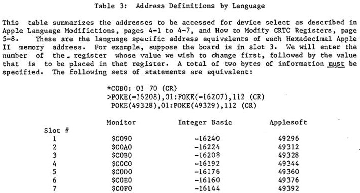


---

<!-- Source PDF page 55; manual page 4-9 -->

## Software Examples

The following program listings are offered as
examples of how the VIDEOTERM can be controlled by
one of your programs. They are not meant to be
taken as the best way to use the board, but as
indicative of what you can do. Each example will be
explained in detail so that you can see just how the
program works. Throughout the rest of this chapter,
the symbol “(CR)” is used to indicate that you
should strike the Return key.

### A. Assembly Language

Program Listing 2 gives an example of how the
VIDEOTERM can be controlled using Assembly Language.
The object of the program is to allow you to view on
your monitor the same text that is currently being
listed on your printer. To enter this program, go
into the Apple Monitor by typing
CALL —154 (CR)
Then type the following (note that you do not have
to type the “*“; the Apple II displays this symbol
to let you know that it is ready for more input)
\*300:48 8A 48 98 48 20 42 03 (CR)
\*308:20 00 C8 A9 80 20 ED FD (CR)
\*310:A5 36 8D 40 03 A5 37 8D (CR)
\*318.41 03 A9 2B 85 36 A9 03 (CR)
\*320:85 37 20 EA 03 68 A8 68 (CR)
\*328:AA 68 60 8D 7B 06 8A 48 (CR)
\*330:98 48 20 42 03 20 Cl C8 (CR)
\*338:68 A8 68 AA AD 78 06 4C (CR)
\*340.00 CO 8D FF CF 80 00 C3 (CR)
\*348:AO 30 8C F8 06 A2 C3 8E (CR)
\*350:F8 07 60 80 08 08 AO 10 (CR)


---

<!-- Source PDF page 56; manual page 4—10 -->

```text
                 PROGRAM LISTING # 2


                        2          LST ON
0000:                   3 *
0000:                   4 BYTE     E~U $678
0000:                   5 NO       EQO $6F8
0000:                   6 MSLOT    EQO $7F8
0000:                   7 COOT     EQO $FDED
0000:                   8 *
0000:                   9          ORG $300
0300:                 10           082 $300
0300:                 11 *
0300:48               12 START     PHA             SAVE REGISTERS
0301:8A               13           TXA
0302:45               14           PHA
0303:98               15           TYA
0304:48               16           PNA
0 3 0 5 : 2 0 42 03   17           JSR SETREOS     SET—NP FOR ENTP.Y INTO 0800 RON
0 3 0 8 : 2 0 00 CR   18           JSR $C$00       ENITIALIZE VTDEOTERM
0 3 0 8 : A 9 80      19           LDA 8S80        TRANSMIT FARE ONARACTER TO PRINTS
0 3 0 0 : 2 0 ED PD   20           JSR COOT
0 3 1 5 : A 5 36      21           LDA $36         STORE OLD OUTPUT VECTOR
  0312: 80 40 03       22          STA J7$PADR+1   INTO A JMP OPERAND
  0315: AS 37          23          IDA S37
  0317: 90 41 03       24          STA JSIPADR+2
0 3 1 A : A 9 28       25          IDA ‘1<OUTI     SET UP NEW OUTPUT VECTOR
0 3 1 C : 8 5 36      26           STA $36
0 3 1 E : A 9 03      27           IDA #>OUTI
0 3 2 0 : 8 5 37        28             STA $37
0322:20IA 03          29           JSR $3EA        SWAP IN DOS OUTPUT VECTOR
0325: 68              30 DONE      PLA             RECOVER REGISTERS
0326: A8                  31
0327:68               32           PLA
032$:AA               33           TAX
0329:68               34           PLA
032A:60               35           RTS
032$:                 36 *
  0325: 80 75 06       37 OUTI     STA BYTE+3      SAVE BYTE TO OUTPUT
 032E: 8A              38          TXA             SAVE REGISTERS
  032F: 4$             39          PHA
  0330: 9$             40          TYA
  0331: 4$             41          PHA
0 3 3 2 : 2 0 32 33   42           JSR SETREOS     SET—UP FOR ENTRY INTO 0800 ROM
0 3 3 5 : 2 0 83 0$   43           JSR $0813       OUTPUT BYTE TO VIDEOTERM
0338:6$               44           PLA             RECOVER REGISTERS
0339:A8               45           TAY
033A:68               46           PLA
0338: AA              47           TAX
0 3 3 0 : A D 7$ 06   48           IDA BYTE+3      OUTPUT BYTE TO PRINTER
0 3 3 F : 4 0 00 CO   49 JNPADR    DSP $CODO       THIS ADDRESS WELL SE CHANGED
0342:                 50 *
0 3 4 2 : 8 0 PP CF   51 SETREGS   STA $CFFF       TURN OFF CO—RESIDENT ROMS
0 3 4 $ : 8 0 00 03   52           STA $C300       SELECT CO—RESIDENT POll IN SLOT 3
0 3 4 8 : A O 30      53           IDY #$30        SET UP THE NO INDEX
0 3 4 A : B C F8 06   54           STY NO
0 3 4 0 : A 2 03      55           LOX #$C3        SET UP THE ON INDEX
0 3 4 F : 8 8 P8 07   56           SIX MSLOT
0352:60               57           ITS
3353:
```


---

<!-- Source PDF page 57; manual page 4—11 -->

When you have finished entering these values, type
\*300.357 (CR)
This will cause a copy of what you have entered
above to be displayed on your video screen.
Carefully double—check your entry to make sure that
it is the same. You can also type
\*300L (CR)
This will cause the Apple to display a listing like
that in Program Listing 2, except that no comments
will be written by the Apple II disassembler. To
continue the listing, type
\*L (CR)
Repeat this last entry once more to finish your
listing. The important entries are the actual
hexadecimal operation codes that are displayed to
the left of the Assembly language operation codes,
since some of the symbols, such as COUT will not be
displayed.
There are several alterations you will have to
make if you have installed the VIDEOTERM in some
slot other than 3. Substitute
\*347:Cn (CR)
\*34E:Cn (CR)
WHERE N IS THE SLOT NUMBER IN WHICH THE VIDEOTERM
has been placed. Also
\*349:<8+n>O (CR)
is necessary. Note that BO would be entered if in
slot 3, CO if in slot 4 and so forth.
Notice the two instructions using “BYTE+3” in


---

<!-- Source PDF page 58; manual page 4—12 -->

the listing at locations $32B and $33C,
respectively. These must be changed to the
equivalent of “BYTE+n”. Do this by using Table 1 to
calculate the new value to be placed at locations
$32C and $33D. Note that the same values will be
placed in each location. Assuming that the
VIDEOTERM has been placed in slot 5, then we would
calculate
$678 + n = $678 + $5 $67D
and we would type
\*32C:7D (CR)
\*33C:7D (CR)
This completes the necessary changes in the program
for use with the VIDEOTERM’s changed location. You
should save this routine onto your diskette or
cassette. The routine starts at $300 and has a
length of $58.
In order to use the routine from either Basic
language, enter the following into your program
PR#p:CALL 768
where p is the slot number that your printer is in
(also true below).
In order to test the program, simply enter the
one—line program (again, using either Basic, but
using Integer Basic here as an example)
\>10 PR#p:CALL 768:END
\>RUN
Note that even with the Apple Disk you should enter
the program -as above. Do not enter (where D$ is a
“CTRL—D”)
\>10 PRINT D$;”PR#p”:CALL 768:END


---

<!-- Source PDF page 59; manual page 4—13 -->

as this will not work with the VIDEOTERM.
If you do not have the Apple Disk Operating
System (DOS), then you should modify the above
Assembly Language program by typing
\*322:EA EA EA
These are NOP (No Operation) codes, and they
effectively keep the program from accessing DOS to
obtain its output address (also called a vector,
since it points to a location which itself contains
an address). The 6502 microprocessor will simply
ignore this instruction and execute the following
one This program modification should be done
before saving your copy of the program.
An important reminder is that the printer is
the controlling device, not the VIDEOTERM, so that
some of the VIDEOTERMs control key sequences will
not be activated, but printer control characters
will be.

### B. Integer Basic

Program Listing 3 is an example of how to place
a character on the screen in a desired location
using an Integer Basic program. This program will
fill the video display with the entire character
set, with each line repeating the set but shifted
over one column so as to make a diagonal pattern.
The screen is filled in a random order, so that it
takes several minutes to completely fill the screen,
but the display is about 80% complete after one
minute. This program is an excellent one to use to
help fine tune the adjustment on your monitor.
Before we begin, it might be helpful if you
briefly review the discussion of how the VIDEOTERM’s
on—board RAM maps into the display and how it is
accessed by internal Apple II addresses.


---

<!-- Source PDF page 60; manual page 4—14 -->

Essentially, the on—screen location of a character
corresponds to its address in the RAM which is
located on the board. A unique set of addresses in
the Apple II allows you to access the VIDEOTERM RAM
directly, but this same set of Apple II addresses
can specify any one of 4 different address locations
on the VIDEOTERM. A technique called “paging” is
used, and by determining which page we are using
(each page being 512 bytes long), we have determined
where the character we are writing is really going
in the VIDEOTERMs RAM, and therefor, on the display
screen.
Let’s take a look in detail at how the program
operates. Line 10 defines several Basic variables.
START is the address, in decimal, of the memory
location in the Apple II where a VIDEOTERM address
is stored. This VTDEOTERM address, in turn, is
defined as the location where the first character of
the first line on the screen is stored (see $6E8 +
n, Table 1). This is needed since the actual memory
location in the on—board RAM of the first display
line on the screen varies. By adding the SLOT value
to START we will obtain the correct Apple II
address. This is done in line 15, with the result
being assigned to the variable LINEl.
DEVICE is the name of the variable assigned the
value of the base address of the 16—byte group of
slot dedicated addresses reserved for the various
peripherals. (Again, see the Apple II Reference
Manual, page 82.) The value —16256 is equal to
$CO8O or 49280. By adding SLOT times 16, we get the
value assigned to LINE2 in line 15. Note that if
SLOT = 3, then LINE2 = —16208 or 49328 or $COBO,
exactly the values we see in Table 3 for slot 3
usage! Because we have the VIDEOTERM in slot 3,
SLOT = 3 in line 10.
The value for SCREEN is equivalent to 53224 or
$CCOO, the Apple II address of the first character
of the current active page of VIDEOTERM Random


---

<!-- Source PDF page 61; manual page 4—15 -->

```text
                     PROGRAM LISTING #      3


>LIST
  10 START=1784:DEVICE=-16256: SLOT3:SCREEN=-13312:PLOT=100
  15 LINE1=START+SL0T:LINE2=DEVICE+SLOT*I6
  20 X= RND (80)
  30 Y= RND (24)
  40 BYTE=(X+Y) MOD 96+32
  50 GOSUB PLOT
  60 GOTO 20: REM

    100   ADDRESS=(X+Y*90+ PFEK (LINE1*16) MOD 2048
    110   PAGE=ADDRESS/512
    120   SELECT= PEEK (LINE2+PAGE*4)
    130   POKE SCREEN+(ADDRESS MOD 512),BYTE
    140   RETURN


>
```


---

<!-- Source PDF page 62; manual page 4—16 -->

Access Memory. See the next chapter, page 5—11, for
an explanation of how the addresses $CCOO to $CDFF
are used in writing characters to the VIDEOTERM
memory. For now, just note that this is the base
address for VIDEOTERM RAM access.
Lines 20 and 30 assign a random integer number
between 0 and 79 to X and a random integer number
between 0 and 23 to Y. These correspond to the
column (X) and the row (Y) that we will put the
character in on the display screen. In line 40, we
then use the screen position to determine which
character will be printed there. The sum of X and Y
is taken modulo 96, which just means that a value
between 0 and 95 will be chosen depending on the
actual value of the sum. Then the value 32 is
added. This value is then assigned to the variable
BYTE. If you look at the ASCII symbols defined in
the Appendix Table, you will see that this limits us
to choosing an ASCII character whose decimal value
is between 32 and 127, inclusive. This includes all
the standard display characters, hut excludes the
control characters.
Line 50 directs program control to the PLO
subroutine, starting at program line 100. Finally
line 60 returns us to line 20 to repeat the process.
Note that the REM statement contains a “CTRL—J”
to space the PLOT subroutine down one line for easier
reading.
Line 100 starts the PLOT subroutine. A value
is calculated and assigned to the variable ADDRESS
This value is calculated as follows. First, the
on—screen character location is calculated as a
number between 0 and 1919 (X + Y * 80). The
on—screen character locations are numbered from 0 to
79 on the first line, 80 to 159 on the second, and
so forth, to 1840 to 1919 on the twenty—fourth line
This is added to the VIDEOTERM start screen address
multiplied by the value of 16. We do this because
the start screen address was divided by 16 in the


---

<!-- Source PDF page 63; manual page 4—17 -->

firmware to save one byte of room.
The resulting number of this process is then
taken modulo 2048, since there is only 2K RAM
on—board and thus there are only 2048 locations to
store information at. This is called “wrap—around”
since the character stored at VIDEOTERM RAM address
2047 is followed on the screen by the character
stored at address 0.
Line 110 assigns to PAGE the current active
page of on—board memory that will be accessed by
Apple II addresses in the range $CCOO to $CDFF.
Then line 120 assigns to SELECT the value stored at
the location $COBO, $C0B4, $COB8 and $COBC,
depending on the current active “PAGE”. The value
stored there is of no consequence. The access by
the “PEEK” activates the appropriate page. It is
important that a “PEEK” access be utilized at this
time for that purpose! (It can also be done at an
earlier time, but only after the correct address has
been calculated.)
Line 13O then writes the actual chosen
character, BYTE to the VIDEOTERM memory using a
poke. Simultaneously, the character appears
displayed on the monitor screen. The address for
the POKE is the base address of the VIDEOTERM
memory, SCREEN ($CC00) plus the page—relative
address of the character (“ADDRESS MOD 512”). Line
140 is the “RETURN” statement that ends the
subroutine.
You night want to play around with the program
a little. A faster display of the character set can
be obtained if you substitute “FOR” statements in
place of the two Random number calls on lines 20 and
30 and “NEXT” statements in place of the “GOTO”
statement on line 60. You can also change line 40
to print any set of characters that you would like
to see. Try modifying it to display the graphics
character set located at “CTRL—P” to “CTRL—SHIFT—O”.


---

<!-- Source PDF page 64; manual page 4—18 -->

```text
                                     PROGRAM LISTING # 4


PR#O
>LIST


     5 DIM A(3):A(0)=1:A(1)=2:A(2)=4.:A(3)=8
    10 START=1784 DEVICE=—16256:SLOT=3: SCREEN=—13312: PLOT= 100
    15 LINE1=START+SLOT:LINE2=DEVICE+SLOT*16
    20 FOR X=O TO 79
    30 FOR Y=O TO 71
    50 COSUB PLOT
    60 NEXT Y,X: REM


    100 ADDRESS=(X+Y/3*8O+ PEEK (LINE1)*16) MOD 2048
    120 SELECT= PEEK (LINE2+ADDRESS/512*A)
    130 ADD=SCREEN+(ADDRESS MOD 512)
    147 R=Y MOD 3
    155 BYTE= PEEK (ADD) MOD 8
    157 STRIP=A(R+1)
    160 POKE ADD,,BYTE/STRIP*STRIP+BYTE MOD A(R)+A(R)*COL
    180 RETURN

>
```


---

<!-- Source PDF page 65; manual page 4—19 -->

Program Listing 4 follows the same pattern as
the previous example. The object of this program is
to demonstrate the writing of one of the graphics
characters in the range “CTRL—Z CTRL—@” to “CTRL—Z
CTRL—G” as explained in Table 2. Let us examine
this example in detail.
Line 5 assigns to the elements of the array A
the corresponding powers of 2. Thus, A(0) = 1, A(1)
= 2, (2) = 4, and A(3) = 8. These will be used
later in the program rather than an equivalent
calculation of the power of 2, because access of an
array element is much faster than the exponentiation
operation.
Lines 10 and 15 are similar to those lines in
Program Listing 2. Lines 20 and 30 set up a pair of
“FOR—NEXT” loops. Notice that in the current order,
the screen will be filled a column at a time. To
change this, simply reverse the order of the two
lines and change the “NEXT” statement in line 60.
Line 40 determines the color of the graphics
character to be printed which in this case is color
1 (magenta). This will appear as a white dot on
your Black and White monitor. In the listing it is
assigned a constant value, but we will change this
later. Line 50 calls the PLOT subroutine and line
60 continues the loops. Notice that the order of Y
and X need to be exchanged if you change the order
of the “FOR” statements. The “REM” statement of
line 60 contains a “CTRL—J” to skip a line in the
listing.
Line 100 begins the PLOT subroutine. We choose
the ADDRESS in the VIDEOTERMs RAM at which the
graphics symbol will be placed as in the preceding
example. Note that Y must be divided by 3 to obtain
a value between 0 and 23, inclusive. Line 120
activates the proper memory page, in a slightly
different fashion than was done in line 120 of the


---

<!-- Source PDF page 66; manual page 4—20 -->

previous example. Line 130 calculates the
page—specific address. The following lines require
considerable explanation. Before we describe these
in detail, let’s consider what is happening overall.
We wish to change the entire screen from black
to white by changing only one low—resolution pixel
at a time. As can be seen in Table 2, page 3—4,
each “CTRL <char>?? in the low—resolution graphics
character set contains 3 pixels. We will start with
the equivalent of “CTRL@” in character position 0
(first column, first row). We wish to replace it
with the symbol corresponding to “CTRL—A” as this
changes the color of the first pixel. Then, we will
replace that with “CTRL—C”, and then with “CTRL—G”.
This adds, in smooth increments, one pixel at a time
in that character position.
Now let’s look at the program in detail. Line
147 takes the modulo base 3 of the row variable, Y.
Note that the Y indexed “FOR NEXT” loop runs from 0
to 71. This is because each graphics symbol only
occupies one—third of a row! So we must take the
row number modulo base 3 to determine which of the 3
pixels at our current location is to be changed to
white.
Line 155 gets the contents of the current
screen location. This will be a value between 0 and
7, and will correspond to the assigned
low—resolution graphics character already there.
You will note that if you turn Table 2 on edge,with
the page number to your left, that the pixel
assignments fall in a normal bit pattern from the
values 0 (“CTRL—@”), 1 (“CTRL—A”), and so forth, to
7 (“CTRL—C”). (See bits 0, 1 and 2 for this
character group in the ASCII Character Code Chart,
page A—1.) Note that no matter which character is
actually at that location, a number between 0 and 7
will still be selected.
For example, if your screen was filled with


---

<!-- Source PDF page 67; manual page 4—21 -->

characters as a result of running the previous
example, and you ran this example without first
clearing the screen, then the program would detect
some character, perhaps a “.“. The rightmost three
bits add up to 6. Thus, BYTE could be assigned a 6,
which it would interpret as a “CTRL—F”. We will
follow this example as we continue to examine the
program.
Line 157 assigns a power of 2 to STRIP based
on the value of R. Since R must be 0, 1 or 2, STRIP
will be 1, 2 or 4, respectively. In our example, we
would obtain 2 for Y = 0, 4 for Y = 1, and 8 for Y =
2. Note that this calculation depends on which of
the three pixel we are adding to the display and not
the value of any character that might already exist
at that location.
At line 60 the actual “POKE” of the character
into address ADD is done. The value “POKE”d is
arrived at as follows. First, the higher order bits
of the first three bits of BYTE are obtained by
dividing and multiplying by STRIP. In our example,
6 would be divided by 2 (A(1) = 2 for R = 0, which
is always the first value used in any character
location due to line 147), and then multiplied by 2,
yielding 6. Thus, we have not changed bit 1 or 2 at
all by this operation, which is the object —— to
leave them undisturbed. This operation, with R = 0,
clears bit 0. When R — 1, we would clear bits 0 and
1, and when R = 2, we would clear bits 0, 1 and 2.
Then the “BYTE MOD A(R)” instruction gets any
previously set bits in this group (i.e., none for R
= 0, bit 0 for R = 1, and bits 0 and 1 for R =2).
Following our example, with R = 0, we would obtain a
0, since the modulo base 1 is always 0. Finally,
the “A(R) * COL” does the actual setting of bit 0.
In our example, it will be equal to 1 x 1 = 1.
Thus, our final “POKE” will be with a value of 7 and
we will fill the entire character location with a
white square in one jump. This is why the line
being drawn on the screen appears to jump faster


---

<!-- Source PDF page 68; manual page 4—22 -->

down the column when there are other characters on
the screen when you start to run the program. If
you clear the screen before running, the drawing
will be done in a smooth fashion.
On the next pass on this row, the value 7 will
be obtained by BYTE (all pixels colored), so that
with R = 1, we will calculate the value of 4 = BYTE
/ STRIP * STRIP, 1 = BYTE MOD A(1), and 2 A(1) *
COL, so that again a 7 will be obtained. You can
verify that the same result will occur for R = 2.
Now if the display was blank to begin with, for:
R = 0 we would obtain the value of 1 to be “POKE”d
for R = 1 we would obtain 3, and for R = 2 we would
obtain 7. You should verify this by calculating the
values for line 160 using BYTE — 0 to start.
Try modifying this program by substituting “COL
= RND(2)” at line 40. This will randomly determine
if the current pixel should be colored or not.

### C. Applesoft

The VIDEOTERM is relatively easy to work from
Applesoft due to its intrinsic “ASC” and “CHR$
functions. As an example of how to implement a
shift/shift-lock feature under program control using
the “ESC” key as the shift key, examine Program
Listing 5.
Line 5 starts by defining the “ESC” key~
(CHRS~S(27)) to be the shift key toggle. We also set
the upper/lower case mode flag, UL = 1, indicating~
that all characters are to be interpreted in the
lower case. A value of 2 will indicate that we wish
to capitalize only the next character and a value of
3 will indicate that we wish to have all upper case
characters until we again type the “ESC” key.
Line 8 makes sure that UL will always be


---

<!-- Source PDF page 69; manual page 4—23 -->

```text
                            PROGRAM LISTING #      5


PR#0
]LIST


2   HOME
3   VTAB 23: PRINT "VIDEOTERM" IS ACTIVE SCREEN”: PRINT CHR$ (4);”PR#3’
5   UL =1:A$ = CHR$ (27)
8   IF UL = 4 THEN UL = 1
10 GET XS:X = ASC (XS)
15 IF XS = AS THEN UL = UL + 1: GOTO 8
20 ON UL GOTO 30,40,50
30 XS = CHR$ (X + (32 * (X > 63)))
40 UL = 1
30 PRINT XS;: GOTO 10
10000 END
```


---

<!-- Source PDF page 70; manual page 4—24 -->

limited to the values 1, 2 or 3. Line 10 is used to
obtain a keyboard character, and then the ASCII
decimal value of the character is assigned to the
variable X.
In line 15, we test to see if we have receive
the “ESC” key entry. If we have, then we increment
UL and go to line 8 to make sure that UL does not
get too large. Thus, if UL = 1 and we get the
“ESC” key, then we change to upper case for the next
character (UL — 2). If another “ESC” entry follows
immediately, then we will go into shift lock (UL =
3). Another “ESC” in a row will leave us in lower
case again (UL = 4 ——> UL = 1). This functions very
much like a normal typewriter.
As soon as we receive any other key entry, we
will proceed to line 20. We jump to a location
dependent on the current UL value. If in lower case
mode, we will go to line 30. Here we take the value
X and add 32 to it if the character is a letter
i.e., if its ASCII decimal value exceeds 63. (See
the ASCII Character Code Chart, page A—i. We are
effectively mapping columns 4 and 5 into columns 6
and 7, respectively.) We emphasize that this is
only done when UL = 1.
If UL = 9 then we go to line 40, skipping the
lower case conversion. Line 40 sets UL = 1 again,
since the first “ESC” key was not followed
immediately by another “ESC”. If UL = 3, we would
proceed immediately to line 50 to print the
character just obtained. Note that for any of the
“GOTO"s we will “fall through”, executing the
following instructions, until line 50 sends us back
to line 10.
Now let's see how the program works using an
example. Enter the program and save it. Now run
it. Let’s enter the proper combination of
characters so that we will see


---

<!-- Source PDF page 71; manual page 4-25 -->

HELLO out There
displayed on the VIDEOTERM. Start by typing the
“ESC” twice. Then type “HELLO “, one letter at a
time. UL will now equal 3. Enter another “ESC” and
type “OUT”. The value of UL was changed to 4 and
then to before “OUT “ was typed, so we will see the
word displayed in lower case. Finally, type the
“ESC” key once and type “THERE”. The program will
type the “T” in upper case and the rest in lower
case. UL was set equal to 2 for “T”, and then back
to 1 at line 40.
You might want to incorporate this technique
into some of your own programs. The character string
could be appended to another one until a full line
was obtained and then it could he saved as part of a
text file. The technique can also be used with
Assembly language to interface your word processor
with the VIDEOTERM.
Program Listing 6 gives an example of cursor
positioning in Applesoft. Th program is simple and
straightforward. Line 5 prints a “CTRL—D”. Line 10
creates a string of 8 backspaces. Then the program
will request that you enter an X and Y coordinate of
a character location in the range of I to 80 for X
and I to 24 for Y. Note that this is different than
how the columns and rows are actually numbered, but
it is easier to count that way. Enter the values on
one line, separated by a comma and terminated by
striking the Return key.
Line 35 positions the cursor to the appropriate
location and line 50 displays the Rub—out character
(CHR$(127)) there. Then line 50 returns us to line
20 for input of another pair of coordinates.
While very simple, note that this is generally
useful. You should try translating the Integer
basic examples into Applesoft, especially the
low—resolution graphics example. That example and


---

<!-- Source PDF page 72; manual page 4—26 -->

```text
         PROGRAM LISTING # 6


5 PRINT CHR$ (12);
10 FOR I = 1 TO 8:H$ = H$ + CHR$ (8): NEXT I
20 VTAB 1: PRINT " ENTER X & Y COORDINATES
30 INPUT X,Y
35 PRINT CHR$ (30); CHR$ (31 + X); CHR$ (31 + Y);
50 PRINT CHR$ (127)
70 GOTO 20


this one can be integrated to yield a simple
plotting program. The low—resolution grapics set
gives 80 by 72 pixels, almost three times the
density of the Apple II’s format nf 40 by 48 in
low—resolution graphics mode.
```


---

<!-- Source PDF page 73 -->

```text
These list ings are patch programs for KEYPRESS, the appropriate one should be
run for your version of Pascal with the disk that has SYSTEM.APPLE on it in
the drive that is volume #4. In addition to enabling the KEYPRESS function,
the type—ahead buffer and system break have also been enabled.


PROGRAM VIDPATCH;

(* This program patches the SYSTEM.APPLE console check routine for version *)
(* 1.0 to allow KEYPRESS, SYSTEM BREAK and type ahead buffers to operate *)
(* with the VIDEOTERM.                           Darrell Aldrich 10/80     *)


VAR BUF:PACKED ARRAY [0..31,0..511] OF 0..255;
F:FILE;
I INTEGER

BEGIN
   RESET(F,’#4:SYSTEM.APPLE’);
   l:=BL0CKREAD (F,BUF,32);
   CLOSE(F);

  BUF[3,147]:=4;
  BUF[3,366]:=234;    BUF[3,367]:=234;    BUF[3,368]:=234;
  BUF[3,202]:=160;    BUF[3,203]:=48;     BUF[3,204]:=173;   BUF[3,205]:=D;
  BUF[3,2061:=192;    BUF[3,207]:=16;     BUF[3,208):=18;    BUF[3,209]:=32;
  BUF[3,210]:=111;    BUF[3,211]:=216;    BUF[3,212]:=234;

  RESET(F#4:SYSTEM.APPLE’);
  I:=BLOCKWRITE(F,BUF,32);
  CLOSE(F);
END.


PROGRAM! VIDPATCH;

(* This program patches the SYSTEM.APPLE console check routine for version *)
(* 1.1 to allow KEYPRESS, SYSTEM BREAK and type ahead buffers to operate *)
(* with the VIDEOTERM.                                Darrell Aldrich 1/81 *)


VAR BUF:PACKED ARRAY [0..31,0..511] OF 0..255;
F:FILE;
I:INTEGER;

BEGIN
  RESET(F,’#4:SYSTEM.APPLE’);
  I:=BLOCKREAD (F,BUF,32);
  CLOSE(F);
  BUF[3,389] :=160;       BUF[3,390] :=48;
  BUF[3,3941 :=60;
  BUF[3,455] :=173;   BUF[3,456] :=O;    BUF[3,457] :=192;    BUF[3,458] :=16;
  BUF[3,459] :=29;    BUF[3,460] :=32;   BUF[3.461] :=24;     BUF[3,462] :=218;
  BUF[3,463] =234;
  BUF[4,207] :=3;

RESET(F,’#4:SYSTEM.APPLE’);
  I :=BLOCKWRITE(F,BUF,32);
  CLOSE(F);                              4—27
END.
```


---

<!-- Source PDF page 74; manual page 4—28 -->

### D. Pascal

The use of the VIDEOTERM with Pascal is
especially easy due to the great flexibility of the
language and the Apple Language card operating
system. As a quick example, Program Listing 7 shows
how, to utilize the “GOTOXY” function.
Program XYADDRESS defines three integer
variables and a single string variable. I is used
as a loop index, and X and Y are, naturally, the X
and Y screen coordinates of the desired character
location. When the program begins, the string
variable S is set equal to “VIDEX” and the screen is
cleared. Then each of the letters of S are accessed
one at a time by execution of the “FOR” loop. The
“CASE” statement is used to assign the actual screen
coordinates at which the chosen character will be
printed. Then the “GOTOXY” function moves the
cursor there, and the Pascal internal “COPY”
function is used to acquire the correct character
from S and display it on the screen at the cursor
location. The next character is then done until the
“FOR” loop has been completed.
Enter the program using the Editor, then quit
and update your work file. Compile and run it. The
program will print “VIDEX” in a V pattern on the
screen, starting in column 0, row 1 and ending in
column 79, row 1.
You should also review the Program PEEKPOKE,
Program Listing 1, for a method of accessing and
changing internal memory location values.


---

<!-- Source PDF page 75; manual page 4—29 -->

```text
               PROGRAM LISTING #7


 (*$L PRINTER: *)
 PROGRAM XYADDRESS;
 VAR I,X,Y:INTEGER;
        $:STRING;
BEGIN


S:=’VIDEX’; (* INITIALIZES STRING *)
PAGE((OUTPUT); (* BLANKS SCREEN *)
FOR I:=1 TO 5 DO BEGIN
 CASE I OF
   1: BEGIN X:=O;Y:=1;END;
   2: BEGIN X:=19;Y:=11;END;
   3: BEGIN X:=39;Y:=23;END;
   4: BEGIN X:=59;Y:=11;END;
   5: BEGIN X:=79;Y:=1;END;
   END; (* OF CASE STATEMENT *)


GOTOXY(X,Y);WRITE(COPY(S,I,1)); (* USES COPY INTRINSIC STRING FUNCTION *)


END; (* OF FOR LOOP *)


END. (* OF PEOGRAM *)
```


---

<!-- Source PDF page 76; manual page 4—30 -->

## Using VIDEOTERM with Other Software

### A. EasyWriter Professional Word Processing System

The EasyWriter, by Information Unlimited
Software, is now totally compatible with the
VIDEOTERM. Be sure to specify that you own a
VIDEOTERM when you purchase EasyWriter, or contact
IUS or your Apple dealer for details on how to
acquire software updates incorporating full
VIDEOTERM utilization. You can now view your text
as it will be printed before printing it. The
resulting display is much easier to read and
on—screen text editing is improved.

### B. Apple PIE

The Apple PIE editor, avaiable from Programma
International, makes full use of all VIDEOTERM
features. Be sure to inform them that you own a
VIDEOTERM if you purchase the editor from Programma
directly, or from your local Apple dealer, to ensure
that you get the new version. Contact Programma
directly for information on updating your version of
Apple PIE, if you currently own a copy.

### C. Others

At present, several other software houses are
modifying or creating software for full VIDEOTERM
compatibility. If you return the enclosed
registration page, VIDEX will keep you informed of
new and modified software products as they become
available.


---

<!-- Source PDF page 77; manual page 4—31 -->

## Interfacing with Other Peripherals

### A. Softcard

The new Softcard by Microsoft utilizes software
which, as far as the VIDEOTERM is concerned, looks
much the same as the Apple Language card. The
installation of the VIDEOTERM card in slot 3 will
cause the Softcard to treat your video screen as if
it was an ordinary display terminal. You should not
have to make any adjustments or changes to the
Input/Output routines of the CP/M Operating System.
See the Checkout section, page 2—12, and follow the
same procedures that you did with Apple Pascal in
adjusting your monitor for the VIDEOTERM.

### B. D. C. Hayes Micromodem II

The VIDEOTERM and the Micromodem II are
compatible.
There are two basic ways to use the VIDEOTERM
and the Micromodem together. As a ‘dumb’ terminal,
without any program in memory, or under the control
of a communication program. If you are going to
use the Micromodem in the dumb terminal mode, it
may be advantageous to use the VIDEX Micromodem
firmware, which replaces the firmware on the
Micromodem board. With our version of the firmware
installed the prompts that the Micromodem issues
will be sent to the VIDEOTERM’s screen. Without our
firmware the prompts will be sent to the 40
column display, even if the VIDEOTERM is turned on!
It is important to note that there are some changes
in the operation of the Micromodem with our
firmware installed.


---

<!-- Source PDF page 78; manual page 4—32 -->

The most important modification is the removal
of the self—test feature of the original Micromodem
IT firmware. Attendant to this change is the
removal of the OUTA entry point in the firmware,
which was used with the self—test procedure. It is
therefore very important to keep your original
firmware EPROM in a safe place, as you will need it
for testing the unit when you desire. The other
changes to the firmware are:
The flashing cursor is no longer removed when
a character is received.
In the original firmware, bit 5 of the FLAGS
register C $77B ) was unused. It is now used for
the VIDEOTERM bit. If bit 5 is set it indicates
that the VIDEOTERM board is present and output will
be routed to it directly. If it is not set, output
will be sent to the normal Apple II display.
Two new Zero Page locations are defined.
VIDEXL ($08) and VIDEXH ($09) hold the address of
the VIDEOTERM output call address. Remember that
this first address is called a vector because it
points to another location whose contents are of
interest. When the VIDEOTERM board is present,
output is routed via an indirect jump (hexadecimal
operation code 6C, see page 123 of the Apple II
Reference Manual) which uses the address stored at
VIDEXL and VIDEXH.
To use the VIDEOTERM with the Micromodem the
sign on process to a dial on computer network
varies slightly. The following illustration shows
the correct way to use the Micromodem and the
VIDEOTERM together. (This example assumes the
VIDEOTERM is in slot 3, the Micromodem is in slot
2, and the VIDEX micromodem firmware installed in
the Micromodem II)


---

<!-- Source PDF page 79; manual page 4—33 -->

PROCEDURE RESULTS
1) Connect VIDEOTERM (If the soft switch is
not being used)
2) PR#3 Prompt returns
3) IN#2 Prompt returns
4) POKE 1786,0 (To enable lower case
display)
5) CRTL—A MICROMODEM:?
6) CTRL—F MICROMODEM:BEGIN TERM
7) CTRL—A MICROMODEM:?
8) CTRL—Q MICROMODEM:DIAL:
9) type number MICROMODEM:AWAIT CARR
10) wait MICROMODEM:CONN
At this point you should be able to sign on to
a computer network (such as the Source or
Micro—Net) normally, with the display in 80
columns! If you did not have the VIDEX Micromodem
firmware the procedure would be the same but you
would not have any display on the VIDEOTERM until
after step 10. (information on step 4 can be found
in the Micromodem manual)
Another popular way to use the Micromodem and
the VIDEOTERM together is through the use of a
Communications Program.
A good communications program can be
invaluable in making the most of your time when
connected to another computer. An important thing
to look for when buying a communications program
is: Compatability with the VIDEOTERM. Although most
programs work well with the VIDEOTERM some do not.
It is always a good idea to try Out a program
before buying it to insure that you will have no
problems setting up the program before trying to
use it.


---

<!-- Source PDF page 80; manual page 4—34 -->

If you are going to use the Micromodem with a
communications program it is important to note that
you have NO need for the VIDEX micromodem firmware.
In fact some programs, such as Apple Computer’s
News and Quotes and Dow Jones program will NOT work
with the modified ROM. However, most programs will
work properly with the VIDEX Micromodem firmware
installed in the Micromodem.
The following is a list of communications
programs that are known to work with a VIDEOTERM
and Micromodem.
ASCII Express ‘The Professional’
Transend
Data Capture 4.0 (VIDEOTERM version)
B. I. T. S.
Z Term (for CP/M)
This is in no way a comprehensive list of all
the communications programs that work with the
VIDEOTERM rather, it is a sampling of programs that
are currently available. New programs are
constantly being released for the Apple ][ and
should not be overlooked when buying a
communications program.


---

<!-- Source PDF page 81; manual page 4—35 -->

## Creating New Character Sets

You may use any 2708, 2758 or 2716 EPROM
programmer although the most common and popular
programmer is the ROMWriter available from Mountain
Hardware. The ROMWriter utilizes 2716 EPROMs. You
Should check the Optional Hardware Modification
section, page 6—4 to 6—6, to ensure that your
VIDEOTERM is correctly set up for the Size of EPROM
that you are Planning to use. Note that the 2758
Should be set up like a 2716.

### A. Text

Naturally, you may print all 128 ASCII
characters on your video monitor using the
VIDEOTERM. However, the expanded character set
available on the 2708 EPROM on the VIDEOTERM
contains another 64 characters which may be printed
Figure 4: Insertion of Character set EPROM into the
VIDEOTERM board

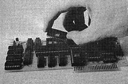


---

<!-- Source PDF page 82; manual page 4—36 -->

using the keyboard or by printing characters from
your running programs. To activate the expanded
character set, enter or “PRINT” the “CTRL—Z 3”.
Return to the standard character set with “CTRL—Z
2”. Depending on the EPROM that you have installed,
you may have virtually any character font available
to you. If you don’t have an EPROM installed in
your VIDEOTERM, the selection of the expanded
character set will simply generate blank white
squares.
VIDEX offers a variety of character fonts on
2708 and 2716 EPROMs. Write to us for a current
list of available character sets. These EPROMS are
easily installed in place of part U—17 in the
photograph on page A—4. Figure 4 shows a photograph
of the insertion of an EPROM into this location. Be
careful when inserting or withdrawing any chip from
the board as you can easily bend the pins which may
result in their breaking.
Figure 5 shows the keyboard correspondence for
the Line Drawing set EPROM. Figure 6 shows an
example report form created using this character
set. The actual use of character cells within the
matrix for this character set is shown in Figure 7a,
pages 4—40 to 4—43. The character set provided in
your 2716 EPROM Character Generator is shown in
Figure 7b, pages 4—44 to 4—51. Several blank forms
have been included as Figure 8, pages 4—52 to 4—55,
for you to use in creating your own character set.
Feel free to photocopy as many of these blank forms
as you like. You can program these yourself if you
have a 2708 EPROM Programmer for the Apple II. You
can even use a 2716 EPROM to obtain a total of 128
new characters by simply resoldering two jumpers on
the VIDEOTERM board (see page 6—4 and Figure 9b).
Follow the instructions included with your
EPROM programmer to program your chip. We advise
that you try programming the standard character set


---

<!-- Source PDF page 83; manual page 4—37 -->

on your first attempt and use it to replace the
VIDEX supplied EPROM in 11—20. That way you can
verify that you are following the correct procedures
in "burning" your EPROMs.

### B. Graphics

You can generate your own set of graphics
display characters using your EPROM programmer.
Follow exactly the same method you used in
generating text character sets.


---

<!-- Source PDF page 84; manual page 4—38 -->

ASCII: ASCII UC:

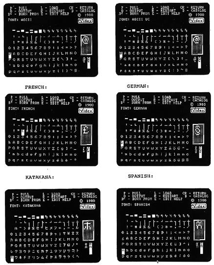


---

<!-- Source PDF page 85; manual page 4—39 -->

SYMBOL: SUPER & SUBSCRIPT:

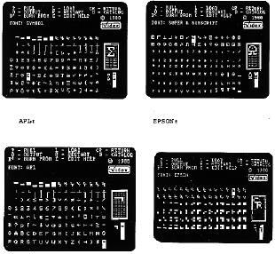


---

<!-- Source PDF page 86; manual page 4—40 -->

GRAPHICS CHARACTER SET

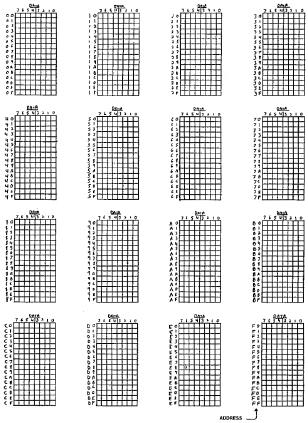


---

<!-- Source PDF page 87 -->

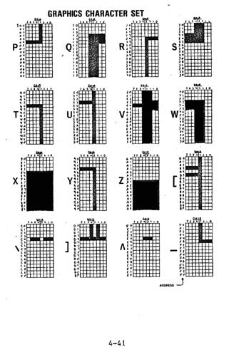


---

<!-- Source PDF page 88 -->

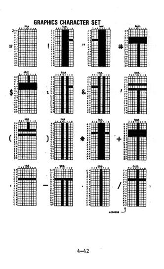


---

<!-- Source PDF page 89 -->

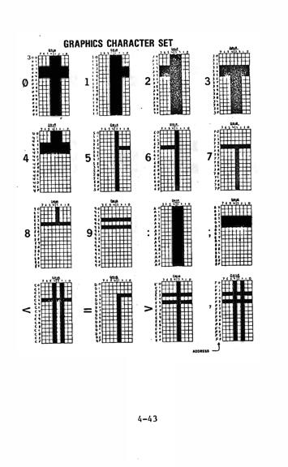


---

<!-- Source PDF page 90; manual page 4—44 -->

GRAPHICS CHARACTER SET

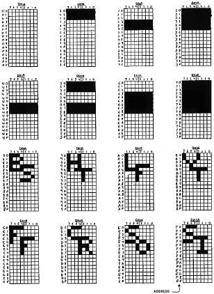


---

<!-- Source PDF page 91; manual page 4—45 -->

GRAPHICS CHARACTER SET

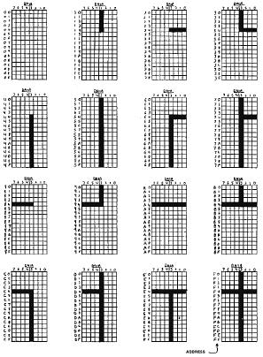


---

<!-- Source PDF page 92; manual page 4—46 -->

GRAPHICS CHARACTER SET

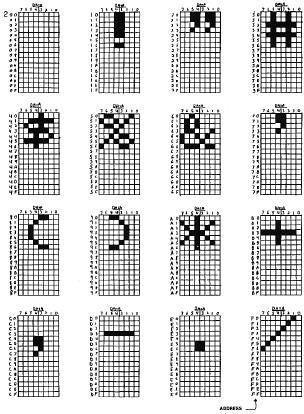


---

<!-- Source PDF page 93; manual page 4—47 -->

GRAPHICS CHARACTER SET

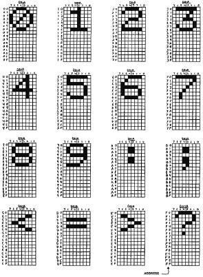


---

<!-- Source PDF page 94; manual page 4—48 -->

GRAPHICS CHARACTER SET

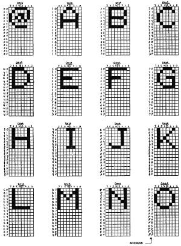


---

<!-- Source PDF page 95; manual page 4—49 -->

GRAPHICS CHARACTER SET

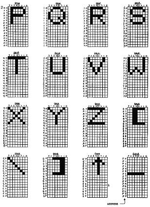


---

<!-- Source PDF page 96; manual page 4—50 -->

GRAPHICS CHARACTER SET

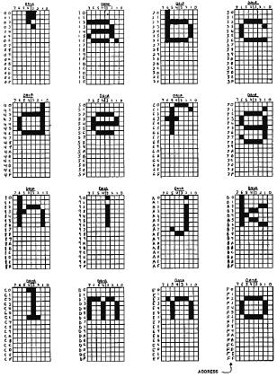


---

<!-- Source PDF page 97; manual page 4—51 -->

GRAPHICS CHARACTER SET

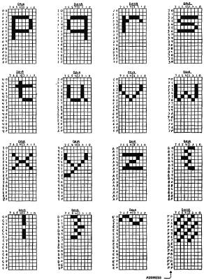


---

<!-- Source PDF page 98; manual page 5-1 -->

# FIRMWARE

For the casual user, not much need be said
about the firmware that The board comes equipped
with. For the most part, you will be satisfied with
the boards performance and much of what it does, why
it does it and how to modify it will remain
transparent to you. If, however, you enjoy
tinkering with register contents and other
esoterica, this section will provide you with some
very interesting Information.
We will begin this section with a discussion of
the CRT Controller chip that is the heart of the
VIDETERM board, the chip's function and how to
access its various registers and options. This will
be followed by a discussion of how to modify some of
the internal registers that your firmware uses.

## Firmware Control of the VIDEOTERM Board

Included in a 2708 EPROM on the VIDEOTERM board
is the software which controls the CRT Controller
and other aspects of character processing. A
listing of this 6502 assembly language program
begins on page 5—x. A careful study of this listing
and its included comments will do much to instruct
you on how to access and control the VIDEOTERM from
your own assembly language programs.
At the heart of the VIDEOTERM board is the
Hitachi HD46505SP CRT controller IC chip (CRTC). It
is the largest chip on the board and occupies a
position just to the upper-left of center. While all
keyboard operations, curser movements, read and
write operations, and editing are under the 6502
microprocessor unit's (MPU's) control, the CRTC
provides all video timing for interfacing to raster
scan CRT displays.


---

<!-- Source PDF page 99; manual page 5—2 -->

The use of static Ram on the VIDEOTERM board
relieves the CRTC of the task of memory refresh.
Its other features are fully employed. These
functions include an internal cursor register which
may be altered so that the cursor may be programmed
to a unique shape, which allows ready recognition of
which program or part of a program is executing. A
light pen strobe input signal allows capture of the
status of an internal light pen register.

### A. CRTC Internal Register Use

The CRTC contains a set of internal registers
which are user software programmable. The contents
of these registers are regularly scanned by the CRTC
to determine such matters as horizontal and vertical
raster timing, position of the cursor, cursor size
and shape, interlace mode and several other items.
Let us see what each of the 18 available registers
does.
Horizontal timing of the raster scan is
controlled by Registers RO, R1, R2 and R3. These
registers control the frequency, position and width
of the horizontal sync pulse and the frequency,
position and duration of the horizontal display
signal. The screen display point of reference for
horizontal registers is the left most displayed
character position. These registers contain data
which is in ‘character time’ units, determined by
the MCM657lA Character Generator. The timing units
are given in Table 4 for the various character cell
matrix sizes which are available through the "CTRL-Q
<params>” character sequence.
RO: An 8—bit write—only register that
determines the horizontal frequency which
is the total, minus one, of displayed and
non—displayed character time units. This
is called the Horizontal Total Register.


---

<!-- Source PDF page 100; manual page 5—3 -->

R1: An 8—bit write—only register that
determines the number of displayed
characters per line. This is termed the
Horizontal Display Register.
R2: An 8—bit write—only register that
determines the horizontal sync position on
the horizontal line. This is termed the
Horizontal Sync Position Register.
R3: A 4—bit write—only register that
determines the width of the horizontal
sync pulse. This is termed the Horizontal
Sync Width Register.
A variety of vertical registers control the
vertical sync pulse frequency and position and the
vertical display frequency and position. It also
generates row selects for interlace or non—interlace
modes. The point of reference for the vertical
registers is the top character position displayed.
These registers are programmed in ‘character time’
units.
R4: A 7—bit write—only register that
determines the vertical refresh rate in
conjunction with R5. The calculated
number of character linetimes is usually
an integer plus a fraction to obtain
exactly a 50 or 60 Hz vertical refresh
rate. The integer number of character
line times minus one is entered into this
register which is called the Vertical
Total Register.
R5: A 5—bit write—only register contains the
fraction needed to obtain, in conjunction
with R4, the needed exact 50 or 60 Hz
vertical refresh rate. This is called the
Vertical Total Adjust Register.
R6: A 7—bit write—only register determines the


---

<!-- Source PDF page 101; manual page 5—4 -->

number of displayed character row on the
screen (in ‘character row’ time units.
This is called the Vertical Displayed
Register.
R7: A 7—bit write—only register determines the
vertical sync position with respect to the
top reference line. This is called the
Vertical Sync Position Register.
R8. A 2—bit write—only register controls the
raster scan mode. As long as bit 0 is clear
(0), the display is in Normal Sync
Mode (non—Interlaced). When bit 0 is set
(1), bit I determines the mode. If it is
clear (0), then Interlace Sync Mode is
set. If bit 1 is set (1), then Interlace
Sync with Video Mode is set. The Normal
Sync Mode is what is normally selected by
the VIDEOTERM. Interlace Sync doubles the
number of dots, duplicating each dot below
its position, thus increasing the quality
of the displayed character. Interlace
Sync with Video keeps the character dot
matrix the same, but doubles the number of
lines on the screen so that twice as many
characters, each one—half their normal
size, are displayed on the screen. This
mode should only be chosen if you are
using a long—phosphor video monitor. This
is called the Interlace Mode Register.
R9~ A 5—bit write—only register that
determines the number of scan lines per
character row including spacing around the
character row. This is one less than the
number of scan lines. This register is
called the Maximum Scan Line Address
Register.
There are eight more registers available which
affect four other display characteristics. Since


---

<!-- Source PDF page 102; manual page 5—5 -->

these registers are utilized in pairs, we will
describe them in that way.
R10 and R11: The Cursor Start and End
Registers, respectively. R10 is a 7—bit and R11 is
a 5—bit write—only register. In both, bits 0 to 4
are the start and end row of the cursor. Rio, the
start row, may be set at any value from 0 to 11
(decimal). R11, the end row, may be set at any
value greater than or equal to the start row value.
Thus if the start row was 0 and the end row was 11,
a full cursor would be displayed, while if the start
and end rows were both 11 an underline cursor would
be formed. In addition, bits 5 and 6 of R10 are
used to set the Cursor Display Mode. If bit 6 is
clear (0), the cursor will not blink, while if it is
set (1), it will blink at a rate determined by bit
5. If bit 6 is clear then the status of bit 5
determines if there is a cursor displayed (cleared
or 0) or not (set or 1). When bit 6 is set and bit
5 is clear (0), you set a 1/16th field rate blink.
When bit 5 is set, you obtain a 1/32nd field rate
blink. You can set these registers so that you can
obtain a wide variety of customized and individually
recognizable cursors which can greatly aid you in
identifying which software program is currently
running.
R12 and R13: These are the high and low,
respectively, addresses for determining where to
start writing on the screen. You should not change
or utilize these registers in any way as you will
interfere with the scrolling operation of the
VIDEOTERM. R12 is a 6—bit and R13 is an 8—bit pair
of write—only registers called the Start Address
Register.
R14 and R15: These are high and low,
respectively, address components of a 14—bit address
determining the current cursor location. You do not
need to access these locations directly, but may
reposition the cursor through the use of the


---

<!-- Source PDF page 103; manual page 5-6 -->

“SHIFT—CTRL-N <x> <y>" sequence where the x and y
screen coordinates, in ASCII character codes are
given in place of the angle brackets. R14 is a
6—bit and R15 is an, 8—bit pair of read/write
registers called the Cursor Register.
R16 and R17: These are high and low,
respectively, address components of a 14—bit address
which is stored when the Light Pen strobe goes high.
The address which is stored is the CRTC Address
Counter. R16 is a 6—bit and R17 is an 8—bit pair of
read—only registers.
Table 4 on the following page summarizes this
information and gives the standard VIDEOTERM default
values used with its various character cell matrix
sizes.


---

<!-- Source PDF page 104; manual page 5-7 -->

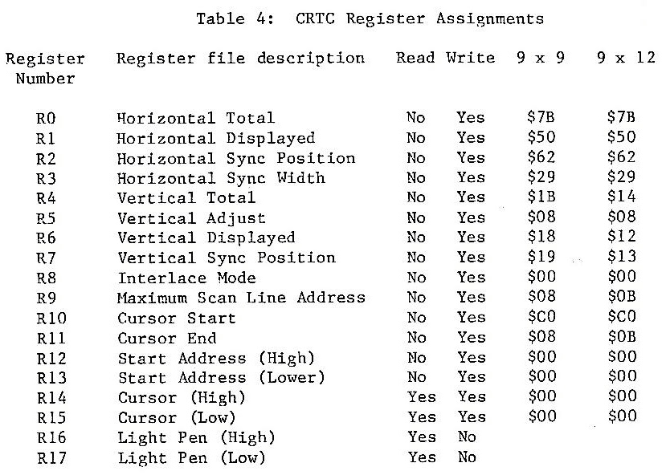


---

<!-- Source PDF page 105; manual page 5—8 -->

### B. How to Modify CRTC Registers

Now that you know what the various registers
are, you undoubtedly want to know how to moddify
their contents. To do this you must place two
values into specific Apple II memory locations. The
first value is the register number, in hexadecimal,
that you wish to write into and the second value is
the new value to be entered. Thus, if you wanted to
change the cursor to a non—blinking upper half of a
cursor five rows thick, you would want to enter "OA
01” and OB 05” to place line numbers 1 and 5 into
RIO and R11, respectively. If you wanted to make
this cursor blink, you would enter “OA 61” where the
$61 (decimal 97) indicates that both bits 5 and 6 of
the word are set.
But how do you determine the address at which
to enter these numbers? This is done using a device
select operation, which algorithm is as follows.
Your first hex address character must be a 'C' as
this is the address space used by Apple II in
dealing with its peripherals. The next number must be
zero. These are the high address of the device
select 16-byte group. The third number will be
eight plus the slot number so that if your board is
in slot 3 the number will be ‘B’ in hex. These
first three numbers of the correct address are
chosen according to Table 3, page 4—7. Also look at
Table 25, page 82, in the Apple II Reference Manual.
The last number of the four is either a ’0’ or ’ 1’.
Enter the CRTC Register to be changed using ‘0’ and
the value to be placed in that register using ‘1’.
Let us continue with our cursor modification example
above and enter the correct information, assuming
that you have the VIDEOTERm in slot 3. Enter the
Monitor by typing
CALL —154 (CR)
Then enter


---

<!-- Source PDF page 106; manual page 5—9 -->

\*COBO:OA (CR)
\*COB1:O1 (CR)
\*COBO:OB (CR)
\*COBI:05 (CR)
You can also enter the information with
\*COBO:OA 01 (CR)
\*COBO:OB 05 (CR)
You have now set the cursor to a non—blinking,
upper—half cursor, five matrix cell rows thick. You
have done this by reinitializing registers R10 and
R11.

### C. Device Select Operation

Device selection is mentioned several times
throughout this manual. The calculation of the
correct 16—byte device specific group has been
demonstrated to be slot dependent. The preceding
section should how to use the device select to
modify a CRTC register. However, whenever a “PEEK”
or “POKE” command is executed in this group, several
things happen. To understand this, we need to
describe how the lowest 4 bits of this two—byte
address affects the VIDEOTERM. This is the ‘x’ in
the $COBx address. (For other slots, substitute $8
+ n, where n is the slot number of the VIDEOTERM.)
The very lowest bit, bit 0, controls whether a
register is being accessed (0) or the contents of
the register is being accessed (1). The next lowest
bit, bit 1, controls whether an eight or nine cell
matrix width is being used. VIDEOTERM automatically
interprets this as 0 (9 cells), so there is no
reason to change this.
The next two bits, bits 2 and 3, determine
which page will be selected (see VIDEOTERM memory
mapping, page 5—12. If the value of both is zero,


---

<!-- Source PDF page 107; manual page 5—10 -->

page zero is selected, if their Value together is
one, page one is selected, and so forth. Thus,
access of $COBO selects for slot 3, a register
access and page zero all at once. Similarly, $COC5
selects for .slot 4, register contents access and
page one use (bit 2 and bit 0 set).

### D. Video Set-Up Flags

Table 1 defined the VlDEOTERM's use of
available Apple 11 RAM scratchpad locations.
Location $7F8 (decimal 2040) was defined as being
used as video set—up flags. These flags will be
explained here.
Each word of storage in the Apple II contains 8
bits. The bit locations In the word are identified
by a number between 0 and 7, with hit 0 the bit
furthest to the right in the word (representing the
l’s place) and bit 7 is the Furthest to the right
(representing the 128’s place, i.e. 2 ). Only 4 of
the 8 bits are used as flags.
Bit 0: Alternate character set flag. When set to
0, It selects the standard character set.
When set to 1, it selects the alternate
character set. If you have the modified
the VIDEOTERM to use its inverse video
option, then the setting of 0 selects for
standard video and 1 selects for an
inverse character (black on white field).
Bit 4: Number of rows flag. When set to 0, it
selects for display of 18 lines of text.
When •set to 1, it selects for display of
24 lines of text.
Bit 6: Upper/lower case flag. When set to 0, it
selects for non—conversion of entered text
so that an tipper case character (all that
you can type directly from the keyboard)
will remain tipper case. When set to 1, it


---

<!-- Source PDF page 108; manual page 5—11 -->

selects for conversion of the entered
character to lower case. This flag is
toggled by the “CTRL—A” entry.
Bit 7: GETLN flag. When set to 0 it indicates
that the VIDEOTERM input came from a
“GET” statement. When set to 1, it
indicates that your input has resulted
from use of the Apple’s GETLN routine,
which means input came from a program’s
“INPUT” statement or directly from the
keyboard. The behaviour of this routine
is fully documented in the Apple II
Reference Manual, pages 33—34.


---

<!-- Source PDF page 109; manual page 5—12 -->

## VIDEOTERM Memory Mapping

As explained in the Apple II Reference Manual
on pages 84 and 85, the Apple II address range from
$C800 to $CFFF is reserved For mapping into 2K of
EPROM memory located on a peripheral card. Which
card, determined by its slot location, is referenced
by these addresses is determined by the “PR#n”
statement.
For the VIDEOTERM, the 1K range from $C800 to
$CBFF is used to access the controlling firmware on
the board. The address range From $CCOO to $CDFF is
used to address the VIDEOTERM’s on—board RAM. The
range from $CEOO to $CFFF is not presently used.
The address range from $CCOO to $CDFE only
covers 512 Bytes of storage. Since the VIDEOTERM
HAS 2K. of on—board RAM, four times the address
range, it would seem impossible to access all of the
on—board memory! To overcome this apparent
limitation, a technique called “paging” is used.
Basically, paging works as follows. The 2048
byte RAM area is subdivided into four 512—byte
segments, each called a “page”. Once the VIDEOTERM
is activated by the correct memory reference, it
will automatically set the correct active page. You
then write the character that you want displayed to
the relative address within the 512—byte group.
This is called a “page—relative address” and may be
calculated by taking the 2048—byte address modulo
512.Then write the character you want displayed to
that address.
Let us review the process as you would
implement it in one of your programs. Determine the
address within the 2048 byte on—board RAM that you
wish to access. This technique is illustrated in
the Applesoft and Integer Basic language software
examples in the preceding chapter on pages 4—12 to


---

<!-- Source PDF page 110; manual page 5—13 -->

4—23,and reviewed again below. Then execute a
“PEEK” on a page—specific address in the reserved
peripheral 16—byte group. For slot 3, these
addresses would be $C0~30, $COB4, $COB8 and $COBC
(49328 TO 49340). This sets the VIDEOTERM’s current
active page to the correct page. Finally, “POKE”
the desired character, represented by its ASCII
character code in decimal, into the page—relative
address acquired by taking the actual address “MOD
512”. You have just placed that character in the
VIDEOTERM’s on—board memory and you will see the
character properly displayed in its chosen position
on your monitor screen.
Note that when you determine the actual 2048
byte address, you must use the current screen start
line address stored at $6F8 + n = 1784 + n, where n
is the number of the slot in which the VIDEOTERM is
located. (See Table 1, page 3—2.) Multiply the
contents of this location by 16. Next determine
where on the screen you want to place the character.
The column number, X, may vary between 0 and 79, and
the row number, Y, may vary between 0 and 23. The
on—screen location will be X + 80 * y• This will
generate a number between 0 and 1919. Add this to
the start location times 16. Take this result
modulo 2048 to keep it in the correct numerical
range. The final algorithm is
ADDRESS = X + Y * 80 + PEEK(1784 + n) * 16
To activate the correct page, take the start
address of the 16—byte group dedicated to the slot
in which the VIDEOTERM is located. This address is
$0080 + n * 16 45184 + n * 16, where n is the slot
location. Add to this result the desired page to be
activated. This is calculated by taking the above
ADDRESS/512. A page number between 0 and 3 is thus
calculated. We then multiply by 4 to put this
number in bits 2 and 3 (see page 5—9). Lastly,
“PEEK” at the address which is the sum of the start
address and four times the page number. Thus


---

<!-- Source PDF page 111; manual page 5—14 -->

PAGE = ADDRESS/512
SELECT = PEEK(45184 + n * 16 + PAGE * 4)
The correct VIDEOTERM RAN page is now activated, and
any character written into the address space $CCOO
(52224) to $CDFF (53247) will go to the active page.
For Integer Basic, subtract the value 69536
from the above decimal address equivalents to
generate the correct negative decimal address
equivalent. The peripheral—specific 16—byte address
group base addresses are listed in Table 3, page
4—7, for all Apple languages.


---

<!-- Source PDF page 112; manual page 5—15 -->

## VIDEX VIDEOTERM Firmware Listing

```text
:AIM
       1    *************************************
       2    *                                   *
       3    *        VIDEOTERM INTERFACE        *
       4    *         FIRMWARE V. 2.4           *
       5    *                                   *
       8    *    WRITTEN 8Y DARRELL ALDRICH     *
       7    *         (Cl 1981 VIDEO            *
       8    *************************************
       10   *
       II   * ZERO PAGE EQUATES
       12   *
       13   CH     EQU $24
       14   CV     EQU $25
       15   BASL   EQU $28
       16   OSAVE EQU $33
       17   CSWL   EQU $36
       18   CSWH   EQU $37
       19   KSWL   EQU $38
       20   XSWH   EQU $39
       21   RNOL   EQU $4E
       22   RNON   EQO $4F
       23
       24   * TEMPORARIES
       25
       26   CRFLAG EQU $478
       27   ASAV1    EQU $4F8
       28   XSAV1    EQU $578
       29   TEMPX    EQU SIFO
       30   OLOCHAR EQU $618
       31   NO       EQU $6F8
       32   MSLOT    EQU $778
       33   *
       34   * MISC EQUATES
       35   *
       36   IN     EQU $200
       37   IORTS EQU $FFCB
       38   *
       39      SLOT N PERMANENTS
       40   *
       41   EASEL EQU $478 ;SCREEN BASE ADDRESS LOW
       42   BASEM EQU $4FB    ;SCREEN BASE ADDRESS HIGH
       43   CHORZ EQU $578    ;CURSOR HORIZONTAL POSITION
       44   CVERT EQU $SFB    ;CURSOR VERTICAL POSITION
       45   BYTE EQU $678     ;1/0 BYTE FOR PASCAL ENTRIES
       46   START EQU $6FB    ;SCREEN START ADDRESS
       47   POFF EQU $778     ;POWER OFF AND LEAD IN COUNTER
       48
       49   * B0,61 15 GO TO IV LEAD IN COUNTER
       38   * B2 15 CONTROL 7 LEADIN COUNTER
       31   * B3—B? IS POWER OFF FLAG
       32   *
       53   FLAGS EQU $?F8        VIDEO SET UP FLAGS
       34   *
       55   * B0 ALTERNATE CHARACTER SET I=OH O=OFF
       56   * B1
       57   * B2
       58   * B3
```


---

<!-- Source PDF page 113; manual page 5—16 -->

```text
                  59 * 84 ROWS OF CHARACTERS 1=24 0=18
                  60 * 85
                  61 * 86 LOWER / UPPER CASE CONVERSION FLAG 1=ON 0=OFF
                  62 * 67 GETLN FLAG I=INPUT CANE FROM GErLN ROUTINE
                  63 *
                  64 *
                  65 * I0 DEVICES
                  66 *
                  67 K80       EQU $0000
                  68 KBDSTR8   EQU SCOIO
                  69 SPKR      EQU $0030
                  70 DEVO      EQU SCOBO
                  71 DEV1      EQU $0081
                  72 DISP0     EQU $CC0O
                  73 DISP1     EQU $0000
                  74 *
                  75 *         ORG SC80O
                  76 *         08J $6800
                  77 *
                  78 *
                  79 * SET UP CRTC AND CLEAR SCREEN
                  80 *
                  81 *
C800: AD 78 07    82 SETUP     LDA POFF             ;GET POWER OFF FLAG
C805: 29 F8        83 AND     #$F8                ;STRIP OFF LEAD IN COUNTERS
C807: C9 30       84           CMP #$30             ;HAS POWER BEEN TURNED OFF?
C809: FO 21       85           BEQ SETEXIT        ;RETURN IF NOT
C803: A9 30       86 RESTART LDA #$30
C808: 80 78 07    87           STA POFF           ;SET DEFAULTS FOR FLAGS
C80E: BD FB 07    88           STA FLAGS
C811: A9 00       89           LDA #$00
C813: 80 FB 06    90           STA START
C816: 20 61 09    91           JSR CLSCRN
C819: A2 00       92           LOX #$00
C818: 8A          93 LOOP      TXA
C810: 80 80 C0    94           STA DEV0           ;FOR THE CRTO ADDRESS
C81F: 80 Al C8    95           LDA TABLE,X        ;GET PRAMETER
C822: 80 81C00    96           STA DEV1           ;STORE INTO CRTC
C825: E8          97           INX
C826: CO 10       98           CPX #$10
C828: 00 Fl       99           8NE LOOP           ;CONTINUE LOOP UNTIL DONE
C82A: 80 59 C0   100 SETEXIT STA $C059
C82D: 60         101           RTS
                 102
                 103
C82E: AD F8 07   104           LDA FLAGS
C831: 29 08      105           AND #$08
C833: FO 09      106           BEQ NORMOUT
C835: 20 93 FE   107           JSR $FE93
C838: 20 22 FC   108           JSR $FC22
C838: 20 89 FE   109           JSR $FE89
C83E: 68         110 NORMOUT PLA                    ;RECOVER REGISTERS
C83F: A8         111           TAY
C840: 68         112           PLA
C841: AA         113           TAX
C842: 68         114           PLA
C843: 60         115           RTS
                 116 *
                 117 *
                 118 *              ;GET CHARACTER FROM XEYBOARD
```


---

<!-- Source PDF page 114; manual page 5—17 -->

```text
                       119   *
C844:   20   DI   CO   120   RDKEY   JSR   CSRMOV    ;POSITION CURSOR
C847:   E6   4E        121   KEYIN   INC   RNOL      ;UPDATE BASIC RANDOM NUMBER
C849:   DO   02        122           8NE   KEYIN2
C840:   E6   4F        123           INC   RNOH
C84B:   AD   00   CO   124   KEYIN2  LDA    KBD     ;POLL KEYBOARD
C85O:   10   FO        125           BPL    KEY[I] ;LOOP UNTIL KEY IS STRUCK
C852:   20   SC   CO   126           JSR   KEYSTAT
C855:   90   FO        127           8CC    KEYIN
C857:   2C   10   CO   128   NOKEY   BIT    K8OSTR8 ;CLEAR KEYBOARD STROBE
C85A:   10             129           CLC
C85B:   60             130           RTS
                       131   *
C85C:   CV   00        132 KEYSTAT  CMP #$8B        ;CHECK FOR CONTROL K
C85E:   DO   02        133           8NE NOTK        ;SKIP IF NOT
C860:   A9   00        134           LDA #$D8        ;SUOSTITUTE A RIGHT BRACKET
C862:   C9   81        135   NOTK    CMP #$81        ;CHECK FOR CONTROL A
C864    DO   OA        136           8NE NTSHFT      ;SKIP IF NOT
C866:   AD   FB 07     137           LDA FLAGS
C869:   49   40        138           EOR #$40
C86B:   00   FO 07     139           STA FLAGS       ;TOGGLE UPR/LWR CASE FLAG
C86E:   00   El        140           8GE NOKEY       ;GET NEXT KEY
C870:   40             141   NTSHFT  PHA             ;SAVE CHARACTER
C87l:   AD   FR 07     142           L0A FLAGS
C874:   OA             143           ASL
C875:   0A             144           ASL             ;CHECK UPR/LWR CASE CONVERSION FLAG

C876:   60             145           PLA            ;RESTORE CHARACTER
C877:   90   IF        146           8CC INDONE     ;DON’T CONVERT IF FLAG CLEAR
C879:   C9   80        147           CMP #$80
C87B:   90   1F        148           8LT INDONE     ;DON’T CONVERT SPECIAL CHARACTERS
C87D:   2C   63 CO     149           8IT $C063
C880:   30   14        150           8MI NOSHIFT
C882:   C9   80        151           CMP #"0"
C884:   F0   0E        152           BEQ ZERO
C886:   C9   CO        153           CMP #"@"
C888:   DO   02        154           8NE NOT@
C88A:   A9   DO        155           LDA #"P"
C88C:   C9   C8        156 NOT@      CMP #"["
C88E:   90   08        157           8LT INOONE
C89O:   29   CF        158           AND #$CF
C892:   D0   04        159           8NE INDONE
C894:   A9   DO        160 ZERO      LDA #"]"
C896:   09   20        161 NOSHIFT   ORA #$20
C898:   48             162 INDONE    PHA            ;DUPLICATE CHARACTER
C899:   29   7F        163           AND #$7F       ;STRIP OFF HIGH BIT
C89B:   8D   78 06     164           STA BYTE       ;SAVE FOR PASCAL
C89E:   68             165           PLA            ;RECOVER FOR BASIC
C89F:   38             166           SEC
C8A0:   60             167           RTS
                       168   *
C8Al:   78   50 5E
C8A4:   29   18 0B
C8A7:   18   19        169 TABLE     HEX 78505E2918081819
C8A9:   00   08 E0
C8AC:   08   00 0O
C8AF:   00   00        170           HEX 0008EO0800000000
                       171 *
                       172
                       173 * SECONDARY BASIC OUTPUT ROUTINE
```


---

<!-- Source PDF page 115; manual page 5—18 -->

```text
                     174    *
                     175    *
C881:   8D   78 06   176    BASOUT1   STA BYTE           ;SAVE CHARACTER
C884:   A5   25      177              LDA CV             ;PERPORM VTAB
C886:   C0   F8 05   178              CM? CVERT
C889:   F0   06      179              BEQ CVOK
C888    80   PB 05   180              STA CVERT
C88E    20   04 CA   181              JSR VTAB
C8C1    AS   24      182    CV0K      LDA CH             ;PERFORM HTAB
C8C3    CD   70 05   183              CMP CHORZ
C8C6    90   03      184              8CC PSCLOUT
C8C8    80   78 05   885              8TA CHORZ
C8CB    AD   78 06   886   PSCLOUT    LDA BYTE           ;GET CHARACTER
C8CE    28   89 CA   887              JSR OUTPTI         ;OUTPUT CHARACTER
C8D1    A9   OF      188   CSRMOV     LDA #$0F           ;SET UP CRTC ADDRESS
C8D3    80   80 CO   189              STA DEVO           ;FOR CURSOR LOW ADDRESS
C8D6    AD   78 05   190              LDA CHORZ          ;CALCULATE ADDRESS
C8D9    C9   50      191              CMP #80
C8D8    00   13      192              BCS RTS6
C8DD    AD   70 04   193              ADC BASEL
C8E0    80   01 CO   194              STA DEV1           ;SAVE ADDRESS
C8E3    A9   OE      195              LDA #$OE           ;SET UP CRTC AOORESS
C8E5    80   80 CO   196              STA DEVO           ;FOR CURSOR HIOM ADDRESS
C8E8    A9   00      197              LOA #$00           ;CALCULATE ADDRESS
C8EA    60   F8 04   198              AOC BASEH
C8E0    80   81 CO   199              STA DEV1           ;SAVE ADDRESS
C8FO    60           200    RTS6      RTS
                     201    *
                     202    *
                     203    * PERFORM ESCAPE FUNCTIONS
                     204    *
C8F1    49   CO      205    ESC1    EOR #$CO
C8F3    C?   08      206            CMP #$08
C8F5    80   10      207            OGE RTS3
C8F7    A8           208            TAY
C8F8    A9   C9      209            LOA #>BELL
C8FA    48           210            PHA
C8FB    89   P2 CO   211            LOA ESCT8L,Y
C8FE    48           212            PHA
C8FF    60           213            RTS
                     214    *
C900    EA           215            NOP
                     216    *
C901    AC   78 05   217    CLREOL  LOY CHORZ            ;PUT CURSOR HORIZONTAL ONTO Y
C904    A?   AO      218    CLEOLZ  LDA #$A0             ;USE A SPACE
C906    20   71 CA   219    CLEOLO  JSR CHRPUT           ;PUT CHARACTER ON SCREEN
C909    C8           220            INY
C90A    CO   50      221            CPY #80              ;CONTINUE UNTIL
C90C    90   P8      222            8LT CLEOL2           ;Y>=80
C90E    60           223            RTS
                     224    *
C90F    A9 34        225    LEADIN  LDA #$34             ;SET LEAO IN BIT
C911    80 78 07     226    PSAVE   STA POFF
C914    60           227    RTS3    RTS
C915    A9 32        228    GOXYI   LOA #$32             ;SET LEADIN COUNT TO 2
C917    00 P8        229            8NE PSAVE
                     230    *
C919    AO   CO      231    BELL    LOY #$C0             ;BEEP THE SPEAKER
C91B    A2   80      232    BELLI   LDX #$80
C91D    CA           233    BELL2   DEX
```


---

<!-- Source PDF page 116; manual page 5—19 -->

```text
C9lE:   00   FO         234           BNE   BELL2
C020:   AD   30    CO   235           LDA   SPKR
C023:   88              236           DEY
C024:   DO        FS    237           BNE   BELL1
C926:   60              238           RTS
                        239
                        240
                        241 * STORE CHARACTER ON SCREEN AND ADVANCE CURSOR
                        242 *
C027:   AC   70 05      243 STOADV   LOY    CHORZ
CO2A:   CO   50         244          CPY    #80
C92C:   90   05         245          BCC    NOT8I
CO2E:   48              246          PHA
CO2F:   20   80 CO      247          JSR    CRLF
C032:   60              248          PLA
C933:   AC   78 05      249 NOT8I    LDY    CHORZ
C936:   20   71 CA      250          JSR    CHRPUT    ; PLACE CHARACTER ON SCREEN
C939:   EE   78 05      251 ADVANCE INC     CHORZ     ; INCREMENT CURSOR HORIZONTAL INDEX
CO3C:   2C   70 04      252          BIT    CRFLAG
C93F:   10   07         253          BPL    RTS8
C941:   AD   72 05      254          LDA    CHORZ
C044:   C9   50         255          CMP    #80
C946:   80   68         256          BCS    CRLF
C048:   60              257 RTS8     RTS
                        258 *
                        259 * CLEAR TO END OF hAGE
                        260 *
C040:   AC   78 05      261 CLREOP   LOY    CHORZ     ; GET CURSOR HORIZONTAL INTO Y
C94C;   AD   FO 05      262          LDA    CVERT     ; GET CURSOR VERTICAL INTO A
C94F:   48              263 CLEOP1   PHA              ; SAVE CURRENT LINE ON STACK
COSO:   20   07 CA      264          JSR    VTABZ     ; CALCULATE BASE ADDRESS
C953:   20   04 C?      265          JSR    CLEOLZ    ; CLEAR TO END OF LINE, SET CARRY
C056:   AO   00         266          LDY    #$00      ; CLEAR FROM HORIZONTAL INDEX 0
COSO:   60              267          PLA
C959:   69   00         268          ADC    #%00      ; INCREMENT CURRENT LINE (C=I)
C95B    CO   18         269          CMP    #24       ; DONE TO BOTTOM OF WINDOW?
CO5D:   90   F0         270          BCC    CLEOP1    ; IF NOT KEEP CLEARING LINES
C95F:   80   23         271          BCS    JVTAB     ; VERTICAL TAB TO CURSOR POSITION
                        272 *
                        273 *
                        274 * CLEAR SCREEN
                        275 *
C960:   20   67 CO      276 CLSCRN   JSR    HOME     ; HOME CURSOR
C064:   98              277          TYA
C965:   FO   ES         278          BEQ    CLEOP1 ; CLEAR TO END OF PAGE
                        279 *
                        280 *        HOME   CURSOR
                        281 *
C067:   A9   00         202 HOME     LOA    #$00    ; SET CURSOR POSITION TO 0,0
C969:   OD   78 05      283          STA    CHORZ
C96C:   80   F8 05      284          STA    CVERT
C96F:   AS              205          TAY
C970:   FO   12         286          BEQ    JVTAB   ; VERTICAL TAB TO CURSOR POSITION
                        287 *
C972:   CE   78 05      288 BS       DEC    CHURZ   ; DECREMENT CURSOR HORIZONTAL INDEX
C075:   10   OD         289          8PL    RTS3    ; IF POS, OK. ELSE MOVE UP
C077:   A9   4F         290          LDA    #79     ; SET CURSOR HORIZONTAL TO
C070:   8D   78 05      291          STA    CHORZ   ; RIGHTMOST SCREEN POSITION
                               292 *
                               293 * MOVE CURSOR UP
```


---

<!-- Source PDF page 117; manual page 5—20 -->

```text
               294   *
C97C: AD EB 05 295   UP           L0A    CVERT      ; GET CURSOR VERTICAL INDEX
CO7F: FO 93    296                BEQ    RTS3       ; IF TOP LINE THEN RETURN
C981: CE PB 05 297                DEC    CVERT      ; DECREMENT CURSOR VERTICAL INDEX
C984: 4C 04 CA 298   JYTAB        JMP    VTA8       ; VERTICAL TAB TO CURSOR POSITION
               299   *
               200   *
C987: A9 30    301   NOTGOXY      LDA    #$30       ; CLEAR LEAD IN BITS
C989: 80 78 07 302                STA    POFF
C98C: 68       303                PLA               ; RECOVER CHARACTER
C980: 09 80    304                ORA    #$80
C98F: C9 81    305                CMP    #"1"
C991: 00 67    306                BNE    NOTO
C993: A9 08    307                LDA    #$O8
C995: 80 58 CO 308                STA    $CO58
C998: 00 50    309                BNE    FLGSET
               310   *
CO9A: C9 82    311   NOT1         CMP    #"2"
C99C: DO 51    312                8NE    NOT2
C99E: A9 FE    313   LOLITE       LDA    #$FE
C9AO: 20 FO07 314    FLOCLO       AND    FLAGS
C9A3: 80 PB07 315    FLGSAV       STA    FLAGS
C9A6: 60       316                RTS
               317   *
               318   *
               319   *
               320   * PASCAL OUTPUT ENTRY POINT
               321   *
               322   *
C9A7: 80 78 06 323   PSOUT         STA    BYTE
C9AA: 4E 78 04 324                 LSR    CRFLAG
C9AD: 4C C8 C8 325                 JMP    PSOLOUT     ; JUMP FOR PASCAL ENTRY
               326   *
               327   *
               328   * CR LF ROUTINE
               329   *
C980: 20 27 CA 330   CRLF          JSR    CR
C983: EE F8 05 331   LF            INC    CVERT      ; INCREMENT CURSOR VERTICAL
C9B£: AD FB 05 332                 LDA    CVERT
C9B9: C9 18    333                 CMP    #24        ; OFF SCREEN?
C988: 90 4A    334                 8CC    VTABZ      ; IF NOT MOVE CURSOR
C980: CE FB 05 335                 DEC    CVERT      ; IF SO DECREMENT CURSOR VERTICAL
               336   *
C9CO: AD FR 06 337                 LDA    START      ; INCREMENT THE START ADDRESS
C9C3: 69 04    338                 ADC    #$04       ; BY ONE LINE
C9CS: 29 7F    339                 AND    #$7F
C9C7: 80 F8 06 340                 STA    START
C9CA: 20 12 CA 341                 JSR    BASCLC1    ; CALCULATE THE START ADDRESS
COCO: A9 00    342                 LDA    #$0D       ; SET UP CRTC ADDRESS
C9CF: 80 80 CO 343                 STA    DEVO       ; FOR START LOW ADDRESS
C9D2: AD 78 04 344                 LDA    BASEL      ; GET START LOW
C905: 80 81 CO 345                 STA    DEV1       ; SAVE START LOW
CODO: A9 OC    346                 LDA    #$OC       ; SET UP CRTC ADDRESS
CODA: 80 BO CO 347                 STA    DEVO       ; FOR START HIGH ADDRESS
CODO: AD FB 04 348                 LDA    BASEH      ; GET START HIGH
C9EO: 80 RI CO 349                 STA    DEV1       ; SAVE START HIGH
C9E3: A9 17    358                 LDA    #23        ; PUT WINDOW BOTTOM—1 INTO A
COES: 20 87 CA 351                 JSR    VTABZ      ; CALCULATE BASE ADDRESS
C9E8: AO 08    352                 LDY    #$00
C9EA: 20 84 C9 353                 JSR    CLEOLZ     ; CLEAR BOTTOM LINE
```


---

<!-- Source PDF page 118; manual page 5—21 -->

```text
COED:   80 95  354           BCE    JVTAB ;MOVE CURSOR BACK
               355 *
COEF: C9 B3 356 NOT2         CMP    #"3"
C9F1: DO 0E 357              BNE    JST0ADV
COF3: A9 01 358 HILITE       LOA    #$0l
COPS: 0D F8 359 FLGSET       ORA    FLAGS
C9P8: D0 A     360           BNE    FLGSAV
               361 *
               362 *
               363 * BASIC INITIAL I/O ENTRY POINT
               364 *
               365 *
               366 *
C9FA: C9 B0    367 NOTO      CMP    #"0"
C9FC: DO 9C    368           BNE    NOT1
C9FE: 4C 09 C8 369           JMP    RESTART
               370 *
CAO1: 4C 27 CO 371 JSTDADV   JMP    STOADV
               372 *
CAO4: AD PB 05 373 VTAB      LDA    CVERT         ;GET CURSOR VERTICAL
CAB7: 8D P8 04 374 VTABZ     STA    ASAV1         ;MULTIPLY A BY 5
CAOA: OA       375           ASL
CAOA: OA       376           ASL
CAOC: 6D P8 04 377           ADC    ASAV1
CA0E: 6D P8 06 378           ADC    START         ;ADD START
CA12: 48       379 BASCLCI   PHA                  ;SAVE A
CA13: 4A       380           LSR                  ;CALCULATE BASEH
CA14: 4A       381           LSR
CAIS: 4A       382           LSR
CA16: 4A       383           LSR
CA17: 8D PB 04 384           STA    BASEH
CA1A: 68       385           PLA                  ;RECOVER A
CA1B: OA       386           ASL                  ;CALCULATE BAGEL
CA1C: OA       387           ASL
CA1D: OA       388           ASL
CA1E: OA       389           ASL
CAlF: 8D 78 04 390           STA    BAGEL
CA22: 60       391 RTS2      RTS
               392 *
               393 *
CA23: C9 00    394 VIDOUT    CMP    #$OD
CA25: DO 06    395 BNEVOGUT1
CA27: A9 00    396 CR LOA    11000
CA29: 80 78 05 397           STA    CHDRZ
CA2C: 60       398           RTS
CA2D: 09 80    399 VDOUT1    ORA    #$80          ;SET HIGH BIT
CA2F: C9 AO    400           CMP    #$A0
CA31: 00 CE    401           BGE    JSTOADV       ;IF NOT CONTROL PRINT IT
CA33: CO 87    402           CMP    #$87
CA3S: 90 08    403           BLT    RTS4          CTRL @ — F
CA37: A8       404           TAY
CA38: AO C9    405           LDA    #>BELL
CA3A: 48       406           PHA
CA3B: 09 89 CO 407           LDA    CTLTBL—$87,Y
CA3E: 48       408           PHA
CA3F: 60       409 RTS4      RTS
               410 *
CA40:          411 CTLTBL    DFB BELL—1
CA41:          412           DFB 85—1
CA42:          413           DFB RTS3—I
```


---

<!-- Source PDF page 119; manual page 5—22 -->

```text
CA43: 82         414              DF8      LF—1
CA44: 48         415              DF8      CLREOP—l
CA4S: 60         416              DF8      CLSCRN—1
CA46: AF         417              DF8      CRLF—I
CA47: 90         418              DF8      LOLITE—l
CA48: E2         419              DF8      HILITE—1
CA49: 13         420              DF8      RTS3—1
CA4A: 13         421              DF8      RTS3—1
CA4E: 13         422              DF8      RTS3—1
CA4C: 13         423              DF8      RTS3—1
CA4D: 13         424              DF8      RTS3—l
CA4E: 13         425              DF8      RTS3-1
CA4E: 83         426              DF8      RTS3—1
CA50: 13         427              DF8      RTS3—1
CA5I: 13         428              DF8      RTS3—1
CA52: 66         429              DF8      HOME—1
CA53: 0E         430              DF8      LEAD1N—1
CA54: 13         431              DF8      RTS3—1
CA55: 38         432              DF8      ADVANCE-1
CA56: 00         433              DF8      CLREOL—1
CA57: 14         434              DF8      GOKY1—1
CA58: 78         435              DF8      UP—1
                 436   *
                 437   * CALCULATE SCREEN ADDRESS AND SWITCH IN CORRECT PAGE
                 438   *
                 439   *
CA59: 18         440 PSNCALC      CLC
CA5A: 98         441              TYA
CA5E: 60 78 04   442              AOC      BASEL1
CA5E: 48         443              PHA
CA5F: A9 00      444              LDA      #S00    ; CALCULATE SCREEN ADDRESS HIGH
CA6l: 60 F8 04   445              ADC      BASEN
CA64: 48         446              PHA
CA65: 0A         447              ASL
CA66: 29 OC      448              AND      #$0C    ; USE BIT 0 AND I FOR PAGING
CA68: AA         449              TAX
CA69: 80 80 CO   450              LDA      DEVO,X ;SET CORRECT SCREEN PAGE
CA6C: 68         451              PLA
CA6O: 4A         452              LSR
CA6E: 68         453              PLA
CA6F: AA         454              TAX
CA7O: 60         455              RIS
                 456   *
                 457   *
                 458   * PUT A CHARACTER AT CVERT, CHORZ
                 459   *
                 460   *
CA7I: OA         461   CHRPUT     ASL
CA72: 48         462              PHA              ; SAVE SHIFTED CHARACTER
CA73: AD FO 07   463              LDA FLAGS        ; GET CHARACTER SET FLAG
CA76: 4A         464              LSR              ; SHIFT IT INTO CARRY
CA77: 68         465              PLA              ; RECOVER SHIFTED CHARACTER
CA78: 6A         466              ROR              ; ROTATE CARRY INTO CHARACTER
CA79: 48         467              PHA              ; SAVE CHARACTER
CA7A: 20 59 CA   468              JSR PSNCALC      ; SET UP SCREEN ADDRESS
CA7D: 68         469              PLA              ; RECOVER CHARACTER
CA7E: 80 05      470              ECS WRITE1       ; SELECT MEMORY RANGE
CA8O: 90 00 CC   471              STA DISPO,X      ; STORE CHARACTER ON SCREEN
CA83: 90 03      472              BCC WSKIP        ; SKIP
CA85: 90 00 CD    473 WRITEl      STA DISPl,X      ; STORE CHARACTER ON SCREEN
```


---

<!-- Source PDF page 120; manual page 5—23 -->

```text
CA88:60          474 WSKIP       RTS                ;RECOVER X REGISTER
                 475    *
                 476    *
                 477    * GENERAL OUTPUT ROUTINE
                 478    *
                 479    *
CA89: 48         480    OUTPT1 PHA                  ; SAVE CHARACTER
CA8AtA9F?        481             LDA      #$F7
CA8C:20A8   C9   482             JSR      FLGCLR
CA8F:8059   CO   483             STA      $CO59
CA92:AD78   07   484             LDA      POFF
CA95:2907        485             AND      #$07      ; CHECK FOR LEAD IN
CA970004         486             BNE      LEAD      ; BRANCH IF LEAD IN
CA99:68          487             PLA                ; RECOVER CHARACTER
CA9A:4C23   CA   488             JMP      VI DOUT   ; OUTPUT CHARACTER
                 489    *
CA9D:2904        490    LEAD     AND      #$04      ; CHECK FOR GO TO KY
CA9F:FR03        491             BED      GOXY3     ; IF NOT SKIP
CAAI:4C87   C9   492             JMP      NOT GOXY
CAA4:68          493    GOXY3 PLA                   ; RECOVER CHARACTER
CAA5:38          494             SEC
CAA6:E920        495             S8C      #$20      ; SUBTRACT 32
CAA8:297F        496    GOTOXY AND        #$7F      ;STRIP OFF UNEEDED BITS
CAAA:48          497             PHA                ; SAVE A
CAAO:CE78   07   498             DEC      POFF      ; DECREMENT LEAD IN COUNTER
CAAE:AD78   07   499             LDA      POFF
CABI:2903        500             AND      #S03      ; GET COUNT
CAO3:0015        501             8NE      GOXY2     ; SKIP IF COUNT NOT ZERO
CABS:68          502             PLA                ; RECOVER A
CAO6:C918        503             CMP      #24       ; IF A > WINDOW BOTTOM
CAO8:8803        504             BGE      BADY      ; THEN DON’T MOVE CURSOR VERTICAL
CABA:80FO   05   505             STA      CVERT
CABO:ADF8   05   506    BADY     LDA      TEMPX     ; GET CURSOR HORIZONTAL PRAMETER
CACO:C950        507             CMP      #80       ; IF A > 80 THEN
CAC2:0003        508             OGE      BADX      ; DON’T MOVE CURSOR HORIZONTAL
CAC4:8078   05   509             STA      CHORZ
CAC7:4C04   CA   510    BADO     JMP      VTAB      ; VERTICAL TAB TO CURSOR POSITON
CACA:68          511    ODKY2 PLA                   ; RECOVER A
CACO:80F8   05   512             STA      TEMPX     ; SAVE CURSOR HORIZONTAL PARMETER
CACE:60          513             RTS
                 514    *
                 515    *
                 516    * STOP LIST ROUTINE
                 517    *
                 518    *
CACFzAD00   CO   519    STPLST LDA        K80
CAD2:C993        520             CMP      #$93
CAO4:00OF        521             BNE      STPDONE
CAD6:2C10   CO   522             BIT      KBOSTRB
CAD9:AD00   CO   523    STPLOOP LDA       KB0
CADC:10PB        524             BPL      STPLOOP
CADEiC983        525             CMP      #$83
CAEO:F803        526             BEQ      STPDONE
CAE2:2C10   CO   527             BIT      KBDSTRB
CAE5:60          520    STPDONE RTS
                 529    *
CAE6:A8          530    ESCNOW TAY
CAE7:8931   CO   531             LDA      KLTBL—$C9,Y
CAEA:20Fl   C8   532             SR       ESCI
CAED:2044   CS   533 ESCHEW      JSR      RDKEY
```


---

<!-- Source PDF page 121; manual page 5—24 -->

```text
CAF0:   C9   CE      534             CMP       #$CE
CAF2:   B0   08      535             ODE       ESC 2
CAE4:   C9   C9      536             ClMP      8$C9
CAF6:   90   04      537             BLT       ESC2
CAFS:   C9   CC      538             ClMP      #$CC
CAFA:   DO   EA      539             BNE       ESCNOW
CAFC:   4C   Fl C8   540   ESC2      JMP       ESC1
CAFF:   EA           541             NOP
                     542   *
                     543   *
                     544   *
                     545   *
                     546   *
                     547   * BASIC INITIAL I/O ENTRY POINT
                     548
                     549   *
CB00:   2C   CB FF   550             BIT       IORTS         ; SET VFLAG ON INITIAL ENTRY
CB03:   70   31      551             BVS       ENTR
CB05:   38           552   INFAKE    SEC                     ; FAKE INPUT ENTRY C=0
CB06:   90           553             HEX       90
CB07:   18           554   OUTENTR   CLC                     ; OUTPUT ENTRY C=l
CB08:   B8           555             CLV
CB09:   50   28      556             BYC       ENTR
CB0B:   01   82      557             HEX       0182
CB0D:   11           558             DEB       INIT
CB0E:   14           559             DFB       READ
CB0F:   1C           560             DFB       WRITE
CB10:   22           561             DFB       STATUS
                     562   *
CB11:   4C   00 C8   563   INIT      JMP       SETUP
                     564   *
CB14:   20   44 C8   565   READ      JSO       RDKEY
CB17:   29   7F      566             AND       #$7F
CB19:   A2   00      567             LOX       #$00
CB1B:   60           568             RTS
                     569   *
CB1C:   20   A7 C9   570   WRITE     JSR       PSOUT
CB1F:   A2   00      571             LOX       #$00
CB21:   60           572             RTS
                     573   *
CB22:   C9   00      574   STATUS    CMP       #$00
CB24:   F0   09      575             BEQ       STEXIT
CB26:   AD   00 C0   576             LDA       KBD
CB29:   0A           577             ASL
CB2A:   90   03      578             BCC       STEXIT
CB2C:   20   SC C8   579             JSR       KEYSTAT
CB2F:   A2   00      580   STEX IT   LDX       #$00
CB31:   60           581             RTS
                     582   *
                     583   * BAS1C INPUT ENTRY POINT
                     584   *
CB32:   91   28      585   INENTR    STA      (BASL),Y ; REPLACE FLASHING CURSOR
CB34:   38           586             SEC
CB35:   B8           587             CLV
CB36:   8D   FE CF   588   ENTR      STA      $CFFF     ; TURN OFF CO-RESIDENT MEMORY
                     559   *
                     590   *
                     591   *
                     592   * SAVE REGISTERS SET UP NO AND CN
                     593   *
```


---

<!-- Source PDF page 122; manual page 5—25 -->

```text
                       594   *
CB39:   48             595   WHERE     PHA                 ; SAVE REGISTERS OH STACK
CB3A:   85   35        596             STA     XSAVE
CB3C:   4A             597             T XA
CB3D:   48             598             PHA
CB3E:   98             599             TYA
CB3F:   48             600             PHA
CB40:   A5   35        601             LDA     XSAVE       ; SAVE CHARACTER
CB42:   86   35        602             STX     XSAVE       ; SAVE INPUT BUFFER INDEX
CB44:   A2   C3        603             LDX     #$C3
CB46:   BE   78 04     604             STX     CRFLAG
CB49:   4B             605             PHA
CB4A:   50   10        606             BVC     10          ; GO TO ID IF NOT INITIAL ENTRY
                       607   *
                       608   *
                       609   * BASIC   INITIALIZE
                       610   *
                       611   *
CB4C:   A9   32        612             LOA     #<INENTR    ; SET UP INPUT AND OUTPUT HOOKS
CB4E:   85   38        613             STA     K SWL
CB50:   86   39        614             STO     K SWH
CB52:   A9   07        615             LDA     #<OUTENTR
CB54:   85   36        616             STA     CSWL
CB56:   86   37        617             STO     CSWH
CB5B:   20   00   CB   618             JSR     SETUP       ; SET UP CRTC
CB5B:   18             619             CLC
                       620   *
                       621   *
CB5C:   90   6F        622   10         BCC    BASOUT
                       623   *
                       624   *
                       625   * BASIC INPUT ROUTIE
                       626   *
                       627   *
CB5E:   68             628   B ASI NP   PLA                ; POP STACK
CB5F:   A4   35        629              LDY XSAVE          ; GET INPUT BUFFER INDEX
CB61:   F0   1F        630              BEQ GETLN          ; IF ZERO ASSUME GETLN
CB63:   88             631              DEY
CB64:   AD   78   06   632              LDA   OLdCHAR      ; GET LAST CHARACTER FROM GETLN
CB67:   C9   88        633              CMP #$I88          ; IF 85 ASSUME GETLN
CB69:   F0   17        634              BEQ GETLN
CB6B:   D9   00   02   635              CMP IN ,Y
CB6E:   F0   12        636              BEQ   GETLN
CB70:   49   20        637              EOR   #$20
CB72:   D9   00   02   638   SKIP       CMP IN,Y           ; IF SAME AS CHARACTER IN INPUT
CB75:   DO   38        639              BNE   NTGETLN      ; BUFFER THEN ASSUME GETLN
CB77:   AD   78   06   640              LDA OLOCHAR        ; GET LAST CHARACTER FROM GETLN
CB7A:   99   00   02   641              STA   IN,Y         ; FIX INPUT BUFFER
CB7D:   80   03        642              BGE   GETLN        ; GO TO GETLN
CB7F:   20   ED   CA   643   ESC        JSR   ESCNEW       ; PERFORM ESCAPE FUNCTION
CB82:   A9   80        644   GETLN      LDA #$80           ; SET GETLN FLAG
CB84:   20   F5   C9   645              JSR   FLGSET
CB87:   20   44   C8   646              JSR   RDKEY        ; GET CHARACTER FROM KEYBOARD
CB8A:   C9   98        647              CMP #$98           ; CHECK FOR ESCAPE
CB8C:   Fl   Fl        648              BED   ESIC
CB8E:   C9   80        649              CMP #$80           ; CHECK FOR CR
CB90:   D0   05        650              BNE   NOTCR        ; IF NOT SKIP
CB92:   48             651              PHA                ; SAVE CHARACTER
CB93:   20   01   C9   652              JSR   CLREOL       ; CLEAR TO END OF LINE
CB96:   68             653              PLA                ; RECOVER CHARACTER
```


---

<!-- Source PDF page 123; manual page 5-26 -->

```text
CB97: C9     95        654   NOTCR     CMP   #$95             ; CHECK FOR PICK
CB99: D0     12        655             BNE   NOTPICK          ; IF NOT SKIP
CB9B: AC     78   05   656   CHRGET    LDY   CHORZ            ; GET CURSOR HORIZONTAL POSITION
CB9E: 20     59   CA   657             JSR   PSHCALC          ; SET UP SCREEN ADDRESS
CBAl: 80     05        658             BCS   READ1            ; READ CHARACTER FROM SCREEN
CBA3: BD     00   CC   659             LDA   DISPO,X
CBA6: 90     03        660             BCC   RSKIP
CBA8: BD     00   CO   661   READ1     LDA   DISP1,X
CBAB: 09     80        662   RSK IP    ORA   #$80             ; SET HIGH BIT
CBAD: 80     78   16   663   NOTPICK   STA   OLDCHAR          ; SAVE CHARACTER IN OLDCHAR
CBB0: D0     08        664             BNE   DONE             ; EXIT
CB02: 20     44   CR   665   NTGETLN   JSR   RDKEY            ; GET CHARACTER FROM KEYBOARD
CB05: AO     00        666             LDY   #$00             ; CLEAR CHACHARACTER
CBB7: 8C     78   10   667             STY   OLDCHAR
                       668   *
CBBA: BA               669   DONE     TSX                     ; PUT CHARACTER INTO STACK
CBBB: E8               670            INX
CBBC: E8               671            INX
CBBD: E8               672            INX
CBBE: 9D     00 01     673            STA     $100,X
CBC1: A9     00        674   OUTDONE1 LDA     #100            ; SET CH = 00
CBC2: B5     24        675   OUTDONE STA      CH
CBC5: A0     F8 05     676            LDA     CVERT           ; SET CV = CVERT
CBC8: B5     25        677            STA     CV
CBCA: 4C     2E CR     678            JMP     EXIT
                       679   *
                       680   *
                       681   * PRIMARY BASIC OUTPUT ROUTINE
                       682   *
                       683   *
CBCD: 68               684   BASOUT   PLA                     ; RECOVER CHARACTER
CBCE: AC     FB 07     685            LDY     FLAGS           ; CHECK GETLN FLAG
CB01: 10     08        686            BPL     BOUT            ; IF CLEAR THEN SKIP
CB03: AC     78 06     687            LDY     OLDCHAR         ; GET LAST CHARACTER FROM GETLN
CB06: C0     E0        688            CPY     #$E0            ; IF IT IS LOWER CASE THEN USE IT
CB08: 90     01        689            BLT     BOUT
CBDA: 98               690            TYA
CBOB: 20     B1 C8     691   BOUT     JSR     BASOUT 1        ; OUTPUT CHARACTER
CBDE: 20     CF CA     692            JSR     STPLST
CBE1: A9     7F        693            LDA     #$7F            ; CLEAR THE GETLN FLAG
CBE3: 20     A0 C9     694            JSR     FLGCLR
CBE6: AD     78 05     695            LDA     CHORZ           ; GET CURSOR HORIZONTAL

CBE9: E9     47        696             SBC   #$47
CBEB: 90     D4        697             BCC   OUTDONE1
CBED: 69     1F        698             ADC   #$lF
CBEF: 18               699   FIXCH     CLC
CBF0: 90     D1        700             BCC   OUTDONE
                       701   *
CBF2:   60             702   ESCTBL    DF8   CLSCRN-l
CBF3:   38             703             DF8   ADVANCE-I
CBF4:   72             704             DF8   BS-I
CBF5:   82             705             DF8   LF- I
CBF6:   78             706             DF8   UP - I
CBF7:   00             707             DF8   CLREOL-I
CBF8:   48             708             DF8   CLREOP—I
CBF9:   66             709             DF8   HOME-l
                       710   *
CBFA: C4     C2 CI
CBFD: FF     C3        711 XLTBL       HEX   C4C2C1FFC3
                       712 *
```


---

<!-- Source PDF page 124; manual page 5—27 -->

```text
CBFF:         EA        713                  NOP
                     714
CC00:         80     FF CF      715          ROMSW      STA      5CFFF
CC03;         80     00 C3      716               STA   $C300
CC06:         60        717                  RTS


——END ASSEMBLY—-

ERRORS: 0

1031 BYTES


SYMBOL TABLE — ALPHABETICAL ORDER:

    ADVANCE    =$C930     ASAV1       =$04F8       BADX           =$CAC7        BADY      =$CABO
    BASCLC1    =$CA12     BASEH       =$04FB       BASEL          =$047B    ?   BASINP    =$CBSE
    BASL       =$28       BASOUT      =$CBCD       BASOUT1        =$C801        BELL      =$C919
    BELL1      =$C91B     BELL2       =$C9ID       BOUT           =$C000        BS        =$C972
    BYTE       =$0678     CH          =$24         CHORZ          =$0570    ?   CHRGET    =$CB9B
    CHRPUT     =$CA7I     CLEOL2      =$C906       CLSOLZ         =$C904        CLEOP1    =$CP4F
    CLREOL     =$C?01     CLREOP      =$C949       ELSCRN         =$C961        CR        =$CA27
    CRFLAG     =$0478     CRLF        =$C900       CSRMOV         =$CBDI        CSWH      =$37
    CSWL       =$36       CTLTBL      =$CA4O       CV             =$25          CVERT     =$OSFB
    CVOK       =$CBC1     DEVO        =$0000       DEV1           =$COB1        DISPO     =$0008
    DISP1      =$CDOO     DONE        =$CBBA       ENTR           =$0031,       ESC       =$007F
    ESC1       =$C8FI     ESC2        =$CAFC       ESCNEW         =$CAED        ESCNOW    =$CAE6
    ESCTBL     =$CBF2     EXIT        =$082E ?     FIXCH          =$CBEF        FLAGS     =$7FB
    FLGCLR     =$C9A0     FLOSAV      =$COA3       FLGSET         =$C9F5        GETLN     =$0082
?   GOTOXY     =$CAA8     GOXYl       =$C91S       GOXY2          =$CACA        GOXY3     =$CAA4
    HILITE     =$09F3     HOME        =$C?67       IN             =$0200        INDONE    =$CO?8
    INENTR     =$CB32 ?   INFAKE      =$0005       INIT           =$0011        IO        =$CB5C
    IORTS      =$FFCB     JSTOADV     =$CAOI       JVTAB          =$C984        KB0       =$0008
    KBOSTRB    =$COIO     KEYIN       =$C847       KEYIN2         =$0840        KEYSTAT   =$C8SC
    KSWH       =$39       KSWL        =$38         LEAD           =$CAPD        LEADIN    =$COOF
    LF         =$C9B3     LOLITE      =$C99E       LOOP           =$C81B    ?   MSLOT     =$0778
?   NO         =$06F8     NOKEY       =$C837       NORMOUT        =$CI3E        NOSHIFT   =$CBO6
    NOTO       =$C?FA     NOTI        =$C99A       NOT2           =$CREF        NOTB1     =$C933
    HOT@       =$0800     NOTCR       =$0097       NOTGOXY        =$0987        NOTK      =$0862
    NOTPICK    =$CBAO     NTGETLN     =$CBB2       NTSHFT         =$0870        OLDCHAR   =$0678
    OUTDONE    =$0803     OUTDONEI    =$CBCI       OUTENTR        =$0007        0UTPT1    =$CA89
    POFF       =$0770     PSAVE       =$CO1I       PSCLOUT        =$0808        PSNCALC   =$0A59
    PSOUT      =$C9A7     RDKEY       =$0844       READ           =$0014        READ1     =$CBA8
    RESTART    =$C809     RNDH        =$4F         RNOL           =$4E      ?   ROMSW     =$CCOO
?   RSKIP      =$OBAB ?   RTS2        =$CA22       RTS3           =$0914        RTS4      =$CA3F
    RTS6       =$C8F0     RTS8        =$CP4B       SETEXIT        =$082A        SETUP     =$C800
    SKIP       =$CB72     SPKR        =$C030       START          =$O6FB        STATUS    =$CB22
    STEXIT     =$CB2F     STOADV      =$0927       STPOONE        =$CAE5        STPLOOP   =$0AD9
    STPLST     =$CACF     TABLE       =$C8A1       TEMPX          =$05F8        UP        =$C970
    VDOUT1     =$CA2D     VIDOUT      =$CA23       VTAB           =$CA04        VTABZ     =$CA07
?   WHERE      =$0839     WRITE       =$CBlC       WRITE1         =$0A85        USKIP     =$0A88
    XLTBL      =$CBFA ?   XSAVI       =$0578       XSAVE          =$35          ZERO      =$0894


SYMBOL TABLE — NUMERICAL ORDER:

    CH       =$24             CV      =$25            BASL      =$28             XSAVE    =$35
    CSWL     =$36             CSWH    =$37            KSWL      =$38             KSWH     =$39
```


---

<!-- Source PDF page 125 -->

```text
    RNDL    =$4E       RNDH       =$4F         IN        =$0200     CRFLAG =$0478
    BASEL   =$B47B     ASAV1      =$04FB       BASEH     =$O4FB ?   XSAVI   =$05?8
    CHORZ   =$B57B     TEMPX      =$05FB       CVERT     =$O5FB     OLDCHAR =$06Z8
    BYTE    ~$B67B     NO         =$0XFB       START     =$O6F8 ?   IISLOT  =$0778
    POFF    =$B77B     FLAGS      =$07FB       KBD       =$C000     KBDSTRB =$C010
    SPKR    =$C030     DEVO       =$CBB0       DEVI      =$CBB1     SETUP   =$CB00
    RESTART =$C809     LOOP       =$CBIB       SETEXIT   =$C82A     EXIT    =$CB2E
    NORMOUT =$CB3E     RDKEY      =$C844       KEYIN     =$C847     KEYIN2  =$C840
    NOKEY   =$CB57     KEYSTAT    =$CB5C       NOTK      =$C862     NTSHFT  =$CB7B
    NOTe    =$CB8C     ZERO       =$CB94       NOSHIFT   =$C896     INDONE =$C898
    TABLE   =$CBAI     BASOUT1    =$CBB1       CYOK      =$CBC1     PSCLOUT =$CBCB
    CSRMOV =$CB0l      RTSX6      =$CBF0       ESCI      =$CBFI     CLREOL =$CX01
    CLEOLZ  =$C904     CLEOL2     =$COB6       LEADIN    =$CX0E     PSAVE   =$C91I
    RTS3    =$CXI4     GOXYI      =$C915       BELL      =$C919     BELL1   =$C91B
    BELL2   =$C01D     STOADV     =$C927       NOT81     =$C933     ADVANCE =$C939
    RTS8    =$C948     CLREOP     =$C949       CLEOPI    =$CX4F     CLSCRN =$C961
    HOME    =$C967     BS         =$CX72       UP        =$CV7C     JYTAB   =$C984
    NOTGOXY =$C9B7     NOT1       =$C97A       LOLITE    =$C99E     LGCLR   =$CXAI
    FLOSAV  =$C9A3     PSOUT      =$CPA7       CRLF      =$C9BO     LF      =$C9B3
    NOTZ2   =$C9EF     HILITE     =$C9F3       FLOSET    =$C9F5     NOTO    =$C9FA
    JSTOADV =$CAOI     VTAB       =$CAO4       VTABZ     =$CA07     BASCLC1 =$CAl2
?   RTS2    =$CA2Z     VIDOUT     =$CA23       CR        =$CAZ?     VOQUTi  =$CA2D
    RTS4    =$CA3F     CTLTBL     =$CA40       PSNCALC   =$CA59     CHRPUT =$CA71
    WRITE1  =$CAB5     WSKIP      =$CABB       OUTPTI    =$CAB9     LEAD    =$CA9B
    GOXY3   =$CAA4 ?   GOTOXY     =$CAA8       BADY      =$CABD     BADO    =$CAC7
    GOXY2   =$CACA     STPLST     =$CACF       STPLOOP   =$CAD9     STPDONE =$CAE5
    ESCNOW =$CAE0      ESCHEW     =$CAEO       ESC2      =$CAFC ?   INFAKE  =$CBO5
    OUTENTR =$CBBZ     INIT       =$CB11       READ      =$CBI4     WRITE   =$CBIC
    STATUS  =$CB22     STEXIT     =$CBZF       INENTR    =$CB32     ENTR    =$CB30
?   WHERE   =$CB3X     10         =$CBXC   ?   BASINP    =$CB5E     SKIP    =$CBZ2
    ESE     =$CB7F     GETLN      =$CBB2       NOTER     =$CB97 ?   CHRGET =$CB9B
    READI   =$CBAS     RSKIP      =$CBAB       NOTPICX   =$CBAD     NTGETLN =$CBB2
    DONE    =$CBBA     OUTOONEI   =$CBCI       OUTDONE   =$CBC3     BASOUT =$CBCD
    BOUT    =$CBDB ?   FIXCH      =$CBEF       ESCTBL    =$CBF2     XLTBL   =$CBFA
    DISPO   =$CC00 ?   ROMSW      =$CC00       DISP1     =$CDBB     IORTS   =$FFCB
```


---

<!-- Source PDF page 126; manual page 6—1 -->

# HARDWARE OPERATION

## Theory of Operation

While reading this section, you should make
frequent reference to the labelled photograph of the
VIDEOTERM on page A—4 and the schematic of the board
included as a fold—out end—paper. Also, you should
refer to the description of the board components on
page A—3.
In the middle of the schematic and on the left
of the board are four chips labelled U—1O to U—14,
inclusive. These are the four static Random Access
Memory chips which hold the screen display
information. Due to their low power needs, they
stay relatively cool during board operation and
greatly reduce the power needed to drive the
VIDEOTERM.
Information may be placed in VIDEOTERM memory
by either the user from the Apple II keyboard or by
the VIDEOTERM on—board logic. The determination of
which has control of memory at any moment is made by
the Multiplexer logic, which consists of the three
chips labelled U—14, U—15 and U—16. These are
located directly below the RAM on the schematic
drawing and directly below the CRTC (the largest
chip) on the board.
At the heart of the VIDEOTERM is the Hitichi HD
46505SP CRT Controller which has been described more
fully in the preceding chapter, pages 5—1 to 5—8.
It appears on the right in the schematic and as U—19
in the photograph. It is located, more or less, in
the center of the board. The signal from the CRTC
drives the 2716 EPROM Character Generator, U—2O in
the photograph and in the upper right corner of the
schematic. It contains the standard ASCII character
set and some special graphics symbols in each of two


---

<!-- Source PDF page 127; manual page 6—2 -->

character matrix sizes. Accessed by a single 8 bit
code, the generator produces a character signal 8
bits long by 16 lines for definition of an upto 8 by
16 character matrix. Next to the character
generator is a parallel to serial shift register
chip, unit U—21, which is used to actually generate
the character matrix dots. When the graphics
characters are used, cell 1 contents are copied into
cell 0, since the VIDEOTERM actually uses a 9 by 9
character matrix size (9 by 12 with the optional
character set).
The 2708 EPR0M, labelled U—3 in the photograph
and located at the upper left in the schematic, is
the firmware chip which holds the VIDEOTERM software
listed in the Firmware section starting on page
5—15. When activated, this software controls the
VIDEOTERM’s response to your keyboard input and
other data written to it by the Apple II. The 2708
EPROM labelled U—17 in the photograph and located
directly above the RAM in the schematic, contains
the optional second character set of 64 characters
or 128 characters if you are using a 2716 EPROM.
The tri—state inverting buffer, U—24 in the
photograph and located in various portions of the
schematic, is the optional character set EPROM
enable/disable logic circuit.
When the I/O select enables the VIDEOTERM, the
address is accessed by the software as well as by
the multiplexer. The incoming data is made
available to either the CRTC or the memory depending
on the state of the latch circuit, U—5 in the
photograph and located next to the EPROM firmware in
the upper left corner of the schematic. Thus, only
one of the two can be accessing memory at any one
time, the Apple II data bus or the VIDEOTERM display
memory bus. Part of the two to four line decoder,
U—9 in the photograph and near U—5 on the schematic,
is used to generate the write enable signal for the
memory, allowing information to be stored. The
other part of this chip’s circuit is used to


---

<!-- Source PDF page 128; manual page 6—3 -->

generate a blank display on the screen while the
Apple II is writing into the VIDEOTERM memory.
Two CMOS flip—flop chips, U—7 and U—8 in the
photo and located near the bottom of the schematic,
control which page of memory (of the four available)
is currently being addressed within the range $CCOO
to $CDFF, and if the VIDEOTERM has been activated or
inactivated by addressing within the $C800 to $CFFF
range (according to Apple II Reference Manual
specifications; also see pages 5—10 and 5—l2ff).
If the VIDEOTERM generated only one character
at a time and did the entire job for each one, it
would operate at an intolerably slow speed. Thus, a
pipeline architecture has been used in the board
design. In effect, the board displays the last
character while it is setting up for the current
character. The data latch, U—18 in the photograph
and in the upper right next to the character
generator on the schematic, operates in conjunction
with the data latch U—5 to control the access timing
to the memory. A delay shift register, U-22 in the
photograph and to the right of the CRTC in the
schematic, operates within this pipeline to
correctly delay and coordinate character attribute
information. This chip also handles the cursor and
display enable signal generated by the CRTC.
In order to drive the board's logic, an
on—board clock circuit, entirely separate from the
Apple II’s clock, is used. This low power circuit
is responsible for the VIDEOTERM’S excellent
character generation. Part of the chip labelled
U—4, the chip U—23 and the crystal contained in the
aluminum can compose the clock circuit.
The chip labelled U—1 in the photograph allows
the cursor to flash on top of another character.
Part of this chip is also used for general buffer
purposes. Chips U—2 and U—6 are used for general
logic circuit purposes.


---

<!-- Source PDF page 129; manual page 6—4 -->

## Shift Wire Mod

The Shift Wire Mod is a hardware modification
which allows the shift key to be used normally,
provided it has supporting software, such as the
firmware in the Videoterm.

### Installation of the Shift Wire Mod

Run a wire from pin 24 of the keyboard
connector (the pin second farthest away from the
power supply on the wire comb which connects the
encoder board to the keyboard) to pin 1 of chip
location H—14 on the motherboard (which is
electrically the same as pin 4 of the game I/O
socket (J—14)).

### Use of the Shift Wire Mod

The shift wire mod cannot be used in 40
columns without the use of special software. In 80
columns, the Control—A is used to enter the lower
case mode (another Control—A will return you to
upper case mode). In lower case mode, characters
are lower case unless the shift key is used.
The following special characters are also
available:
Character Mode Description
Left Bracket Shift Lock Control—K
Right Bracket Shift Lock Shift—M
Left Brace Shift Unlock Control—K
Right Brace Shift Unlock Shift—0 (zero)


---

<!-- Source PDF page 130; manual page 6—5 -->

## The Soft Video Switch.

The Soft Video Switch is an automatic version
of the Switchplate assembly. It will automatically
switch to 80 columns when any character is sent to
the Videoterm. If any color graphics mode is
active, the Soft Video Switch will automatically
switch to the 40 column video signal. When the
graphics mode is deselected the Soft Video Switch
returns to the previous mode.

### Installation and checkout of the Soft Video Switch.

1) Turn the Apple ][ off and remove the cover.
2) Locate the I. C. chip F—14 on the
motherboard. It is the second chip down
from the game I/O socket. The chip is
either a 9334 or a 74LS259. Carefully
remove this chip with an IC puller or a
small flat bladed screwdriver. Set this
chip aside.
3) Plug the Soft Video Switch into the F—14
socket. The five prong molex connector
should face the keyboard. Be sure that
all of the pins go into the socket.
4) Place the chip that you removed from the
F—14 socket into the socket on the Soft
Video Switch. The notched end should
point toward the keyboard (the same
direction as before).
5) Plug the three wire cable from the Soft
Video Switch onto the four prong video
connector on the Apple][ motherboard.
The cable should be oriented so that the
two empty holes at the top of the plug are
to the right of the Apple ][ (i.e. away


---

<!-- Source PDF page 131; manual page 6—6 -->

from the power supply). Please note the
four prong video connector on the Soft
Video Switch. This connector is a direct
replacement of the video connector on the
motherboard (for RF modulators).
6) Plug the two wire cable from the Soft
Video Switch onto the five pin video
connector on the Videoterm.
7) Plug the cable supplied with the Videoterm
onto the five prong video connector on the
Soft Video Switch. This cable should be
connected to a monochromatic video
monitor.
8) Turn your Apple on. If the speaker does
not beep upon power up, turn your Apple
off and re—check your installation. Pay
particular attention to step 4.
9) If you have an Autostart ROM, Apple
Language Card, or an Apple ][ plus, goto
step 10. Otherwise, your display will
probably be blank. If so type the
following:
C058 (CR)
10) Adjust the 40 column video level
adjustment (a little turn dial on the Soft
Video Switch) so that you can see the 40
column screen. You should adjust this to
be the same strength as the Videoterm's
output signal.

### Soft Video Switch Theory of Operation.

The Soft Video Switch is controlled by two
conditions: the state of annunciator zero and the
color killer signal. If the color killer is off,


---

<!-- Source PDF page 132; manual page 6—7 -->

the Apple ][ is in its color graphics mode and the
Soft Video Switch will always display 40 columns
(i.e. graphics). If the color killer is on, the
Soft Video Switch follows the state of annunciator
zero (set to off by Autostart on power up and
reset). If the annunciator is off, the Soft Video
Switch displays 40 columns. If the annunciator is
on, 80 columns is displayed. The firmware on the
Videoterm sets annunciator zero on as EACH
character is output. To turn annunciator zero on,
a memory reference to $C058 (—16296) must be made.
To turn it off, $C059 (—16295).

### Use of the Soft Video Switch.

To enter 80 columns, type.
PR#3 (CR)
To go back to 40 columns, hit Reset or type a
control Z immediately followed by a “1”. A control
X should be used to prevent an error message in
immediate mode. A return is not required.


---

<!-- Source PDF page 133; manual page 6-8 -->

## Figure 9: VIDEOTERM Soldering Points

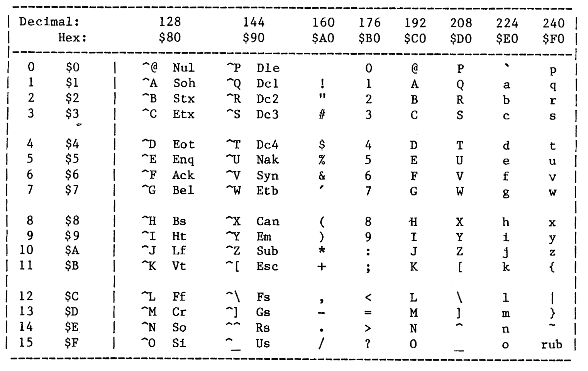


---

<!-- Source PDF page 134; manual page A-1 -->

# APPENDIX

## ASCII CHARACTER CODE CHART

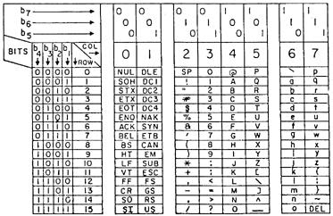


---

<!-- Source PDF page 135; manual page A- 3 -->

## TECHNICAL SUMMARY

```text

Board Description

    Consult Figure 10, page A—4, for the location
of each IC on the VIDEOTERM board. Function of each
chip is described in the Theory of Operation
section, page 6—1.

 Unit No.           Description

   U—1       74LS86 Exclusive OR gate, general use
   U—2       74LS02 Four NOR gates
   U—3       2708 EPROM organized as 8 bits x 1K words
   U—4       74LS04 Partly used for clock circuit
   U—5       74LS373, 74DP8304, OR 74LS245 — Factory
                 choice
   U—6       75LS00 Four NAND gates
   U—7       4013 CMOS flip—flops
   U—S       4013 CMOS flip—flops
   U—9       74LS139 2 TO 4 LINE DECODER
   U—10      2114 Static RAM organized as 4 bits x 1K
                  words (low—power)
   U—11      2114 Static RAM
   U—12      2114 Static RAM
   U—13      2114 Static RAM
   U—14      74LS157/74LS158 Multiplexer logic use
   U—15      74LS157/74LS158 Multiplexer logic use
   U—16      74LS157/74LS158 Multiplexer logic use
   U—17      2708 or 2716 EPROM containing optional
                 character set, organized either
                 as 8 or 16 bits x 1K words
   U—18      74LS273 (Std.) or 74L5374—Factory choice
   U—19      Hitachi HD465O55P/Motorola MCM6845 CRT
                  Controller
   U—20      2716 EPROM Character generator
   U—21      74LS166 Parallel to serial shift register
   U—22      74LS175 Delay shift register
   U—23      74LS161 System timing clock generator
   U—24      74LS368 Tri—state inverting buffer
```


---

<!-- Source PDF page 136; manual page A—4 -->

Figure 10: VIDEOTERM Board Photograph

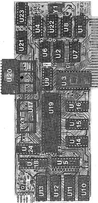


---

<!-- Source PDF page 137 -->

## Figure 11: Schematic Diagram of VIDEOTERM Board

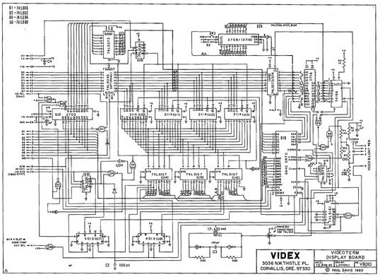


---

<!-- Source PDF page 138 -->

## Soft Video Switch Schematic

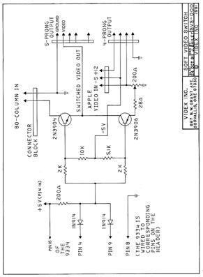


---
