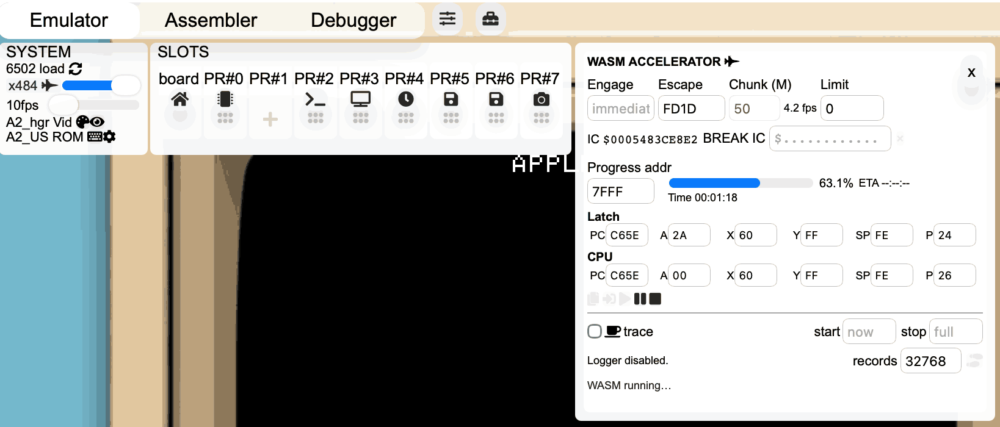

# WASM accelerator user guide

RetroAppleJS can temporarily hand 6502 execution to a WebAssembly (WASM) CPU core for fast computation. The **WASM ACCELERATOR** panel lets you choose when this handoff begins and ends, inspect or edit registers, stop at an exact instruction count, monitor a program's progress, and capture a CPU trace.



*The screenshot shows an active run with a 50-million-instruction chunk, Escape `$FD1D`, progress monitored at `$7FFF`, and tracing disabled. The SYSTEM `x484` reading is an estimated achieved WASM speed; the slider's highest selectable JavaScript setting is x72.*

## 1. Find the accelerator: the CPU speed slider has three modes

The **CPU speed slidebar is tricky** because the same slider has three different scales. **Click the numeric speed label beside the slider** to cycle through them:

| Mode | Range | Use |
| --- | --- | --- |
| Default percentage mode | **0 → 400%** | Normal speed and modest acceleration; steps of 20%. |
| Fine percentage mode | **0 → 100%** | Slower execution and finer control; steps of 5%. |
| Factor mode | **x1 → x72** | High-speed JavaScript execution; the x72 endpoint exposes the WASM accelerator. |

The sequence is **0–400% → 0–100% → x1–x72 → 0–400%**. Here, 100% and x1 mean the normal emulated CPU rate. Factor mode also has a leftmost **0** position for STEP TRACE; its running-speed positions start at x1.

To open the accelerator:

1. In **SYSTEM**, click the numeric CPU speed label until factor mode appears.
2. Drag the CPU speed slider all the way right to **x72**.
3. A **jet icon** appears beside the speed label. Click the jet itself to open **WASM ACCELERATOR**.

Clicking the number changes the slider mode; clicking the jet opens the accelerator. Selecting x72 alone sets the JavaScript CPU speed. **Press Play in the accelerator panel to actually engage WASM.**

Changing slider modes carries the current speed into the new scale where possible. A speed outside the new range is clamped: switching from 400% to the 0–100% scale selects 100%, for example. Check the label after switching.

At the zero endpoint, a bug icon opens the [live STEP TRACE debugger](STEP_TRACE_MANUAL.md). The separate **fps slider** below the CPU slider controls the regular emulator's processing frame rate; the small fps value beside **Chunk (M)** belongs to WASM execution.

## 2. What is being accelerated?

On engagement, RetroAppleJS pauses the JavaScript CPU, copies its registers and a 64 KiB memory image into the WASM core, and executes batches of 6502 instructions there. The memory image contains physical main RAM at `$0000–$BFFF` and a snapshot of the currently mapped CPU-bus window at `$C000–$FFFF`.

The WASM core has a **flat private memory image**. It does not run the regular emulator's live device bus, soft switches, bank switching, or cycle-timed peripherals. Use it for computation whose code and data are already in memory: arithmetic, searches, compression, and other long loops that do not need live I/O.

Choose an **Escape** address before the program needs keyboard input, disk access, speaker output, camera capture, or another device operation. On a normal handback, the bridge copies RAM and registers back, redraws the screen, and resumes JavaScript execution so those operations can work through the normal hardware model.

Main RAM is restored directly. Changed bytes at `$D000–$FFFF` are applied through the emulator's current write map, allowing writes to an already mapped writable language-card bank while leaving normal ROM protected. Writes in `$C000–$CFFF` are ignored on handback because their device side effects cannot be reconstructed. A status warning reports changed bytes detected there; it cannot detect every attempted device access, including reads or writes that leave the same byte value.

This CPU accelerator is separate from the JavaScript/WASM image-conversion backends available on the Dithertizer peripherals.

## 3. Quick start

1. Load your program and let JavaScript complete any disk loading or hardware setup.
2. Open **WASM ACCELERATOR**. Opening the panel halts the JavaScript CPU and fills both register rows from its current state.
3. Leave **Engage** blank to start at the current PC, or enter the address of the computation you want to accelerate.
4. Set **Escape** to the instruction where JavaScript should take over. The default is `FD1D`; replace it for your program when necessary.
5. Start with a smaller **Chunk (M)**, such as `1`, while checking your setup. Leave **Limit** at `0` for unlimited execution, or set a finite instruction budget.
6. Leave **trace** unchecked for maximum speed, then click **Play**.

An Escape address is checked **before** its instruction executes. That instruction will execute under JavaScript after the handback. Opening the panel or pressing Play does not reset the machine or load a program.

## 4. Execution settings

| Control | Meaning and accepted values |
| --- | --- |
| **Engage** | Optional hexadecimal 6502 address. Blank starts immediately at the current PC. An address arms a JavaScript execution trap: JavaScript runs until its PC reaches that address, then WASM starts before that instruction. It does not jump to the address. |
| **Escape** | Optional hexadecimal address where WASM returns control to JavaScript, before executing the instruction at that address. Default `FD1D` is `$FD1D`, a ROM keyboard-input entry in the usual Apple II ROM. Blank removes the address-based escape. |
| **Chunk (M)** | Decimal millions of instructions per batch. Default `50` means 50,000,000 instructions. Fractions are allowed: `0.1` means 100,000. Editable while idle or paused; Play/Resume applies the new value. |
| **Limit** | Decimal maximum number of WASM instructions in the current handoff. `0` means unlimited. This is an instruction count, not millions, milliseconds, or CPU cycles. Pausing and resuming retains the handoff's count. |

Address fields accept plain hexadecimal, `$` notation, or `0x` notation: `6000`, `$6000`, and `0x6000` are equivalent. Even a digits-only address such as `1000` is hexadecimal. Registers follow the same convention. **Chunk, Limit, and records are decimal numeric fields.**

Set Engage and trace settings before Play. To revise an active run, pause first. Limit is sampled at Play/Resume; changing it during execution does not alter that running segment. Engage applies to a new handoff, not Resume.

### Chunk size, responsiveness, and speed

WASM runs synchronously on the browser's main thread and yields between batches. Larger chunks reduce overhead but keep the browser busy longer, making UI refreshes and Pause/Stop responses less frequent. Smaller chunks improve responsiveness but may reduce throughput. Pause and Stop requests take effect when the current batch yields; they do not interrupt an in-flight WASM call.

The fps reading beside **Chunk (M)** measures completed execution/yield batches per second. Register and progress updates are additionally limited by the dashboard's refresh cadence, so this is not a guaranteed display frame rate. It is also not the Apple II video refresh rate.

While WASM is running, the SYSTEM speed label becomes an **estimated achieved multiplier**. The implementation estimates:

```text
MIPS = chunk size in millions × measured batch fps
speed multiplier = MIPS / 0.43
```

The baseline is approximately 0.43 million instructions per second. Thus `50 × 4.2 ≈ 210 MIPS`, or roughly x488; rounded readings sampled at different times explain the screenshot's x484. The estimate uses configured chunk size, so short final batches and tracing can make it misleading. It is not a measured cycle-accurate MHz rate or a promise that every program is that much faster.

WASM execution is not throttled to the selected JavaScript slider speed. The previous SYSTEM speed label is restored on pause or handback.

## 5. Register rows and transport buttons

**CPU** shows the current registers and is read-only. **Latch** holds editable values. Opening the panel copies the JavaScript registers into Latch; subsequent execution updates CPU without automatically replacing your Latch values.

| Register | Meaning | Width |
| --- | --- | --- |
| **PC** | Program counter: address of the next instruction | 16 bits, up to four hex digits |
| **A** | Accumulator | 8 bits, up to two hex digits |
| **X**, **Y** | Index registers | 8 bits each |
| **SP** | Stack pointer within stack page `$0100–$01FF` | 8 bits |
| **P** | Processor status flags | 8 bits |

P's bits, from bit 7 to bit 0, are **N, V, reserved, B, D, I, Z, C**: negative, overflow, reserved, break, decimal, interrupt-disable, zero, and carry. JavaScript state import normalizes the reserved and break bits; an imported P value may therefore be displayed in normalized form.

The buttons below CPU appear in this order:

| Icon / tooltip | Action |
| --- | --- |
| **Copy** — overlapping sheets | Copy current registers into Latch. This replaces the editable values without changing execution state. |
| **Latch** — arrow into a box | Write all six Latch values into the halted JavaScript CPU while idle, or the paused WASM CPU. Editing a field alone does not apply it. |
| **Play** | Start immediately, arm Engage, or resume a paused WASM run. |
| **Pause** | Pause WASM after the current batch. Its private memory and registers remain available for Resume. JavaScript stays halted. |
| **Stop** | During running execution, request a normal handback and resume JavaScript. While armed, cancel the pending Engage trap and resume JavaScript. See the paused-state limitation below. |
| **x** at the panel's top right | Cancel/close. While running, requests Stop; while armed, clears the Engage trap. Closing resumes JavaScript, including after an IC breakpoint. |

Copy, Latch, and Chunk are disabled while running or armed. Play is disabled until a run is paused or idle. Use Copy before making a small register change, edit the required fields, and press Latch; Play then uses the applied state. Setting PC in Latch deliberately changes where execution continues.

### Current limitation: stopping from Pause

In the documented revision, **Stop or close while WASM is paused resumes the old JavaScript state without copying the paused WASM memory/registers back**. Use Pause to inspect, edit, or resume, and avoid Stop/close from that state if you want to preserve the computed result.

To return a paused WASM state safely, set **Escape** to the paused CPU's current PC, then press **Play**. The resumed loop detects Escape before executing another instruction and performs the normal RAM/register handback. To transfer the state and keep JavaScript halted for inspection, set **BREAK IC** to the current IC and press Play, with any instruction Limit left above the current handoff count (or `0`).

## 6. IC and BREAK IC: stop at an exact instruction boundary

**IC** is the shared 48-bit instruction counter, displayed as twelve hexadecimal digits, for example `$0005483CE8E2`. It counts completed opcodes since CPU reset and remains continuous across JavaScript/WASM handoffs. It is separate from Limit's count of instructions in one handoff.

**BREAK IC** arms a one-shot breakpoint at an absolute global instruction count. Unlike Pause, it caps the final execution batch so the breakpoint lands exactly at the requested count, even with a large Chunk setting.

The field accepts hexadecimal terms and addition/subtraction:

```text
$000000123456
$000000123456-$08
$000000123456+$100
```

All terms are hexadecimal: `$08` means eight instructions and `$100` means 256. To stop 256 instructions after the displayed IC, copy that displayed value and append `+$100`. There is no symbolic `IC` variable in this field. Commit the entry by leaving the field; the adjacent status then shows **armed**.

When the breakpoint hits:

- RAM, registers, and IC are transferred back to JavaScript.
- **JavaScript remains paused** and the accelerator panel stays open.
- The breakpoint changes from **armed** to **hit** and does not fire again unless rearmed.
- PC points to the next instruction, ready for [STEP TRACE](STEP_TRACE_MANUAL.md).

Use the adjacent **×** button to clear the breakpoint. A target numerically below the current IC is rejected as already passed; it does not request a stop after the next 48-bit wrap. A target equal to the current IC can hand back without executing another WASM instruction. Opening the panel again clears its IC breakpoint.

For a reproducible debugging run, repeat the same reset, program load, inputs, and memory setup, accelerate to an IC reported by a previous run, and inspect the next instruction in STEP TRACE. Different inputs or peripheral timing can change the instruction path, so an IC value alone does not reproduce a machine state.

## 7. Progress addr, percentage, Time, and ETA

**Progress addr** watches one byte in the WASM memory image. The default is hexadecimal `7FFF`. Your program must write meaningful progress to that address; the accelerator cannot infer how much work an arbitrary program has completed.

| Byte value | Displayed progress |
| --- | --- |
| `$00` / 0 | 0.0% |
| `$80` / 128 | 50.2% |
| `$A1` / 161 | 63.1%, as in the screenshot |
| `$FF` / 255 | 100.0% |

The percentage is `byte × 100 / 255`, rounded to one decimal place. Reserve a RAM byte your program is not otherwise using, initialize it to zero, and update it toward `$FF` as work advances. `$7FFF` is a default suggestion, not automatically reserved memory.

For example, when your program has calculated an 8-bit progress value in A, it can publish it with:

```asm
        STA $7FFF       ; A = progress from $00 to $FF
```

**Time** displays accumulated time spent in the WASM run, excluding time waiting while paused. It resets for a new handoff and after completion. **ETA** estimates remaining running time from observed progress toward 255. It updates when the byte changes, not continuously between changes. `--:--:--` means there is insufficient progress history for an estimate. Resume or changing Progress addr resets the estimate's baseline; a value falling below that baseline also resets it.

Nonlinear work, an unrelated byte, or a wrapping counter produces an unreliable ETA. Reaching 100% does not stop execution. Leave Progress addr blank to disable byte monitoring; Time still works. Invalid addresses show **invalid address**.

## 8. Trace logging and download

The **trace** checkbox enables the WASM CPU activity logger. This is a captured execution log, distinct from the live STEP TRACE interface.

| Control | Meaning |
| --- | --- |
| **trace** | Enable instruction logging for the handoff. Leave unchecked for fastest execution. |
| **start** | Optional hex PC address. Blank starts logging immediately; an address arms logging until that PC is reached. |
| **stop** | Optional hex PC address. Logging ends before the instruction at that address; CPU execution continues. Blank logs until the record buffer fills. |
| **records** | Decimal maximum number of stored records. Default `32768`. The buffer fills once; it does not overwrite older records. |
| **Download** — footprints icon | Download the retained log when records are available. |

The logger status shows **disabled**, **armed**, **Logging**, or **Logging complete**, with record counts. Filling the buffer or reaching the trace stop address ends logging and lets fast execution continue. This differs from **Escape**, which ends the WASM handoff. If trace start and Escape are the same address, Escape takes priority and logging never starts there.

Set trace, start, stop, and records before a new run. Each new handoff with tracing enabled creates a fresh buffer. Pause/Resume normally retains it. While paused, disabling trace retains captured records; enabling it after it was disabled creates a fresh buffer. Changing records does not resize an existing retained buffer on Resume. Download a log before starting another capture you want to keep.

While logging is active, the bridge calls WASM one instruction at a time so it can capture the pre-execution PC, opcode, operand, A, X, Y, P, and SP. This reduces acceleration. An armed trace start combined with a different Escape address also requires one-instruction checks until the trace starts. Use a small Chunk when working with traces to improve UI responsiveness.

Known Apple II ROM instruction sequences are compacted into group markers and repetition counts. Consequently, **stored records are not always equivalent to executed instructions**.

The downloaded filename has this form:

```text
apple2_wasm_bootlog_2026-10-03T09-00-00-000Z.txt
```

Its contents are **Base64-encoded binary records**, not a plain-text disassembly. After Base64 decoding, records are 10 bytes each. Ordinary records contain the 16-bit little-endian PC, opcode, 16-bit little-endian operand, then A, X, Y, P, and SP. Group records use PC marker `$FFFF`, a 16-bit group ID, a 32-bit repetition count, and two padding bytes. See the activity-group table in [the bridge source](../res/EMU_WASMcpu6502.js) when writing a decoder.

## 9. Practical workflows

### Accelerate a computation after setup

Suppose setup and loading must run in JavaScript, the compute routine begins at `$6000`, and its exit is `$6100`. Set **Engage** to `6000` and **Escape** to `6100`, then Play. JavaScript runs setup and stops before `$6000`; WASM executes the computation; JavaScript resumes before `$6100`. This assumes the routine does not need live I/O or memory remapping.

### Inspect a long calculation halfway through

Have the program publish progress in a reserved byte and enter that address in Progress addr. Play, then Pause when the progress is useful to inspect. Read the WASM CPU row, optionally Copy/edit/Latch registers, then Resume. To finish immediately with the paused result intact, use the current-PC Escape procedure described above.

### Capture a small region of code

Leave trace unchecked for an initial speed check. Then configure **trace start** at the routine entry and **trace stop** at its exit, set a sufficient record capacity, enable trace, and start a new handoff. Use a distinct later Escape address, or leave Escape blank with a finite Limit. Download the capture after it completes. Trace stop only stops logging; use Escape or BREAK IC when you also want execution to stop or hand back.

## 10. Status messages and troubleshooting

| Symptom or status | Explanation / action |
| --- | --- |
| No jet icon | Switch to factor mode by clicking the numeric speed label, then select x72. |
| **JavaScript CPU halted** | Opening the panel pauses JavaScript. Configure the run and press Play, or close to resume. |
| **WASM armed** | Engage has not been reached. Check whether the program actually executes that PC; Engage is not a jump command. |
| **WASM running…** | The WASM core owns execution. The Apple II screen can remain unchanged until handback redraws it. |
| Delayed Pause/Stop or slow UI | A batch is still busy. Use a smaller Chunk on the next run or after Pause, particularly with tracing. |
| **WASM finished: escape… / instruction limit / manual stop** | A normal handback copied state to JavaScript and resumed it. The panel closes. |
| **IC breakpoint… JavaScript CPU remains paused** | An exact breakpoint handback completed. Inspect with STEP TRACE or deliberately resume execution. Closing the panel resumes JavaScript. |
| **already passed current IC** | Choose a future absolute IC, or reproduce the earlier run from reset. |
| **illegal opcode…** | The WASM core stopped on an unsupported opcode and reports its byte/address. Inspect the report; this error handback also resumes JavaScript. |
| **writes in $C000–$CFFF were ignored** | The run changed the private snapshot of device/slot space. Move Escape earlier so JavaScript handles the required device interaction. |
| Progress never changes / strange ETA | Check that the program writes a monotonic 0–255 value to the selected RAM byte. |
| **Logger disabled** / unavailable download | Enable trace before running and ensure its start PC is reached and stored records exist. |
| Invalid address/register/IC message | Check hexadecimal widths and prefixes. BREAK IC supports only hexadecimal addition/subtraction; decimal settings use numeric values. |

## Related documentation and implementation

- [Emulator user instructions](EMULATOR.md)
- [Live STEP TRACE manual](STEP_TRACE_MANUAL.md)
- [6502 reference](6502.md)
- [WASM accelerator bridge and logger](../res/EMU_WASMcpu6502.js)
- [SYSTEM speed slider and panel integration](../res/EMU_apple2main.js)

This guide describes repository revision `c44c29d880a1c7947221e1897c4425b3e506d119` (3 October 2026), including its current paused-stop behavior.
