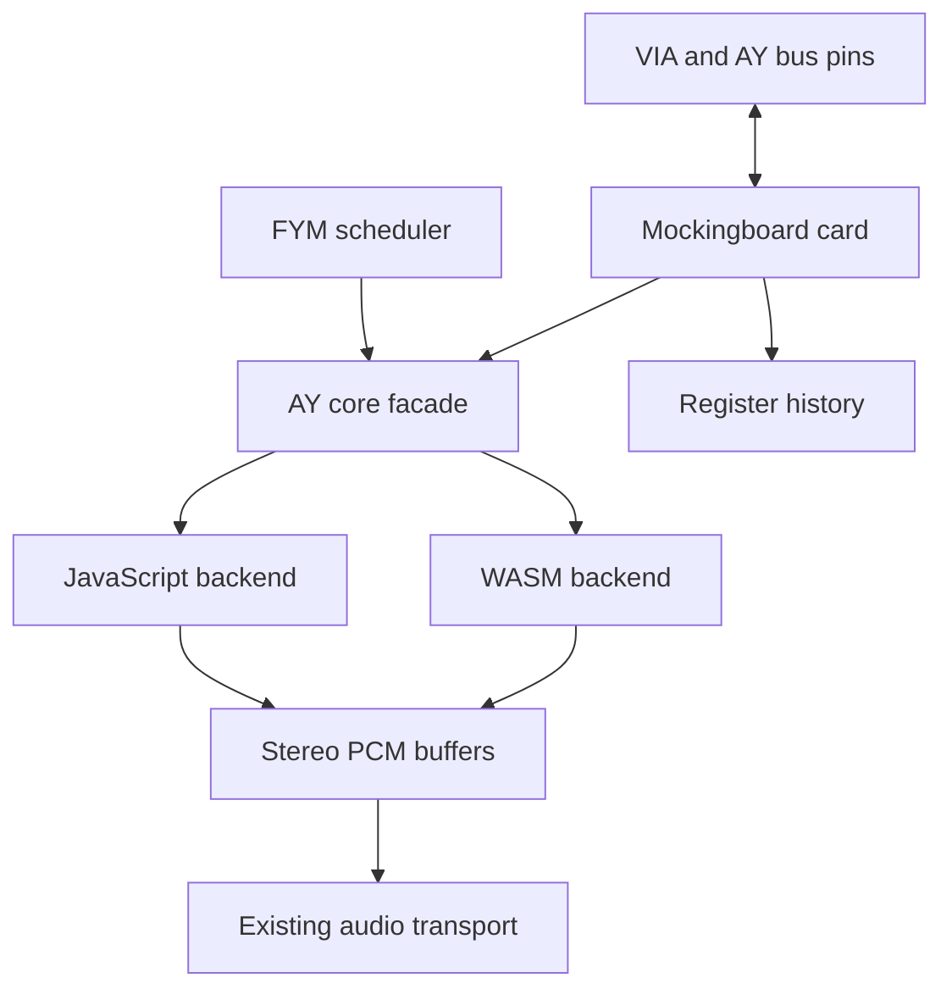

# Shared AY/YM core: JavaScript and WebAssembly design

Date: 2026-10-05
Status: ABI v1 implementation available; browser acceptance pending. See `docs/AY_CORE_WASM.md`.
API / ABI version: 1
Revision: Real-time streaming contracts and fixed-pitch CPU-speed policy added on 2026-10-05.
Repository baseline inspected: `2983fa4`, together with the dual-FYM player prepared in this conversation.

## 1. Purpose and scope

Provide one reusable AY-3-8910 / YM2149 sound core, with interchangeable JavaScript and WebAssembly implementations. Both `tools/MockingboardJS.html` and `res/EMU_CARD_mockingboard.js` will consume this interface. The first release supports one or two chips per instance; multiple cards use independent instances.

The goal is lower measured rendering cost and more predictable allocation behavior while retaining the existing sound algorithm, independent chip state, and emulated-time ordering. WASM speed, memory savings, and battery savings are hypotheses to measure, not acceptance assumptions.

The core includes sound-register decoding, tone, noise, envelope, DAC selection, interpolation, FIR decimation, DC removal, channel routing, and chip mixing. JavaScript retains FYM decompression and metadata, frame/loop scheduling, Apple II slot handling, VIA timers and IRQs, AY bus-control pins, external port pins, history recording, UI, and Web Audio transport.

AudioWorklet, workers, shared memory, SIMD, CPU-WASM integration, and a new VIA implementation are separate changes. The synchronous core can later be hosted in an AudioWorklet without changing its time or register contract. Initially it stays in the emulator's execution context, with completed PCM passed to the existing audio sink. Audio delivery never requests CPU execution from an audio callback.

Both file playback and live emulator playback are first-class sources. The core requires a complete event stream only for the interval being rendered, not a complete song or advance knowledge of future CPU execution. File playback can prepare distant intervals; an emulator can commit only the interval whose bus operations it has actually executed.

## 2. Current code and architectural choice

The current `Ayumi` class represents one chip. Its processing method performs eight interpolation steps per output sample, stereo FIR filtering, and separate DC filtering. It also requests two typed-array subarray views per sample. Browser optimizations may eliminate some allocations; actual allocation pressure must be profiled.

The peripheral already owns two chips. It advances both in `advanceAudio()`, places rendered Float32 frames in a bounded FIFO, and lets `MockingboardAudio` drain them. Chip 0 is routed left and chip 1 right. The prepared FYM player instead spreads each chip's A/B/C channels across stereo and mixes both streams.

Three approaches were considered:

| Approach | Consequence | Decision |
| --- | --- | --- |
| Export every existing Ayumi setter and sample method individually | Small initial port, but leaves the sample loop and repeated boundary crossings in JavaScript | Reject as the primary API |
| One synchronous, block-rendering core behind a shared JS/WASM interface | Moves both chip loops and filtering into the selected backend; keeps emulator ownership and transport stable | Select |
| Move AY, VIA, scheduler, and audio delivery into a worker or worklet together | Adds threading, asynchronous hardware reads, and transport changes to the sound optimization | Defer |

The module is compiled once and may host several independent core instances. A core instance owns one timeline and one or two complete chips. It never invokes JavaScript from a rendering loop.



## 3. State ownership

| Owner | Authoritative state |
| --- | --- |
| AY core | Sound registers R0–R13, generator phases, noise LFSR, envelope state, sample-time fraction, interpolation and filter histories, routing coefficients |
| AY bus adapter | Selected register/address latch, BDIR/BC1/reset observation, bus drive, R14/R15 external-port behavior, synchronous register mirror for CPU reads |
| VIA | Port direction, input/output pins, timers, IFR/IER, interrupts |
| FYM adapter | Inflated file bytes, metadata, frame indices, frame rates, loop points, frame-event deadlines |
| Audio device/player transport | PCM queues, browser audio nodes, scheduling, host playback-rate adjustment, user volume |
| History recorder | Accepted writes and resets with their actual emulated timestamps |
| Stream adapter | Raw CPU and mapped-audio completeness watermarks, CPU-to-audio speed segments and fractional phase, ordered pending event batches, transport epoch/sequence, bounded PCM delivery and queue diagnostics |

The bus mirror is necessary because CPU register reads must remain immediate while audio writes may be collected into a batch. It is updated only when an actual bus write is accepted, using the same masks as the core. `getRegisters()` on the core is a diagnostic view at the core's cursor, not a substitute for a future bus mirror.

R14/R15 are outside this sound ABI. The bus adapter maintains them exactly as the current peripheral does. Modeling physical AY port inputs/outputs later requires a separately versioned port interface.

## 4. Time and ordering contract

### 4.1 Units and range

Each instance has an integer `timebaseHz`, independent of each chip's `clockHz`. Core event ticks are positions in the audio timeline, not necessarily CPU-cycle numbers. For the emulator adapter, use `timebaseHz = 1,000,000,000` (nanosecond audio ticks) and map original CPU-cycle timestamps into that domain through the speed policy in section 14. Original CPU timestamps remain authoritative in the bus/history producer. For FYM playback, use the output sample rate as the timebase and output-frame indices as ticks. Neither source changes the physical AY clock when its orchestration tempo changes.

Absolute ticks are nonnegative JavaScript safe integers, up to `2^53 - 1`. They must never be truncated with a 32-bit bitwise conversion. WASM receives scalar ticks as `f64`, validates integrality/range, and converts internally to unsigned 64-bit integers. Packed events use low/high unsigned 32-bit words.

Each call may advance at most `2^32 - 1` ticks. Larger catch-up intervals are split by the adapter. With sample rates up to 192,000 Hz, this keeps phase products within unsigned 64-bit arithmetic.

The cumulative rendered-frame count must also remain a nonnegative safe integer. A call that would exceed that limit fails with `E_TIME` before mutation; it cannot silently wrap the diagnostic count or sample index.

### 4.2 Rendering and boundary writes

The cursor starts at `originTick`. Output-frame boundaries occur at:

`originTick + n * timebaseHz / sampleRate`, for integer `n >= 1`.

`renderUntil(T, ...)` completes all samples whose boundaries are at or before T. For a write at t, the core first completes samples with boundaries at or before t, then applies the write. Thus a write exactly on a sample boundary affects subsequent samples. A write between boundaries affects the next generated sample.

This retains the current renderer's sample-level quantization. It does not introduce sub-sample scheduling or claim additional cycle accuracy for the analog waveform. Replacing that algorithm later requires a new quality mode with its own reference tests. The producer must retain original CPU-cycle timestamps even in sample-timed mode. The emulator adapter maps them into high-resolution audio ticks while preserving original timestamps and the speed-segment history for capture/replay. It must not merge or discard same-output-sample writes. Quantization to the core's integer tick resolution happens only after the speed mapping; collapsing a later speed policy into already captured raw CPU timestamps is prohibited.

At 44.1 kHz, an output sample covers approximately 22.7 microseconds. Rapid amplitude writes can therefore contain several transitions within one output interval. Sample-timed compatibility is the explicit v1 precision contract, not a claim that all digitized-sound or pulse-width techniques are reproduced with cycle-level fidelity. Dense-write fixtures are required before promoting WASM. A future sub-sample renderer must consume the existing full-resolution event timestamps; selecting its precision mode requires explicit capability/version negotiation and separate reference expectations.

Within each call, events must be ordered by nondecreasing tick. Events at equal ticks are processed in input order; reset/write order is observable. Events at the current cursor are legal, including an additional same-tick write in a subsequent call. Events earlier than the cursor or later than T are rejected.

Calling `renderUntil(T)` asserts that every accepted write/reset with a timestamp strictly before T has been supplied, whether in previous calls or in the current batch. The producer's `sealedBeforeTick` watermark must be at least T. The core cannot independently prove the caller's assertion; the stream adapter enforces it. A future write at T remains legal and affects subsequent samples, while a newly discovered write earlier than T is a late-event error, not an instruction to rewind or patch already rendered audio.

An empty batch with a completed interval means that the AY continues from its current state without new register writes. An empty batch with an unknown interval does not authorize rendering ahead. Browser callback deadlines, low PCM fill, and elapsed wall time never advance the completeness watermark.

`renderUntil(T)` also applies events at T after completing audio through T. The resulting register view includes those writes even if they produced no new sample. An identical T with no events is a successful no-op.

### 4.3 Exact sample counting

Maintain integer `samplePhase` in `[0, timebaseHz)`. For elapsed ticks d:

```
q = samplePhase + d * sampleRate
frames = floor(q / timebaseHz)
nextPhase = q % timebaseHz
```

Use this rule between every event group and the requested end tick. It avoids cumulative floating-point frame drift. The same events must produce the same samples regardless of rendering block boundaries.

Backward time is an error. A hardware restart creates a fresh transport origin explicitly; it is never inferred from a decreasing tick.

## 5. Shared JavaScript API

Factory initialization may be asynchronous. Operations on an initialized instance are synchronous.

```javascript
var core = await AYCore.create({
    backend: "auto",         // "auto", "js", or "wasm"
    chipCount: 2,
    sampleRate: 44100,
    timebaseHz: 1000000000,  // emulator adapter maps CPU cycles to audio ticks
    originTick: 0,
    maxFrames: 4096,
    maxEvents: 4096
});
```

| Method | Required behavior |
| --- | --- |
| `configureChip(chip, {model, clockHz})` | Model is `"AY"` or `"YM"`. Establishes the clock and reference DAC table. Allowed only before the first advancement or after `resetTransport()` |
| `setMix(chip, weights)` | Six Float64 coefficients, `[AL, AR, BL, BR, CL, CR]`. Replaces output routing at the current cursor without resetting generators or filters |
| `writeNow(chip, reg, value)` | Writes R0–R13 at the current audio cursor; useful after advancing through the mapped CPU horizon. Preserves repeated writes |
| `resetChipNow(chip)` | Applies the defined chip reset at the current cursor, retaining the continuous output filter history |
| `renderUntil(endTick, batch, output)` | Applies the packed event batch and fills caller-owned planar Float32 PCM; returns generated frame count |
| `getRegisters(chip, destination)` | Copies 14 masked registers into a caller-owned Uint8Array; performs no time advancement |
| `getPosition(destination)` | Fills caller-owned `{tick, samplePhase, renderedFrames}` with the current timeline position |
| `resetTransport(originTick)` | Clears every chip and all interpolation/filter history, establishes a new sample origin; retains clock/model/routing configuration |
| `saveState()` | Returns a versioned state blob for the current backend at a completed call boundary |
| `loadState(blob)` | Validates and restores a compatible snapshot atomically |
| `destroy()` | Releases instance resources; subsequent operations fail with a destroyed-handle error |

`batch` is `{data: Uint8Array, count: number}` using the event format below. `null` means no events. `output` is `{left: Float32Array, right: Float32Array}`. Each array must accommodate every frame produced by the call; the unused suffix is left unchanged. Zero-frame calls accept empty output arrays.

The facade validates arguments, stages packed events with one contiguous copy for the WASM backend, invokes one render export for both chips, and copies only the generated PCM into the caller's buffers. Neither backend allocates objects or arrays during rendering. Existing per-chip convenience setters may be implemented by an adapter for migration, but they are not the rendering contract.

The JS backend precomputes the FIR phase subarray views at creation, replacing the current per-sample view construction without changing the numerical operations. Output arrays must be separate, nonoverlapping Float32Array storage and must not alias the event batch. All six mixing coefficients must be finite and in `[0, 1]`. Chip clocks must be positive integers at most `64 * sampleRate`, retaining the existing algorithm's supported interpolation-step range. Unsupported clocks fail with `E_ARGUMENT` rather than producing an incorrect waveform.

The live-stream operations throw an `AYCoreError` carrying a stable code on invalid input. The facade resolves error messages outside the numerical loop.

## 6. Packed events and WASM ABI

All memory structures are little-endian. Event stride is 16 bytes; event and PCM buffers are at least four-byte aligned.

| Event byte offset | Type | Meaning |
| --- | --- | --- |
| 0 | u32 | Absolute core audio tick low word |
| 4 | u32 | Absolute tick high word; at most `0x001FFFFF` |
| 8 | u8 | Chip index, 0 or 1 within the instance |
| 9 | u8 | Operation: `0 = WRITE`, `1 = RESET_CHIP` |
| 10 | u8 | Register, 0–13 for WRITE; zero for RESET_CHIP |
| 11 | u8 | Value, 0–255 for WRITE; zero for RESET_CHIP |
| 12 | u32 | Reserved; must be zero |

The reserved word is not a sequence number: array order defines ordering. The batch is caller-owned and is consumed entirely during the call. The core retains no event pointers after returning. Transport epochs, packet sequences, and producer watermarks are stream-adapter metadata outside these records. They do not repurpose the reserved word or require WASM to own an asynchronous event queue.

C-style exports:

```c
uint32_t ay_abi_version(void);                      /* returns 1 */
uint32_t ay_config_buffer(void);                    /* module-owned 40-byte setup staging */
int32_t  ay_create(uint32_t config_ptr);             /* positive handle or negative error */
int32_t  ay_configure_chip(int32_t h, uint32_t chip,
                          uint32_t model, uint32_t clock_hz);
int32_t  ay_set_mix(int32_t h, uint32_t chip, uint32_t weights_ptr);
int32_t  ay_write_now(int32_t h, uint32_t chip, uint32_t reg, uint32_t value);
int32_t  ay_reset_chip_now(int32_t h, uint32_t chip);
int32_t  ay_reset_transport(int32_t h, double origin_tick);
int32_t  ay_render_until(int32_t h, double end_tick,
                        uint32_t events_ptr, uint32_t event_count,
                        uint32_t left_ptr, uint32_t right_ptr,
                        uint32_t capacity_frames);
int32_t  ay_get_registers(int32_t h, uint32_t chip, uint32_t dest_ptr);
int32_t  ay_get_position(int32_t h, uint32_t dest_ptr);
int32_t  ay_state_size(int32_t h);
int32_t  ay_save_state(int32_t h, uint32_t dest_ptr, uint32_t capacity_bytes);
int32_t  ay_load_state(int32_t h, uint32_t src_ptr, uint32_t length_bytes);
int32_t  ay_destroy(int32_t h);
uint32_t ay_event_buffer(int32_t h);
uint32_t ay_left_buffer(int32_t h);
uint32_t ay_right_buffer(int32_t h);
uint32_t ay_control_buffer(int32_t h);
uint32_t ay_state_buffer(int32_t h);
```

Model IDs: `0 = AY`, `1 = YM`. Mutators return zero on success. Rendering returns the nonnegative frame count, save returns bytes written, and size queries return required size. All failures return negative codes.

Create configuration, 40 bytes:

| Offset | Type | Field |
| --- | --- | --- |
| 0 | u32 | Structure size, 40 |
| 4 | u32 | ABI version, 1 |
| 8 | u32 | Chip count, 1–2 |
| 12 | u32 | Timebase Hz, 1–`UINT32_MAX` |
| 16 | u32 | Sample rate, 8,000–192,000 |
| 20 | u32 | Maximum frames per call, 1–16,384 |
| 24 | u32 | Maximum events per call, 1–16,384 |
| 28 | u32 | Flags, zero |
| 32 | f64 | Origin tick, nonnegative safe integer |

Creation uses the module-owned setup staging returned by `ay_config_buffer()`, initialized before any instance exists. Create calls are serialized; the core copies the configuration before returning and retains no pointer to that shared staging. Instances own event, output, 64-byte control, and snapshot scratch buffers. All control/configuration buffers are eight-byte aligned. Getter pointers remain valid until destruction; pointer getters return zero for an invalid handle. The control buffer holds six f64 routing coefficients at offsets 0–47, or a position record: f64 tick at 0, u32 phase at 8, u32 reserved zero at 12, f64 rendered-frame count at 16. These uses are sequential, not concurrent.

The snapshot scratch has exactly the implementation's required snapshot capacity reported by `ay_state_size()`, fixed for the instance's configuration. Save writes there; load stages a matching-length blob there before validation. Register/position reads and mixing updates use the control scratch. No unexported allocator is required by the facade. Snapshot copying into a new user-owned Uint8Array occurs outside audio rendering.

The WASM module exports its `memory`. The facade uses the owned buffers for rendering. Render pointers must refer to those exact instance buffers; overlapping/foreign outputs are rejected. Pointer arithmetic and lengths are bounds-checked before state mutation. There are no imports for logging, DOM, file access, browser audio, or callbacks. Handles encode a generation as well as a slot so a stale handle cannot target a newly created instance.

Error codes:

| Code | Name | Meaning |
| --- | --- | --- |
| -1 | `E_ARGUMENT` | Invalid configuration, chip, register, value, flags, or pointer |
| -2 | `E_HANDLE` | Destroyed, unknown, or stale instance |
| -3 | `E_TIME` | Nonintegral, backward, oversized, or out-of-range timeline advancement |
| -4 | `E_ORDER` | Unsorted or out-of-window event batch |
| -5 | `E_CAPACITY` | Too many events or insufficient output/state capacity |
| -6 | `E_MEMORY` | Creation could not reserve the requested fixed buffers |
| -7 | `E_STATE` | Invalid, incompatible, or corrupt snapshot |
| -8 | `E_PHASE` | Reconfiguration attempted after advancement |

The implementation validates the entire batch and required sample count before writing PCM or mutating generators. Expected validation errors leave core state and output buffers unchanged. A runtime trap invalidates the instance; continued playback through that instance is prohibited.

## 7. Sound and reset semantics

R0–R13 masks are `[FF,0F,FF,0F,FF,0F,1F,FF,1F,1F,1F,FF,FF,0F]`. Values are unsigned bytes, then masked. Tone period zero and envelope period zero resolve to one, matching the existing setters. Noise period zero retains the existing Ayumi update behavior. R7 high bits remain readable but do not create host I/O operations.

Every R13 write invokes envelope retriggering, including consecutive writes of the same value. A value of 255 is an ordinary byte which becomes shape 15 after masking; it is not a core-level no-write marker. The FYM adapter suppresses the special 255 marker before emitting events.

`RESET_CHIP` clears the sound register image and initializes tone/noise/envelope digital state: tone counters/output bits zero, effective tone periods one, noise counter zero/LFSR seed one, envelope period one/counter zero/shape zero/segment zero with the existing shape initializer. It retains interpolation, FIR, and DC history, permitting an existing filter tail to drain. This is the defined software reset contract. It must be reviewed against current bus-reset behavior during integration; any difference is reported explicitly rather than disguised as a performance change.

`resetTransport()` performs a cold restart: digital state and all interpolation/filter histories are cleared. Sample phase and rendered-frame count return to zero at the supplied origin.

Keep Float64 numerical state and the current FIR coefficients in the first WASM implementation. Write Float32 only at the PCM boundary. Compile without fast-math/reassociation or floating-point contraction. SIMD and reduced precision require separate benchmark and equivalence decisions.

Mixing is an explicit linear matrix. There is no implicit normalization based on chip count, no limiter, and no silent clipping in the core. Existing adapters choose their gains:

- Peripheral: chip 0's three channels left at 0.5 each; chip 1's three channels right at 0.5 each, retaining current output scaling.
- FYM player: linear pans 0.1/0.5/0.9 for each chip, multiplied by `1 / (1.5 * loadedChipCount)`, retaining the prepared player's normalization.

User volume belongs to the host audio transport, preferably a native GainNode. A routing change at the cursor affects future PCM only and does not rewrite queued samples. Muting output does not freeze chip phases.

## 8. Snapshot and backend lifecycle

Snapshots include cursor/origin/sample phase, rendered-frame count, chip clocks/models, all sound registers, tone/noise/envelope phases, interpolation coefficients/history, FIR buffers/indices, DC buffers/sums/index, and routing. A register dump alone cannot restore continuous sound.

The snapshot header is 24 bytes: magic `AYST` at offset 0; u32 snapshot version 1 at 4; u32 ABI version 1 at 8; u32 backend ID (`1 = JS`, `2 = WASM`) at 12; u32 implementation-state version at 16; u32 total byte length at 20. Payload is backend-owned and versioned. Load checks the complete payload before committing state. Configuration and capacities must match; runtime handles, scratch pointers, output contents, and caller-owned FYM position are not included.

Version 1 snapshots are same-backend snapshots. A live JS/WASM transfer is deliberately deferred. Selecting another backend stops playback and starts a fresh core from the adapter's initial state. A complete emulator checkpoint must combine CPU/memory, core, VIA, bus, history, and pending producer-event state; saving this core alone is not an Apple II checkpoint. Before capture, finish the current CPU execution boundary, seal it, and consume all accepted sound writes through its mapped audio boundary. Capture the source mapping anchor, fractional phase, current target frequency, and speed-segment history required by pending events together with the core state. Snapshotting is outside the real-time rendering callback.

Restoration begins a new transport epoch, cancels old browser audio nodes, and discards old-epoch packets/PCM. The restored core generators and sample phase are retained; audible playback is anchored to the current browser clock. Previously scheduled browser audio is not part of a restorable emulator checkpoint.

`backend: "auto"` selects WASM only after capability, ABI-version, and initialization checks; otherwise it creates JS and exposes the reason in diagnostic status. Forced `"wasm"` fails explicitly if unavailable. Backend choice is fixed for that instance. A runtime WASM failure stops playback and surfaces an error; no mid-stream restart or silently lost events are permitted.

## 9. Integration with the FYM tool and peripheral

### FYM player

Keep two independent frame schedulers and file clocks. Configure `timebaseHz = sampleRate`. Frame zero is emitted at the transport origin. Frame k starts at output-frame index `ceil(k * sampleRate / frameRate)`. Implement this with an integer remainder scheduler, not a growing floating-point deadline. Loop transitions retain the scheduler's fractional phase; they do not reset the transport clock.

Build each batch by merging the two chip event streams in deadline order, with chip 0 before chip 1 for equal deadlines. Emit R0–R12 and an R13 write only when the FYM marker is not 255. Do not suppress repeated R13 shapes. Start establishes a new transport origin; Stop disconnects the audio callback. Loading a replacement file stops the pair, as in the prepared player.

The callback generates its packed batch in reusable storage, calls `renderUntil()`, and copies resulting PCM. Frame scheduling remains JavaScript work at song-frame frequency; the per-sample AY loop belongs entirely to the selected core.

### Mockingboard peripheral

Preserve `advanceTo(cpuTick)`, `getAudioFormat()`, queue/drain methods, VIA timing, register bus access, and history APIs. Replace the private per-sample `advanceAudio()` loop with core block rendering, split at buffer capacity and accepted write/reset boundaries.

For an accepted sound write at CPU cycle c, update the bus mirror synchronously, append one event with its original CPU timestamp to the bounded producer queue, and record the original event exactly once. The stream adapter projects that event to audio tick t using the speed segment active at c before passing it to the numerical core. R14/R15 remain in the bus adapter. Render completed event intervals in batches at CPU execution boundaries, audio refill points, or earlier safe flush points imposed by queue capacity. The numerical core may lag the CPU within this bounded window; hardware readback and IRQ behavior may not.

The existing direct path remains a valid compatibility adapter: render through t and call `writeNow()` at t. It is useful for characterization and debugging, but the normal optimized path should not cross the WASM boundary separately for every setter or output sample. Both paths must reproduce the same PCM from the same accepted event sequence. Repeated R13 writes and ordered same-tick operations remain separate events.

A bus address-latch operation is not itself a sound-register write. Append events only when the AY bus handshake accepts a register write or reset. A bus read uses the synchronous mirror and does not wait for numerical rendering. To inspect the core's current sound state diagnostically, flush the completed producer interval first or display its rendering cursor alongside the mirror.

The integration audit must verify callback timestamps. The current slot-I/O context's `ctx.cpuTick` already includes `cycleOffset`; do not add that offset twice. Use the accepted bus transaction's timestamp, including read-modify-write side effects and same-tick ordering, rather than an instruction-entry tick or video callback timestamp. The authoritative completed horizon comes from executed CPU/bus progress and must be reconciled with any separate IO clock after restart. `syncBus()` currently passes `lastCpuTick`, and `advanceTo()` ticks the VIAs before its audio advancement. Do not assume a callback during an elapsed timer interval necessarily happened at the old cursor or interval end. Current VIA timer ticking changes IRQ state rather than AY port pins; if a future pin transition can generate an AY write during ticking, its actual transition timestamp must be supplied and the interval split there. Existing timer/IRQ tests remain mandatory.

The required CPU-speed policy keeps the AY clock and audible pitch fixed while changing intervals between CPU-orchestrated writes. `EMU_DEVICE_mockingboard_audio.js` currently uses `AudioBufferSourceNode.playbackRate = target/base`; that behavior must be replaced because it shifts pitch. Keep transport playback rate at 1 and perform tempo mapping before core rendering, as specified in section 14. Do not implement the new policy by time-stretching already synthesized PCM. Backward CPU-clock realignment requires an explicit core transport reset consistent with the hardware restart path.

The peripheral FIFO retains its existing ownership and bounds. Core scratch output is copied into the FIFO before the next call overwrites it. Rendering while no audio consumer is attached must still advance chip state, as the existing peripheral does.

## 10. Files, loading, build, and memory

Proposed files:

| Path | Role |
| --- | --- |
| `res/EMU_CHIP_AY.js` | Shared facade, register/batch validation, backend selection |
| `res/EMU_CHIP_AY_JS.js` | JavaScript backend using the existing Ayumi numerical algorithm |
| `res/EMU_CHIP_AY_WASM.js` | Generated static asset containing module bytes, ABI metadata, source fingerprint |
| `tools/ay_core/ay_core.c` / `ay_core.h` | C implementation and ABI declarations |
| `tools/ay_core/build.sh` | Reproducible optimized scalar WASM build |
| `tests/ay_core.test.js` | Shared contract, state, and numerical equivalence tests |
| `tools/AY_Core_Benchmark.html` | Manual browser benchmark and backend diagnostics |

Keep `res/ayumi.js` available for other tools and the numerical reference. Declare includes explicitly in `index.html` and in the standalone tool, in dependency order. No dynamically injected scripts, JSON includes, or peripheral-specific functions in `index.html`. Compiled bytes are embedded in the generated JavaScript asset, following the project's offline/static loading preference; instantiation happens once before creating cores. This avoids an extra runtime `.wasm` request.

Use a small plain C build with no libc-dependent audio runtime, no Emscripten object bindings, and no WASM-to-JS imports. Preserve Ayumi attribution and audit upstream/project license obligations before incorporating native source. Use explicit scalar exports and optimization compatible with the numerical requirements above.

WASM memory is fixed after initialization. The facade defaults to 32 pages (2 MiB), reserves staging/stack space, and allocates instance state and scratch buffers during creation. There is no `memory.grow`, allocation, buffer-view construction, or state serialization while rendering. Creation may fail with `E_MEMORY` when the fixed budget is exhausted; it must not change a playing instance's memory. Destruction returns space to the setup-time allocator.

This fixed module budget is a cost to include in benchmarks. Existing per-chip DC/FIR/interpolation arrays already occupy approximately 22 KiB before object overhead. A WASM core is not justified by an assumption that these filters disappear or that total memory necessarily falls.

## 11. Validation and performance decision

First normalize a JS backend against the defined contract; retain the unmodified Ayumi numerical algorithm as the sound reference. Then run identical packed events against JS and WASM.

Required checks:

- All three channels on each chip; independent tone, noise, envelope, clocks, and routing.
- AY and YM amplitude curves; all 16 envelope shapes and repeated R13 writes.
- Register masks, zero-period behavior, and the FYM-only 255 marker rule.
- Writes before/on/after sample boundaries and ordered same-tick resets/writes.
- Completed empty intervals versus unknown intervals; rejected late writes and monotonic producer watermarks.
- Event/PCM queue pressure and lossless event batching, including full batches split across one timestamp.
- Stale epoch packets, missing/reordered packet sequences, pause/resume, single-step, and restore.
- Offline rendering versus irregular online delivery of the same captured emulator trace; host delivery jitter must not alter PCM.
- High-rate amplitude and envelope writes within one output sample; document the v1 precision limit explicitly.
- A constant tone period at 0.5x, 1x, and 2x CPU speed has the same fundamental pitch while note-gating intervals lengthen/shorten correctly.
- Speed changes during a sustained note preserve oscillator/filter phase, map only subsequent execution, and do not retime already committed PCM.
- Offline and irregular online replay include the same speed-change segments and reproduce identical mapped event ordering.
- Identical output for arbitrary block splits, including zero-frame calls.
- Safe timestamps beyond `2^32`, fractional CPU-to-sample ratios, and capacity preflight.
- Same-backend snapshot restoration reproduces the subsequent PCM; corrupted snapshots leave state unchanged.
- Invalid pointers, handles, time, batch order, and capacities; isolation between multiple instances.
- Start/Stop/restart/unmount, muted playback, and disabled audio consumers.
- Current Mockingboard VIA, AY bus, history, audio-device, and configuration tests.

Digital register and generator states must match exactly for equivalence fixtures. PCM parity gate: peak absolute JS/WASM difference at most `1e-6`, with no growing phase drift over a ten-minute synthesized trace. If this fails, investigate operation order before widening the tolerance. Block splitting within a backend must be bit-identical at the Float32 PCM boundary.

Browser benchmark matrix: Chromium, Firefox, and Safari where available; one/two chips at 44.1/48 kHz; tone-only, noise/envelope-heavy, dual-FYM, and authentic dense Mockingboard register traces. Test 128, 512, and 4096-frame blocks, including the shorter intervals imposed by real bus writes. Compare core-only rendering and complete adapter-to-PCM cost. Measure cold initialization separately, then warm up and report median/p95 time across repeated runs, allocation/GC observations, module/state/scratch/transport memory, and actual audio glitches under UI load.

A Node benchmark is supporting evidence, not a substitute for those browser measurements. Use identical numerical quality, events, and output duration. Existing unrelated test failures are recorded by name with their baseline status.

Promotion criterion: retain WASM as optional unless it shows at least a 20% reduction in median end-to-end synthesis cost for representative two-chip playback, no worse p95 time, and all correctness gates pass. Browser-specific exceptions remain on JS under auto selection. This is a project decision threshold, not a forecast of speedup.

## 12. Delivery sequence and review decisions

1. Implement the common JS contract and event fixtures; verify compatibility before changing the peripheral.
2. Implement the scalar C/WASM backend against that contract and prove PCM/state parity.
3. Migrate the dual-FYM tool and measure both implementations through the same adapter.
4. Integrate the peripheral, audit timestamps and reset behavior, and replay authentic history traces.
5. Run the browser benchmark matrix and choose the default based on evidence.

The shared JS contract and stream adapter should be exercised with both source types before the C/WASM ABI is implemented. Deterministic file playback alone cannot validate producer completeness, synchronous bus reads, or queue-pressure recovery.

Review decisions represented by this proposal: synchronous core; one/two chips per instance; block output with full-resolution timed events and an explicit producer completeness guarantee; fixed-pitch CPU-to-audio tempo mapping; immediate bus readback with batched numerical rendering; bounded queues and transport epochs; existing numerical algorithm with declared sample-level precision; static asset loading; startup backend selection; same-backend snapshots; AudioWorklet deferred. The next artifact after design review is an implementation plan, not a combined implementation patch.

## 13. Online event production and completeness

### 13.1 One numerical contract, two source adapters

| Property | FYM file source | Live emulator source |
| --- | --- | --- |
| Source of writes | Known file frames and loops | Accepted AY bus transactions generated during CPU execution |
| Timebase | Output-frame indices, with integer frame scheduling | Original CPU-cycle stamps mapped to nanosecond audio ticks through fixed-pitch tempo segments |
| Available future | Can be planned in advance | Limited to executed CPU/bus progress |
| Completeness declaration | Every file event before audio tick T has been expanded | Every transaction before CPU cycle C has executed; its mapped audio horizon is T |
| Empty interval | No file register updates occur there | CPU time advanced without accepted AY writes |
| Hardware readback | Not involved in playback | Immediate VIA/bus mirror, independent of rendering latency |

Once events are accepted and timestamped, the same stream must produce the same PCM whether supplied upfront or incrementally. External input may change what the emulator will do next; it does not make an already completed event interval ambiguous.

### 13.2 Sealing an interval

For the emulator, first establish `sealedCpuBeforeTick = C` from completed CPU execution. Project C through the applicable speed segments to obtain `sealedBeforeTick = T` in core audio units. All accepted raw events before C must have been mapped and delivered, and every speed change affecting that interval must have been supplied. The producer publishes `sealedBeforeTick = T` only after every mapped sound event with audio tick less than T has been delivered. Watermarks are monotonic within an epoch. Events exactly at T may still arrive and must retain their submission order. Publishing a watermark is a causal guarantee, not an estimate of where the CPU will be by an audio deadline.

The renderer may render to any target no later than the watermark. In particular, the producer must not mark an interval complete because it contains no queued events: the CPU may not have executed that interval yet. Continuing an oscillator through a verified quiet interval is correct; extrapolating into unexecuted CPU time is prohibited.

Example at a 1,000,000 Hz CPU target: raw CPU cycles 10,000, 10,120, 10,800, and 11,000 map to audio ticks 10,000,000, 10,120,000, 10,800,000, and 11,000,000. After supplying those two writes and sealing before CPU cycle 11,000, `renderUntil(11000000, batch, output)` is valid. A subsequently discovered write at CPU cycle 10,900 is a protocol fault. A write at cycle 11,000 remains legal and affects subsequent samples. At other CPU speeds, calculate the corresponding horizon from the mapping; never pass raw CPU-cycle counts as nanosecond ticks.

Core validation rejects writes earlier than its cursor. The stream adapter also rejects events earlier than a previously published watermark, even if rendering has not yet reached it. A protocol violation stops the affected stream and exposes diagnostics; accepted events are never retroactively rewritten.

### 13.3 Transport envelope for future workers

A synchronous caller can enforce these rules directly. If event delivery later crosses a worker boundary, use an ordered packet envelope outside the 16-byte WASM records:

```javascript
{
    epoch: 7,                    // current stream generation
    sequence: 42,                // contiguous packet sequence within that epoch
    sealedCpuBeforeTick: 11000,  // emulator-source metadata
    sealedBeforeTick: 11000000,  // mapped core audio horizon
    eventCount: 2,
    data: packedEventBytes       // mapped audio ticks; WRITE/RESET_CHIP records
}
```

Epoch and sequence are nonnegative safe integers. A new epoch is established explicitly; receiving an unexpected newer epoch does not implicitly reset the core. Sequence starts at zero for each established epoch. Reject duplicates, gaps, and reordered packets rather than skipping them or guessing missing writes. Older-epoch packets are discarded and counted. Core handles and transport epochs have different roles and are not interchangeable.

Events remain ordered across packets. The emulator source also preserves a speed-segment log containing each accepted CPU target change at its original CPU-cycle boundary. It must be delivered before sealing beyond that change and captured with raw AY history for replay. The core packet contains already mapped audio ticks; source mapping metadata is outside the numerical WASM ABI. Runtime mapping needs the current segment anchor/rate, not an unbounded list of past changes. When history capture is enabled, retain speed changes for the same bounded window as the captured register writes, including the active mapping anchor at the oldest retained event. Extend capture metadata with the fixed-pitch timing-policy version and canonical rate segments. An old capture lacking speed metadata may be replayed under an explicitly declared nominal 1x assumption; it cannot reconstruct speed changes that were never recorded. Each packet may advance its watermark only after it supplies all newly required events. Events may occur at its current watermark; later same-tick events are legal until the watermark advances past that tick. If a capacity-limited batch is split within a same-tick group, keep the watermark at that tick until the remainder is delivered. Do not advance past an omitted event.

Packets contain complete fixed-stride records. Buffer ownership is explicit: copied or transferred buffers may be reused only after the receiving side has consumed them or returned ownership. Shared memory is a later transport option with separately defined publication/consumption synchronization; it is not required by ABI v1.

PCM delivery carries `{epoch, firstFrame, frameCount}` alongside its two channel buffers. `firstFrame` is the core's cumulative output-frame index before that render call. Validate contiguous PCM ranges within an epoch. Missing PCM is an underrun/transport fault, not permission to invent sound writes.

### 13.4 Execution and batching ownership

In the first implementation, CPU execution, VIA/bus readback, the event producer, and AY numerical rendering run in the same emulator execution context. The browser audio sink consumes completed PCM. Moving that execution context into a dedicated emulator worker later preserves the synchronous hardware contract.

A future worklet may either consume PCM or host the same numerical kernel with a properly sealed event stream. It cannot wait for the CPU to execute, block on a producer, or require synchronous cross-thread bus reads. Its processing block size must come from the supplied sample arrays rather than a hard-coded 128-frame assumption.

The producer uses reusable event storage and batches at safe boundaries. When storage approaches capacity, flush a proven complete interval or yield CPU execution before accepting more writes. Never suppress repeated writes as an overflow remedy. The FIFO capacity must accommodate the producer's maximum permitted burst, or its execution slices must be bounded accordingly.

## 14. Playback clocks, buffering, and discontinuities

### 14.1 Separate emulated and browser clocks

Maintain four distinct positions: the executed/committed raw CPU horizon, its mapped safe audio horizon, the AY core rendering cursor in audio ticks, and the PCM position already consumed or scheduled by the browser. Browser `AudioContext.currentTime` anchors playback only. It cannot determine AY divider phases or permit the core to run past the mapped safe audio horizon. A core audio tick and a CPU cycle may have different units; comparisons and diagnostic fields must make that distinction explicit.

Use the actual audio-device sample rate when establishing a new core. A device sample-rate change requires a new output configuration and explicit transport transition; changing the clock silently inside a playing core is prohibited.

### 14.1.1 Required policy: fixed pitch, scaled note durations

**User requirement:** increasing CPU speed makes CPU-orchestrated notes shorter; decreasing CPU speed makes them longer. It does not transpose the sound. Keep each AY/YM clock, tone period interpretation, output sample rate, and browser playback rate fixed. Tone/noise/envelope generators retain their nominal physical clock; CPU-issued register changes follow the scaled orchestration timeline.

| CPU speed | CPU-issued note interval relative to nominal | Pitch for unchanged tone registers |
| --- | --- | --- |
| 0.5x | Twice as long | Unchanged |
| 1x | Nominal duration | Unchanged |
| 2x | Half as long | Unchanged |
| 4x | One quarter as long | Unchanged |

A program can still intentionally change pitch by changing tone registers. Pitch bends, gating, and software modulation generated by CPU writes follow the accelerated/slowed event sequence. Hardware envelope/noise clocks remain nominal; this policy does not multiply every internal AY divider by CPU speed.

Set `AudioBufferSourceNode.playbackRate = 1`. Do not alter `chip.clockHz`, reinterpret PCM sample rates, or resample the finished waveform to apply CPU speed. No pitch-preserving PCM time-stretcher is needed: generate the correct waveform by mapping event timing before synthesis.

### 14.1.2 CPU-to-audio mapping

Let `C` be an original CPU-cycle count, `U` be high-resolution core audio ticks, `Q = 1,000,000,000` be the audio timebase, and `F` be the positive target CPU cycles per browser second. Within one speed segment anchored at `(C0, U0)`:

```
U(C) = U0 + (C - C0) * Q / F
```

At nominal speed, F is the base CPU frequency. At 2x, twice as many CPU cycles occupy the same audio interval, while the AY renderer still advances its oscillators at their nominal clocks. Equivalently, note duration is the sum of CPU-cycle intervals divided by the target frequencies active during those intervals.

The mapper uses carried fractional phase and deterministic rational/fixed-point arithmetic. Do not repeatedly round independent deltas, derive positions from wall-clock callback arrival, or multiply growing absolute CPU counters into an unsafe Number expression. Bound conversion chunks and arithmetic intermediates; quantize only the final core tick. Mapping must be independent of packet/render block splits, monotonic, and accurate to at most one core tick for the supported duration/rate range. Preserve raw cycle stamps to permit finer future mapping and fidelity analysis.

Normalize a positive UI target to the nearest millihertz, then reduce `frequencyNumerator / frequencyDenominator` by their greatest common divisor: begin with `round(targetHz * 1000) / 1000`. Validate target frequencies in `[0.001, UINT32_MAX]` Hz and reject a positive value that rounds to zero. Numerator and denominator are safe integers; the reduced denominator is at most 1000. Record this canonical pair, not an independently rounded floating-point speed factor, in source traces and snapshots. Exactly zero remains the distinct pause command.

Use an unsigned Q64.32 fixed-point audio anchor: a whole-tick field plus 32 fractional bits. Within a segment, derive each event position from its segment origin using the integer expression below; do not accumulate rounded event-to-event deltas:

```
positionQ32 = anchorQ32
    + floor((C - C0) * Q * frequencyDenominator * 2^32 / frequencyNumerator)
coreTick = floor(positionQ32 / 2^32)
```

The supported safe CPU-counter range and denominator bound fit the numerator product in unsigned 128-bit arithmetic. A reference mapper may use exact integer arithmetic outside the audio callback; a native mapping helper must produce the same result. At a speed change, retain the resulting Q32 anchor, including its fractional bits. Truncation contributes less than one Q32 unit per segment change; limit a transport epoch to fewer than `2^32` speed changes, keeping accumulated projection error below one nanosecond. Final integer core ticks can merge very close events; original source order is still retained.

Check the projected safe-integer audio range before narrowing intermediate arithmetic or passing a tick to the core. The source mapper owns this arithmetic; the AY core receives integer audio ticks and does not know the CPU slider value. Include mapping cost in the end-to-end benchmark, and snapshot the segment origin, canonical rate pair, Q32 anchor, and segment-change count. Nanosecond core ticks remain subject to the safe-integer API limit, approximately 104 days of accumulated audio time from zero; an implementation must report that limit rather than silently wrap. A future longer-range scalar ABI or state-preserving time rebase requires an explicit versioned extension.

A speed change is anchored at an actual completed CPU boundary. Compute its audio anchor using the old segment, retain fractional phase, and start the new segment there. Already admitted writes retain the segment that applied to them; already rendered/scheduled PCM is never retimed. Preserve AY oscillator/envelope/filter state across the change. Tempo changes therefore have ordinary queue latency, not an instantaneous rewrite of previously committed sound.

A zero CPU target means pause/step mode and never enters the division above. No executed cycles during pause means no advancement of mapped audio time. For deliberate single-step execution, use the most recent positive target frequency, or nominal frequency if none exists, to advance the numerical state for the actual executed cycles; discard that step's presentation PCM by default.

The target is a requested orchestration rate, not proof that the host can sustain it. If CPU execution falls behind, report the deficit rather than shifting pitch or fabricating future writes. A new core is configured for an actual audio-device sample rate; a later device-rate change requires an explicit transport transition.

### 14.2 Queue budget and backpressure

Maintain bounded event and PCM storage, including PCM already scheduled in browser audio nodes. Bounding only the peripheral FIFO does not bound total queued audio latency. Account for instance scratch buffers, the producer queue, the peripheral FIFO, and scheduled transport buffers separately.

For initial emulator playback, retain the existing 30 ms host lead as a starting policy. Use configurable low/high watermarks, initially 15/60 ms, to guide refill and CPU pacing; these are tuning values, not a guarantee for the standalone 4096-frame ScriptProcessor tool. The existing peripheral FIFO capacity of approximately 250 ms at nominal sample rate is a separate hard frame/memory bound.

With fixed-pitch playback rate 1, n PCM frames represent `n / sampleRate` browser seconds at every CPU speed. A 30 ms lead therefore needs the same PCM frame count at 0.5x, 1x, or 2x. Faster CPU orchestration can create more register events per audio interval, so event capacity, producer execution slices, mapping cost, and event-application throughput must still be budgeted together. The DSP sample workload remains approximately the device sample rate per browser second when the producer keeps up; it must not increase by CPU speed merely to be played back faster. If a selected accelerator mode exceeds event/CPU throughput, expose that limitation; WASM does not guarantee every requested speed.

| Condition | Default response |
| --- | --- |
| Event storage nearing full | Flush only a sealed interval or yield producer execution; retain every accepted event |
| PCM approaching its high watermark | Reduce/pause host-side production at safe CPU boundaries until the sink catches up |
| PCM hard capacity reached | Apply backpressure before enqueuing more; never silently overwrite frames |
| Audio deadline arrives without enough completed PCM | Emit silence for the missing presentation interval and count an underrun; do not advance the core into unknown CPU time |
| Producer resumes after underrun | Re-anchor subsequent completed PCM to the browser clock with the target lead; retain all numerical state and event order |
| Unavoidable excess presentation backlog | Use an explicit resynchronization action, count discarded PCM, and re-anchor; first consume accepted events through the completed CPU horizon |

An explicit presentation resynchronization may discard already generated PCM; it may not discard accepted register writes or bypass their effect on generators/filter state. Normal playback uses backpressure rather than repeated automatic skipping. The current peripheral's overflow/drop behavior must be audited against this policy during integration.

No audio callback performs allocation, WASM compilation, file decompression, CPU execution, a blocking wait, or an unbounded catch-up loop. Allocate scratch storage beforehand; split producer work into bounded batches. An AudioWorklet hosting choice does not relax the browser's processing deadline.

### 14.3 Pause, step, reset, and restore

| Transition | Core and presentation contract |
| --- | --- |
| Pause | Finish accepted events through the completed CPU horizon; retain generator/filter state there. Cancel queued browser presentation, clear queued PCM, and establish a fresh transport epoch without cold-resetting the core |
| Resume | Continue from retained numerical state and the source mapping anchor at the completed CPU boundary. Anchor the new epoch's first PCM index and browser start time explicitly; keep transport playback rate 1 |
| Single-step | Apply each executed instruction's accepted writes and map its actual elapsed cycles at the last positive/nominal target frequency. Default presentation is silent; hardware mirrors, IRQs, history, and core state remain inspectable |
| Hardware restart with a new CPU origin | Establish a new epoch, cancel old browser nodes/queues, re-anchor the CPU-to-audio mapper, and perform `resetTransport(newAudioOriginTick)` together with the hardware reset |
| State restore | Restore CPU/VIA/bus/core together, establish a new epoch, reject old delivery, and re-anchor browser playback; never replay previously scheduled nodes |
| Device unmount or source stop | Stop presentation and invalidate that stream's epoch; no later asynchronous reply may restart it |

Changing a presentation epoch can preserve the existing core cursor; it is not automatically a cold reset. The new epoch declares its starting PCM frame index explicitly, so a deliberate flush cannot be mistaken for missing same-epoch frames. Epoch identifiers advance independently of restored emulator state and are never rolled back from a checkpoint.

Native gain transitions may soften host start/stop/resynchronization edges; they are presentation changes and do not modify the reference PCM. A sustained note continues when emulated time genuinely advances with no writes. Paused or unexecuted time does not advance merely to keep the audio callback busy.

### 14.4 Diagnostics and real-time acceptance

Expose raw producer CPU tick/watermark, mapped audio watermark/core cursor, source target frequency/speed segment, pending event count, event high-water mark, generated/queued/scheduled PCM frames, estimated host lead, transport playback rate (1), current epoch, underruns, rejected late events, discarded stale packets, and explicit PCM drops. Diagnostics are updated without logging inside the numerical loop.

Capture at least one authentic emulator trace with tone, noise, envelope, IRQ-driven updates, high-rate amplitude writes, and repeated R13 writes. Replay it once as a complete offline stream and again as irregular online packets with quiet intervals, dense bursts, varying render blocks, speed-change segments, and host delivery jitter. The reference PCM must match exactly within the established JS/WASM parity tolerances; scheduling jitter may alter presentation continuity but not the generated waveform for committed emulated time.

Add pressure and lifecycle cases: full event storage, delayed producer, PCM backpressure, acceleration changes, zero-speed stepping, pause/resume, restart, and restore with old packets still in flight. A fixed tone period must measure the same fundamental pitch at 0.5x/1x/2x while CPU-gated note intervals scale by 2/1/0.5. Test a speed change midway through a note and verify phase continuity, unchanged AY clock, unchanged transport playback rate, and correct remaining event deadlines. Dense sub-sample writes are a precision characterization fixture: parity with the old renderer alone does not prove physical fidelity for those techniques. Report the supported v1 behavior and keep any more precise mode separately testable.

## References

- Repository: `res/ayumi.js`, `res/EMU_CARD_mockingboard.js`, `res/EMU_DEVICE_mockingboard_audio.js`, `docs/CODING_STYLE.md`, and the prepared dual-FYM tool.
- [Chrome: Audio worklet design pattern](https://developer.chrome.com/blog/audio-worklet-design-pattern): WASM audio kernels, buffer transfer, and real-time allocation considerations.
- [MDN: AudioWorkletProcessor.process()](https://developer.mozilla.org/en-US/docs/Web/API/AudioWorkletProcessor/process): real-time callback operation and checking supplied block lengths.
- [MDN: Background audio processing using AudioWorklet](https://developer.mozilla.org/en-US/docs/Web/API/Web_Audio_API/Using_AudioWorklet): off-main-thread audio processing as a separate hosting choice.
- [Mozilla: Calls between JavaScript and WebAssembly](https://hacks.mozilla.org/2018/10/calls-between-javascript-and-webassembly-are-finally-fast-%F0%9F%8E%89/): boundary costs depend on engine and calling pattern; do not substitute call-count assumptions for measurements.
